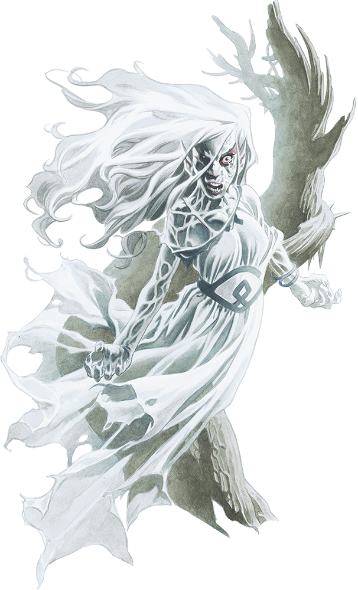

# Phandelver and Below: The Shattered Obelisk

## Agatha, <small>_banshee_</small>

<!-- @formatter:off -->

<!-- @formatter:on -->

:construction: {Texto}
 

[//]: # (### Relações)
[//]: # ()
[//]: # (* {Personagem}, {detalhe})

[//]: # (### Organizações)
[//]: # ()
[//]: # (* {Organização}, {detalhe})

### Locais

* [Conyberry](../../locations/conyberry.md), referência para chegar ao covil

### Referências

* [Sessão 5 Perda](../../sessions/05_perda.md)
  * [Irmã Garaele](phandalin/sister_garaele.md) conta sobre sua missão e
    **Agatha**, a banshee
    ([Cena 4](../../sessions/05_perda.md#cena-4-irmã-garaele))

####

* [Sessão 6 Wyvern Tor](../../sessions/06_wyvern_tor.md)
  * [Irmã Garaele](phandalin/sister_garaele.md) dá detalhes sobre **Agatha**, a
    banshee ([Cena 2](../../sessions/06_wyvern_tor.md#cena-2-despedidas))

####

* [Sessão 7 Floresta](../../sessions/07_floresta.md)
  * **Agatha** menciona que era amiga de [Bowgentle](mentions/bowgentle.md)
    ([Cena 2](../../sessions/07_floresta.md#cena-2-agatha))
  * **Agatha** diz que negociou
    o [Grimório Bowgentle](../../items/books/bowgentle_spellbook.md)
    com [Tsernoth](mentions/tsernoth.md)
    ([Cena 2](../../sessions/07_floresta.md#cena-2-agatha))
