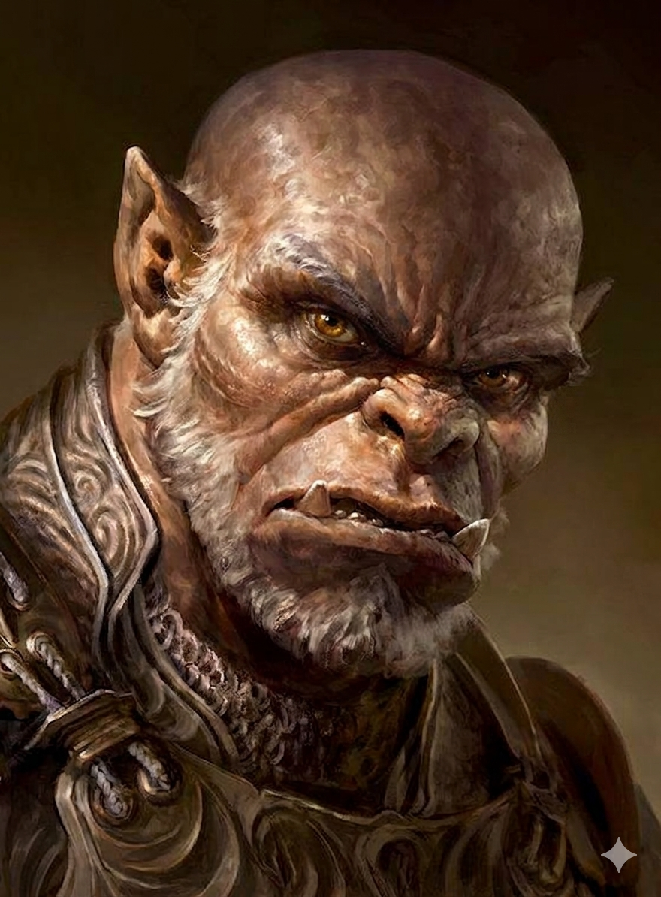

# Phandelver and Below: The Shattered Obelisk

## Brughor, <small>_orc_</small>

<!-- @formatter:off -->

<!-- @formatter:on -->

:construction: {Texto}
 

### Relações

* [Grol](grol.md), rei

### Organizações

* [Cragmaw Goblins](../../../organizations/cragmaw_goblins.md), chefe
  no [Wyvern Tor](../../../locations/wyvern_tor.md)

### Locais

* [Wyvern Tor](../../../locations/wyvern_tor.md), chefe local

### Referências

* [Sessão 6 Wyvern Tor](../../../sessions/06_wyvern_tor.md)
  * grupo rende e interroga **Brughor**
    ([Cena 5](../../../sessions/06_wyvern_tor.md#cena-5-wyvern-tor))

####

* [Sessão 7 Floresta](../../../sessions/07_floresta.md)
  * **Brughor** indica a localização
    do [Castelo Cragmaw](../../../locations/cragmaw_castle.md)
    ([Cena 1](../../../sessions/07_floresta.md#cena-1-brughor))

####

* [Sessão 9 Pacato](../../../sessions/09_pacato.md)
  * [Reidoth](../thundertree/reidoth.md) aponta que o mapa de **Brughor** está
    errado ([Cena 5](../../../sessions/09_pacato.md#cena-5-libertado))
