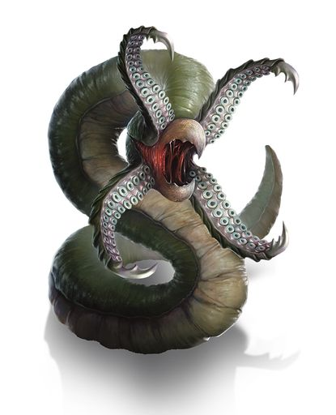

# Phandelver and Below: The Shattered Obelisk

## Grick (RIP), <small>_grick_</small>

<!-- @formatter:off -->

<!-- @formatter:on -->

A criatura semelhante a uma minhoca aguarda invisível, camuflando-se entre as
rochas das cavernas e grutas que habita. Somente quando a presa se aproxima é
que ela se ergue, seus quatro tentáculos farpados se desdobrando para revelar
seu bico faminto e afiado.
 

### Relações

* [Lhupo](lhupo.md), mestre

[//]: # (### Organizações)
[//]: # ()
[//]: # (* {Organização}, {detalhe})

### Locais

* [Castelo Cragmaw](../../../../locations/cragmaw_castle.md), templo

[//]: # (### Itens)
[//]: # ()
[//]: # (* {item}, {detalhe})

### Referências

* [Sessão 11 Barricadas](../../../../sessions/11_barricadas.md)
  * derrotado pelo grupo
    ([Cena 1](../../../../sessions/11_barricadas.md#cena-1-altar))
