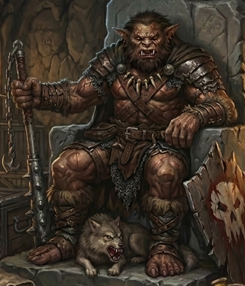

# Phandelver and Below: The Shattered Obelisk

## Klarg (RIP), <small>_bugbear_</small>

<!-- @formatter:off -->

<!-- @formatter:on -->

O líder dos [Cragmaw Goblins](../../../organizations/cragmaw_goblins.md)
baseados no [Esconderijo Cragmaw](../../../locations/cragmaw_hideout.md) é um
bugbear chamado **Klarg** e tem ordens para saquear quaisquer caravanas ou
viajantes mal defendidos que passem
pela [Estrada Triboar](../../../locations/triboar_trail.md).

Recentemente havia recebido instruções
do [Castelo Cragmaw](../../../locations/cragmaw_castle.md) para capturar o
anão [Gundren Rockseeker](../gundren_rockseeker.md) e o que mais estivesse com
ele.

Ao capturar Gundren juntamente com seu amigo humano, enviou prontamente o anão
para o Castelo Gragmaw, mas manteve [Sildar](../sildar_hallwinter.md), com a
intenção de negociar algum tipo de resgate.

Mas antes que isso fosse possível, o grupo invadiu seu esconderijo, e, após
negociar com o traidor [Yeemik](yeemik.md), o atacaram covardemente e o mataram.
 

### Relações

* [Yeemik](yeemik.md), segundo em comando e rival
* [Grol](grol.md), rei

### Organizações

* [Cragmaw Goblins](../../../organizations/cragmaw_goblins.md), chefe
  no [Esconderijo Cragmaw](../../../locations/cragmaw_hideout.md)

### Locais

* [Esconderijo Cragmaw](../../../locations/cragmaw_hideout.md), chefe local

### Referências

* [Sessão 1 Goblins](../../../sessions/01_goblins.md)
  * [Yeemik](yeemik.md) pede a cabeça de **Klarg** em troca de
    libertar [Sildar](../sildar_hallwinter.md)
    ([Cena 4](../../../sessions/01_goblins.md#cena-4-negociação))
  * morto em combate pelo grupo
    ([Cena 5](../../../sessions/01_goblins.md#cena-5-klarg))

####

* [Sessão 2 Phandalin](../../../sessions/02_phandalin.md)
  * corpo negociado em troca da liberdade de [Sildar](../sildar_hallwinter.md)
    ([Cena 2](../../../sessions/02_phandalin.md#cena-2-troca))
  * [Flip](flip.md) diz que apenas **Klarg** sabia a localização
    do [Castelo Cragmaw](../../../locations/cragmaw_castle.md)
    ([Cena 4](../../../sessions/02_phandalin.md#cena-4-interrogatório))
