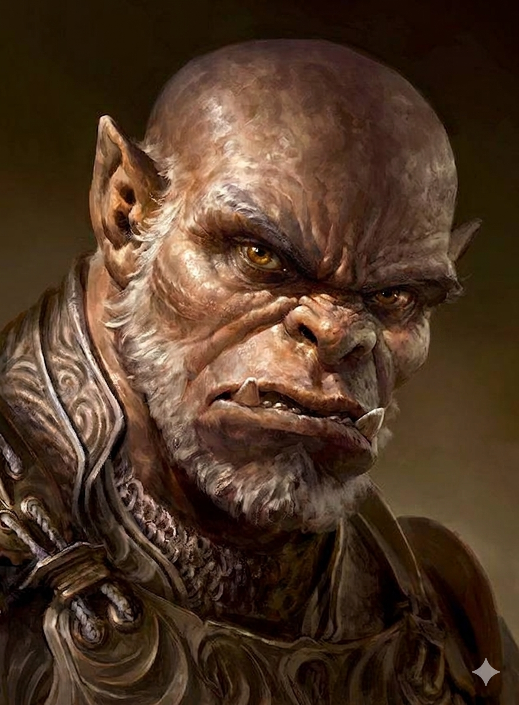

# Phandelver and Below: The Shattered Obelisk

## Brughor, <small>_orc_</small>

<!-- @formatter:off -->

<!-- @formatter:on -->

Líder dos [Cragmaw Goblins](../../../../organizations/cragmaw_goblins.md)
baseados em [Wyvern Tor](../../../../locations/wyvern_tor.md) liberado após
interrogatório em que forneceu a localização &mdash; posteriormente revelada
falsa &mdash; do [Castelo Cragmaw](../../../../locations/cragmaw_castle.md).

Avistado no refeitório
do [Castelo Cragmaw](../../../../locations/cragmaw_castle.md), fugiu antes de
entrar no combate.
 

### Relações

* [Grol](../castle/grol.md), rei

### Organizações

* [Cragmaw Goblins](../../../../organizations/cragmaw_goblins.md), chefe
  no [Wyvern Tor](../../../../locations/wyvern_tor.md)

### Locais

* [Wyvern Tor](../../../../locations/wyvern_tor.md), chefe local

### Referências

* [Sessão 6 Wyvern Tor](../../../../sessions/06_wyvern_tor.md)
  * grupo rende e interroga **Brughor**
    ([Cena 5](../../../../sessions/06_wyvern_tor.md#cena-5-wyvern-tor))

####

* [Sessão 7 Floresta](../../../../sessions/07_floresta.md)
  * **Brughor** indica a localização
    do [Castelo Cragmaw](../../../../locations/cragmaw_castle.md)
    ([Cena 1](../../../../sessions/07_floresta.md#cena-1-brughor))

####

* [Sessão 9 Olie](../../../../sessions/09_olie.md)
  * [Reidoth](../../thundertree/reidoth.md) aponta que o mapa de **Brughor**
    está errado ([Cena 5](../../../../sessions/09_olie.md#cena-5-libertado))

####

* [Sessão 10 Castelo](../../../../sessions/10_castelo.md)
  * grupo vê **Brughor*
    no [Castelo Cragmaw](../../../../locations/cragmaw_castle.md)
    ([Cena 1](../../../../sessions/10_castelo.md#cena-1-recepção))

[//]: # (####)
[//]: # ()
[//]: # (* [Sessão {X} {Título}])
[//]: # (  * {detalhe} &#40;[Cena {X}]&#41;)
