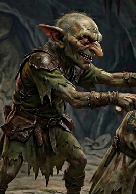

# Phandelver and Below: The Shattered Obelisk

## Yeemik, <small>_goblin_</small>

<!-- @formatter:off -->

<!-- @formatter:on -->

_[_Texto_]_ :construction:
 

### Relações

* [Klarg](klarg.md) (RIP), antigo chefe e rival
* [Grol](grol.md), rei

### Organizações

* [Cragmaw Goblins](../../../organizations/cragmaw_goblins.md), novo chefe
  no [Esconderijo Cragmaw](../../../locations/cragmaw_hideout.md)

### Locais

* [Esconderijo Cragmaw](../../../locations/cragmaw_hideout.md), novo chefe

### Referências

* [Sessão 1 Goblins](../../../sessions/01_goblins.md)
  * pede a cabeça de [Klarg](klarg.md) em troca da liberdade
    de [Sildar](../sildar_hallwinter.md)
    ([Cena 4](../../../sessions/01_goblins.md#cena-4-negociação))

####

* [Sessão 2 Phandalin](../../../sessions/02_phandalin.md)
  * novo líder no [Esconderijo Cragmaw](../../../locations/cragmaw_hideout.md)
    ([Cena 2](../../../sessions/02_phandalin.md#cena-2-troca))
