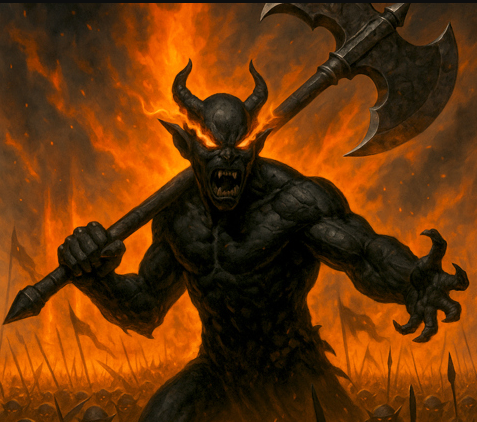

# Phandelver and Below: The Shattered Obelisk

## Maglubieyt, <small>_deity_</small>

<!-- @formatter:off -->

<!-- @formatter:on -->

**Maglubiyet**, também conhecido como "O Poderoso" ou "O Alto Chefe", é a
principal divindade dos goblinóides e governante do seu panteão, dominando
heróis mortais e deuses imortais com punho de ferro.
 

### Relações

* [Lhupo](../cragmaw/castle/lhupo.md), sacerdote

[//]: # (### Organizações)
[//]: # ()
[//]: # (* {Organização}, {detalhe})

[//]: # (### Locais)
[//]: # ()
[//]: # (* {Local}, {detalhe})

[//]: # (### Itens)
[//]: # ()
[//]: # (* {item}, {detalhe})

### Referências

* [Sessão 11 Barricadas](../../../sessions/11_barricadas.md)
  * [Lhupo](../cragmaw/castle/lhupo.md) alega falar em nome de **Maglubiyet**
    ([Cena 1](../../../sessions/11_barricadas.md#cena-1-altar))
