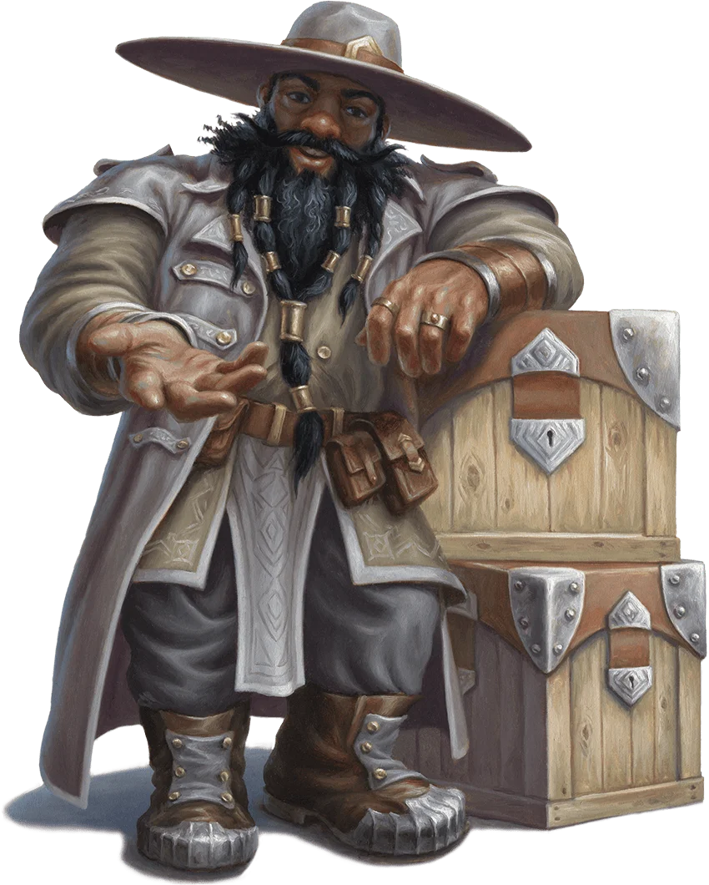

# Phandelver and Below: The Shattered Obelisk

## Gundren Rockseeker, <small>_anão_</small>

<!-- @formatter:off -->

<!-- @formatter:on -->

O anão **Gundren Rockseeker** é um velho conhecido do grupo, e os contratou para
escoltar uma carga de suprimentos até [Phandalin](../../locations/phandalin.md).
Gundren seguiu à frente com o guerreiro e seu
amigo, [Sildar Hallwinter](sildar_hallwinter.md), para tratar de assuntos na
cidade, enquanto o grupo segue com os suprimentos.

Gundren e seus irmãos, [Tharden](mentions/tharden_rockseeker.md)
e [Nundro](mentions/nundro_rockseeker.md), estão empenhados em descobrir a localização de
certas minas lendárias da região de Phandalin. Seu objetivo é recuperá-las para
seu clã e restabelecer a mina.
 

### Relações

* [Sildar Hallwinter](sildar_hallwinter.md), amigo
* [Elmina Barthen](phandalin/barthens/elmina_barthen.md), amiga e parceira de
  negócios
* [Tharden Rockseeker](mentions/tharden_rockseeker.md), irmão
* [Nundro Rockseeker](mentions/nundro_rockseeker.md), irmão

[//]: # (### Organizações)
[//]: # ()
[//]: # (* {Organização}, {detalhe})

### Locais

* [Neverwinter](../../locations/neverwinter.md), mercador
* [Phandalin](../../locations/phandalin.md), mercador e minerador

### Referências

* [Sessão 0 Prólogo](../../sessions/00_prologo.md)
  * **Gundren** apresenta seu amigo [Sildar](sildar_hallwinter.md)
    ([Cena 1](../../sessions/00_prologo.md#cena-1-trabalho))
  * **Gundren** oferece trabalho de escolta de carga
    até [Phandalin](../../locations/phandalin.md)
    ([Cena 1](../../sessions/00_prologo.md#cena-1-trabalho))
  * parte na frente para [Phandalin](../../locations/phandalin.md)
    com [Sildar](sildar_hallwinter.md)
    ([Cena 2](../../sessions/00_prologo.md#cena-2-partida))
  * grupo encontra cavalo morto
    na [Estrada Triboar](../../locations/triboar_trail.md)
    ([Cena 3](../../sessions/00_prologo.md#cena-3-corpos))

####

* [Sessão 1 Goblins](../../sessions/01_goblins.md)
  * [Sildar](sildar_hallwinter.md) diz que grupo deve salvar **Gundren**
    ([Cena 4](../../sessions/01_goblins.md#cena-4-negociação))

####

* [Sessão 2 Phandalin](../../sessions/02_phandalin.md)
  * **Gundren** não é encontrado
    no [Esconderijo Cragmaw](../../locations/cragmaw_hideout.md)
    ([Cena 1](../../sessions/02_phandalin.md#cena-1-decisões))
  * [Yeemik](cragmaw/yeemik.md) diz que a ordem de capturar **Gundren** veio
    de [Grol](cragmaw/grol.md)
    ([Cena 2](../../sessions/02_phandalin.md#cena-2-troca))
  * [Yeemik](cragmaw/yeemik.md) diz que a ordem teria sido um pedido
    de [Spider](mentions/spider.md)
    ([Cena 2](../../sessions/02_phandalin.md#cena-2-troca))
  * [Yeemik](cragmaw/yeemik.md) diz que **Gundren** foi enviado para
    o [Castelo Cragmaw](../../locations/cragmaw_castle.md)
    ([Cena 2](../../sessions/02_phandalin.md#cena-2-troca))
  * [Sildar](sildar_hallwinter.md) confirma que **Gundren** teria sido enviado
    para o [Castelo Cragmaw](../../locations/cragmaw_castle.md)
    ([Cena 3](../../sessions/02_phandalin.md#cena-3-sildar))
  * [Sildar](sildar_hallwinter.md) confirma que foi um pedido de um
    certo [Spider](mentions/spider.md)
    ([Cena 3](../../sessions/02_phandalin.md#cena-3-sildar))
  * [Elmina](phandalin/barthens/elmina_barthen.md) fica desolada ao saber de seu
    sequestro do amigo
    ([Cena 6](../../sessions/02_phandalin.md#cena-6-venda-da-barthen))

####

* [Sessão 5 Perda](../../sessions/05_perda.md)
  * [Sildar](sildar_hallwinter.md) reforça a importância de
    encontrar [Gundren](gundren_rockseeker.md)
    ([Cena 4](../../sessions/05_perda.md#cena-4-irmã-garaele))
