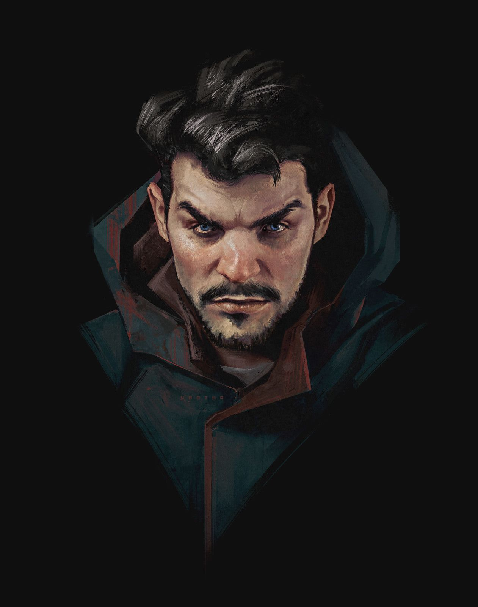

# Phandelver and Below: The Shattered Obelisk

## Iarno Albrek, <small>_humano_</small>

<!-- @formatter:off -->

<!-- @formatter:on -->

Descrito como "um homem baixo, de barba e cabelos escuros, na casa dos 30 anos",
**Iarno Albrek** é um mago e membro
da [Lords' Alliance](../../organizations/lords_alliance.md), que foi enviado
a [Phandalin](../../locations/phandalin.md) como representante oficial da
aliança e ajudar a nova cidade a se estruturar administrativamente e progredir.

Mas **Iarno** desapareceu pouco após chegar a cidade
e [Sildar Hallwinter](sildar_hallwinter.md), enviado para encontrá-lo, teme que
ele tenha sido capturado pelo
[Redbrands](../../organizations/redbrands.md).

Mais adiante, quando o grupo invade
o [Esconderijo Redbrand](../../locations/phandalin/redbrand_hideout.md),
descobrem por uma carta de [Spider](mentions/spider.md) que, **Iarno** é, na
verdade, [Glasstaff](redbrands/glasstaff.md), o líder
dos [Redbrands](../../organizations/redbrands.md).

Ambicioso, Iarno viu em [Phandalin](../../locations/phandalin.md) uma
oportunidade para enriquecer ilicitamente. Em vez de estabelecer uma força se
segurança, que seria seu objetivo original, reuniu um grupo de foras da lei e
rufiões locais para criar sua própria força de opressão e coerção,
os [Redbrands](../../organizations/redbrands.md).

Perseguido pelo grupo, **Iarno 'Glasstaff'** consegue fugir com a ajuda de uma
poção de invisibilidade.
 

### Relações

* [Glasstaff](redbrands/glasstaff.md), identidade secreta

####

* [Sildar Hallwinter](sildar_hallwinter.md), ex-companheiro
  na [Lords' Alliance](../../organizations/lords_alliance.md)

####

* [Spider](mentions/spider.md), aliado

### Organizações

* [Lords' Alliance](../../organizations/lords_alliance.md), ex-membro
* [Redbrands](../../organizations/redbrands.md), líder

### Locais

* [Phandalin](../../locations/phandalin.md), enviado como representante e
  desaparecido
* [Esconderijo Redbrand](../../locations/phandalin/redbrand_hideout.md),
  ocupante como [Glasstaff](redbrands/glasstaff.md)

### Referências

* [Sessão 2 Phandalin](../../sessions/02_phandalin.md)
  * [Sildar](sildar_hallwinter.md) diz que **Iarno** foi enviado para
    representar a [Lords' Alliance](../../organizations/lords_alliance.md) na
    cidade ([Cena 11](../../sessions/02_phandalin.md#cena-11-prefeitura))
  * [Sildar](sildar_hallwinter.md) acha que **Iarno** pode ter sido capturado
    pelos [Redbrands](../../organizations/redbrands.md)
    ([Cena 11](../../sessions/02_phandalin.md#cena-11-prefeitura))

####

* [Sessão 5 Perda](../../sessions/05_perda.md)
  * carta de [Spider](mentions/spider.md) revela
    que [Glasstaff](redbrands/glasstaff.md) é **Iarno**
    ([Cena 1](../../sessions/05_perda.md#cena-1-carta))
  * grupo conta para [Sildar](sildar_hallwinter.md) a verdade sobre **Iarno**
    ([Cena 4](../../sessions/05_perda.md#cena-4-irmã-garaele))

####

* [Sessão 7 Floresta](../../sessions/07_floresta.md)
  * grupo encontra **Iarno** em [Thundertree](../../locations/thundertree.md)
    ([Cena 5](../../sessions/07_floresta.md#cena-5-arrependido))
  * **Iarno** menciona a existência do [dragão](thundertree/venomfang.md)
    ([Cena 5](../../sessions/07_floresta.md#cena-5-arrependido))

####

* [Sessão 8 Venomfang](../../sessions/08_venomfang.md)
  * **Iarno** é mantido algemado a uma bigorna
    ([Cena 1](../../sessions/08_venomfang.md#cena-1-galhos))

####

* [Sessão 9 Pacato](../../sessions/09_pacato.md)
  * **Iarno** deixa [Thundertree](../../locations/thundertree.md) com o grupo
    ([Cena 5](../../sessions/09_pacato.md#cena-5-libertado))
  * **Iarno** menciona a possibilidade de [Spider](mentions/spider.md) estar
    no [Castelo Cragmaw](../../locations/cragmaw_castle.md)
    ([Cena 5](../../sessions/09_pacato.md#cena-5-libertado))
  * grupo libera **Iarno** para se entregar
    em [Phandalin](../../locations/phandalin.md)
    ([Cena 5](../../sessions/09_pacato.md#cena-5-libertado))

[//]: # (####)
[//]: # ()
[//]: # (* [Sessão {X} {Título}])
[//]: # (  * {detalhe} &#40;[Cena {X}]&#41;)
