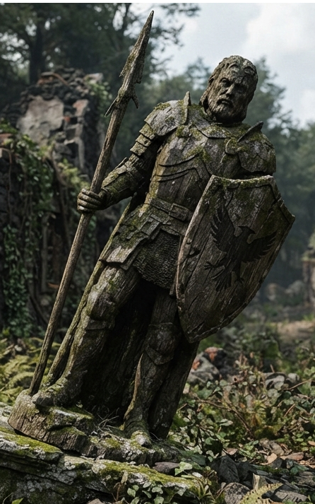

# Phandelver and Below: The Shattered Obelisk

## Palien, <small>_humano_</small>

<!-- @formatter:off -->

<!-- @formatter:on -->

**Palien** foi um herói local que, nos tempos da fundação
de [Thundertree](../../../locations/thundertree.md), foi responsável por livrar
a [Floresta Neverwinter](../../../locations/neverwinter_wood.md) próxima dos
monstros que assolavam a região.
 

[//]: # (### Relações)
[//]: # ()
[//]: # (* {Personagem}, {detalhe})

[//]: # (### Organizações)
[//]: # ()
[//]: # (* {Organização}, {detalhe})

### Locais

* [Thundertree](../../../locations/thundertree.md), herói lendário local

### Referências

* [Sessão 9 Pacato](../../../sessions/09_pacato.md)
  * grupo vê a estátua de **Palien**
    em [Thundertree](../../../locations/thundertree.md)
    ([Cena 3](../../../sessions/09_pacato.md#cena-3-pira))
