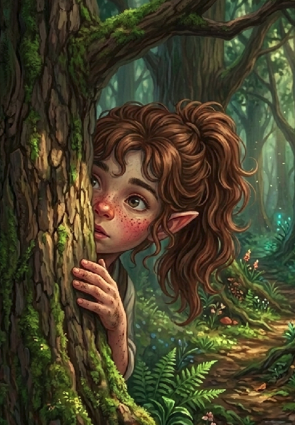

# Phandelver and Below: The Shattered Obelisk

## Carp Alderleaf, <small>_halfling_</small>

<!-- @formatter:off -->

<!-- @formatter:on -->

:construction: {Texto}
 

### Relações

* [Qelline Alderleaf](qelline_alderleaf.md), mãe
* [Pip Stonehill](../stonehill/pip_stonehill.md), amigo

[//]: # (### Organizações)
[//]: # ()
[//]: # (* {Organização}, {detalhe})

### Locais

* [Phandalin](../../../../locations/phandalin.md), moradora
  * [Fazenda Alderleaf](../../../../locations/phandalin/alderleaf_farm.md),
    residente

### Referências

* [Sessão 2 Phandalin](../../../../sessions/02_phandalin.md)
  * [Pip](../stonehill/pip_stonehill.md) diz que **Carp** quase foi capturada
    pelos [Redbrands](../../../../organizations/redbrands.md)
    ([Cena 8](../../../../sessions/02_phandalin.md#cena-8-pip))
  * **Carp** conta como encontrou um "túnel secreto"
    na [Mata Tresendar](../../../../locations/phandalin/tresendar_wood.md)
    ([Cena 13](../../../../sessions/02_phandalin.md#cena-13-carp))
  * **Carp** conta que quase foi vista
    pelos [Redbrands](../../../../organizations/redbrands.md)
    ([Cena 13](../../../../sessions/02_phandalin.md#cena-13-carp))

####

* [Sessão 3 Redbrands](../../../../sessions/03_redbrands.md)
  * **Carp** leva o grupo até o "túnel secreto"
    na [Mata Tresendar](../../../../locations/phandalin/tresendar_wood.md)
    ([Cena 2](../../../../sessions/03_redbrands.md#cena-2-túnel-secreto))
  * grupo acompanha **Carp** e [Pip](../stonehill/pip_stonehill.md) de volta
    a [Fazenda Alderleaf](../../../../locations/phandalin/alderleaf_farm.md)
    ([Cena 3](../../../../sessions/03_redbrands.md#cena-3-uma-voz))