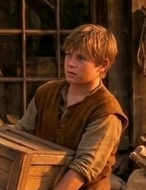

# Phandelver and Below: The Shattered Obelisk

## Ander, <small>_humano_</small>

<!-- @formatter:off -->

<!-- @formatter:on -->

**Ander** é um garoto de 15 anos que, juntamente com seu
irmão [Thistle](thistle.md), trabalha como ajudante
na [Venda da Barthen](../../../../locations/phandalin/barthens_provisions.md).
 

### Relações

* [Thistle](thistle.md), irmão

[//]: # (### Organizações)
[//]: # ()
[//]: # (* {Organização}, {detalhe})

### Locais

* [Phandalin](../../../../locations/phandalin.md), morador
  * [Venda da Barthen](../../../../locations/phandalin/barthens_provisions.md),
    funcionário

### Referências

* [Sessão 2 Phandalin](../../../../sessions/02_phandalin.md)
  * funcionário
    da [Venda da Barthen](../../../../locations/phandalin/barthens_provisions.md)
    ([Cena 6](../../../../sessions/02_phandalin.md#cena-6-venda-da-barthen))
  * sugere que os [Redbrands](../../../../organizations/redbrands.md) podem ser
    responsáveis pelos ataques
    na [Estrada Triboar](../../../../locations/triboar_trail.md)
    ([Cena 6](../../../../sessions/02_phandalin.md#cena-6-venda-da-barthen))
