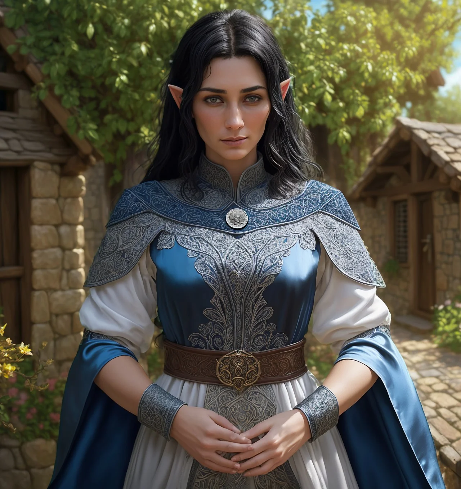

# Phandelver and Below: The Shattered Obelisk

## Irmã Garaele, <small>_elfa_</small>

<!-- @formatter:off -->

<!-- @formatter:on -->

:construction: {Texto}
 

### Relações

* [Sildar Hallwinter](../sildar_hallwinter.md), amigo

### Organizações

* [Harpers](../../../organizations/harpers.md), agente

### Locais

* [Phandalin](../../../locations/phandalin.md), moradora e clériga
  * [Santuário da Fortuna](../../../locations/phandalin/luck_shrine.md), clériga
    responsável

### Referências

* [Sessão 3 Redbrands](../../../sessions/03_redbrands.md)
  * [Harbin](harbin_wester.md) menciona que **Irmã Garaele** não se encontra na
    cidade
    ([Cena 1](../../../sessions/03_redbrands.md#cena-1-gigante-adormecido))

####

* [Sessão 5 Perda](../../../sessions/05_perda.md)
  * [Harbin](harbin_wester.md) diz que **Irmã Garaele** retornou a cidade
    ([Cena 3](../../../sessions/05_perda.md#cena-3-recompensa))
  * [Sildar](../sildar_hallwinter.md) apresenta a **Irmã Garaele** ao grupo
    ([Cena 4](../../../sessions/05_perda.md#cena-4-irmã-garaele))
  * **Irmã Garaele** se apresenta como uma agente
    dos [Harpers](../../../organizations/harpers.md)
    ([Cena 4](../../../sessions/05_perda.md#cena-4-irmã-garaele))
  * **Irmã Garaele** conta sobre sua missão e [Agatha](../agatha.md), a banshee
    ([Cena 4](../../../sessions/05_perda.md#cena-4-irmã-garaele))

####

* [Sessão 6 Wyvern Tor](../../../sessions/06_wyvern_tor.md)
  * **Irmã Garaele** dá detalhes sobre sua missão
    envolvendo [Agatha](../agatha.md), a banshee
    ([Cena 2](../../../sessions/06_wyvern_tor.md#cena-2-despedidas))
  * grupo encontra a trilha para
    o [Covil da Agatha](../../../locations/agathas_lair.md) mencionada por
    **Irmã Garaele**
    ([Cena 3](../../../sessions/06_wyvern_tor.md#cena-3-conyberry))

####

* [Sessão 7 Floresta](../../../sessions/07_floresta.md)
  * grupo encontra o [Covil da Agatha] seguindo as orientações da **Irmã
    Garaele** ([Cena 2](../../../sessions/07_floresta.md#cena-2-agatha))