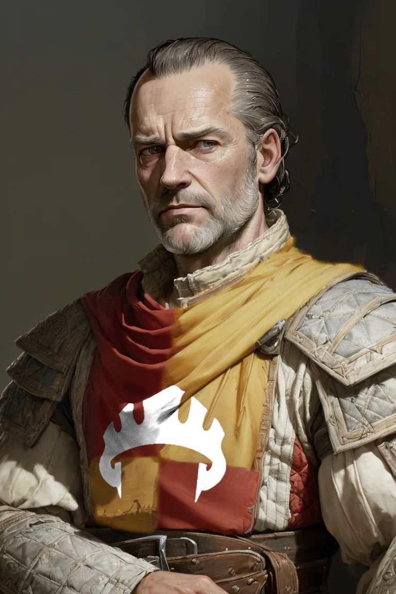

# Phandelver and Below: The Shattered Obelisk

## Sildar Hallwinter, <small>_humano_</small>

<!-- @formatter:off -->

<!-- @formatter:on -->

**Sildar Hallwinter** é um soldado aposentado de 50 e poucos anos originário da
cidade de [Neverwinter](../../locations/phandalin.md).

Sendo é um membro leal
da [Lords' Alliance](../../organizations/lords_alliance.md), está sendo enviando
a [Phandalin](../../locations/phandalin.md) com a missão de encontrar um
companheiro. Sabendo que seu velho
amigo [Gundren Rockseeker](gundren_rockseeker.md) está de partida com o mesmo
destino, resolve acompanhá-lo, pois suspeita que a viagem possa ter mais perigos
do que julga seu amigo otimista.
 

### Relações

* [Gundren Rockseeker](gundren_rockseeker.md), amigo
* [Irmã Garaele](phandalin/sister_garaele.md), amiga

####

* [Iarno Albrek](iarno_albrek.md), ex-companheiro
  na [Lords' Alliance](../../organizations/lords_alliance.md)

### Organizações

* [Lords' Alliance](../../organizations/lords_alliance.md), membro

### Locais

* [Neverwinter](../../locations/phandalin.md), cidade de origem
* [Phandalin](../../locations/phandalin.md), representante
  da [Lords' Alliance](../../organizations/lords_alliance.md)
  * [Hospedaria Stonehill](../../locations/phandalin/stonehill_inn.md), hóspede

### Referências

* [Sessão 0 Prólogo](../../sessions/00_prologo.md)
  * [Gundren](gundren_rockseeker.md) apresenta **Sildar** ao grupo
    ([Cena 1](../../sessions/00_prologo.md#cena-1-trabalho))
  * **Sildar** parte na frente para [Phandalin](../../locations/phandalin.md)
    com [Gundren](gundren_rockseeker.md)
    ([Cena 2](../../sessions/00_prologo.md#cena-2-partida))
  * **Sildar** grupo encontra cavalo morto
    na [Estrada Triboar](../../locations/triboar_trail.md)
    ([Cena 3](../../sessions/00_prologo.md#cena-3-corpos))

####

* [Sessão 1 Goblins](../../sessions/01_goblins.md)
  * prisioneiro de [Yeemik](cragmaw/yeemik.md)
    ([Cena 4](../../sessions/01_goblins.md#cena-4-negociação))

####

* [Sessão 2 Phandalin](../../sessions/02_phandalin.md)
  * grupo liberta **Sildar**
    dos [Cragmaw Goblins](../../organizations/cragmaw_goblins.md)
    ([Cena 2](../../sessions/02_phandalin.md#cena-2-troca))
  * **Sildar** conta como ele e [Gundren](gundren_rockseeker.md) foram
    capturados ([Cena 3](../../sessions/02_phandalin.md#cena-3-sildar))
  * **Sildar** diz como [Gundren](gundren_rockseeker.md) foi levado para
    o [Castelo Cragmaw](../../locations/cragmaw_castle.md) a pedido
    de [Spider](spider.md)
    ([Cena 3](../../sessions/02_phandalin.md#cena-3-sildar))
  * **Sildar** hospeda-se
    na [Hospedaria Stonehill](../../locations/phandalin/stonehill_inn.md)
    ([Cena 7](../../sessions/02_phandalin.md#cena-7-hospedaria-stonehill))
  * [Daran](phandalin/daran_edermath.md) fica satisfeito ao saber que **Sildar**
    chegou como representante
    da [Lords' Alliance](../../organizations/lords_alliance.md)
    ([Cena 9](../../sessions/02_phandalin.md#cena-9-pomar-edermath))
  * **Sildar** está tentando lidar com a papelada
    da [Prefeitura](../../locations/phandalin/townmasters_hall.md)
    ([Cena 11](../../sessions/02_phandalin.md#cena-11-prefeitura))
  * **Sildar** explica que sua missão era
    encontrar [Iarno Albrek](iarno_albrek.md)
    ([Cena 11](../../sessions/02_phandalin.md#cena-11-prefeitura))
  * **Sildar** suspeita que [Iarno](iarno_albrek.md) tenha sido capturado
    pelos [Redbrands](../../organizations/redbrands.md)
    ([Cena 11](../../sessions/02_phandalin.md#cena-11-prefeitura))
  * **Sildar** conta o que aconteceu
    com [Thel Dendrar](phandalin/dendrar/thel_dendrar.md) e sua família
    ([Cena 11](../../sessions/02_phandalin.md#cena-11-prefeitura))
  * **Sildar** propõe que o grupo desmantele
    os [Redbrands](../../organizations/redbrands.md) e
    capture [Glasstaff](redbrands/glasstaff.md)
    ([Cena 11](../../sessions/02_phandalin.md#cena-11-prefeitura))

####

* [Sessão 5 Perda](../../sessions/05_perda.md)
  * [Harbin](phandalin/harbin_wester.md) diz que **Sildar** esta com
    a [Irmã Garaele](phandalin/sister_garaele.md)
    no [Santuário da Fortuna](../../locations/phandalin/luck_shrine.md)
    ([Cena 3](../../sessions/05_perda.md#cena-3-recompensa))
  * **Sildar** apresenta ao grupo a [Irmã Garaele](phandalin/sister_garaele.md)
    ([Cena 4](../../sessions/05_perda.md#cena-4-irmã-garaele))
  * grupo conta para **Sildar** a verdade sobre [Iarno Albrek](iarno_albrek.md)
    ([Cena 4](../../sessions/05_perda.md#cena-4-irmã-garaele))
  * **Sildar** pede que investiguem os ataques
    na [Estrada Triboar](../../locations/triboar_trail.md)
    ([Cena 4](../../sessions/05_perda.md#cena-4-irmã-garaele))
  * **Sildar** sugere que no caminho
    ajudem [Irmã Garaele](phandalin/sister_garaele.md) com sua missão
    ([Cena 4](../../sessions/05_perda.md#cena-4-irmã-garaele))

####

* [Sessao 6 Wyvern Tor](../../sessions/06_wyvern_tor.md)
  * **Sildar** reforça pedido para investigarem próximo a [Conyberry]
    ([Cena 2](../../sessions/06_wyvern_tor.md#cena-2-despedidas))
