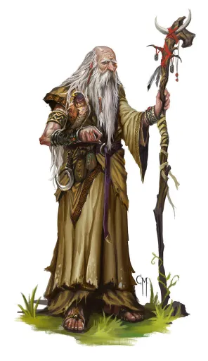

# Phandelver and Below: The Shattered Obelisk

## Reidoth, <small>_humano_</small>

<!-- @formatter:off -->

<!-- @formatter:on -->

**Reidoth** é um velho druida que vive e procura restaurar o equilíbrio da
natureza nas ruínas da antiga vila
de [Thundertree](../../../locations/thundertree.md), destruída por uma erupção
vulcânica e infestada por uma praga de plantas mutantes, zumbis de cinzas,
aranhas gigantes, e mais recentemente, um dragão.
 

### Relações

* [Qelline Alderleaf](../phandalin/alderleaf/qelline_alderleaf.md), amiga

[//]: # (### Organizações)
[//]: # ()
[//]: # (* {Organização}, {detalhe})

### Locais

* [Thundertree](../../../locations/thundertree.md), druida

### Referências

* [Sessão 7 Floresta](../../../sessions/07_floresta.md)
  * [Iarno](../iarno_albrek.md) diz que ouviu os cultistas falarem de um
    **druida** ([Cena 5](../../../sessions/07_floresta.md))

####

* [Sessão 8 Venomfang](../../../sessions/08_venomfang.md)
  * grupo conhece o druida **Reidoth**
    ([Cena 2](../../../sessions/08_venomfang.md#cena-2-druida))
  * **Reidoth** dá dicas para a criação de um owlbear
    ([Cena 2](../../../sessions/08_venomfang.md#cena-2-druida))
  * **Reidoth** participa do combate contra as aranhas gigantes
    ([Cena 3](../../../sessions/08_venomfang.md#cena-3-aranhas))
  * **Reidoth** participa do combate contra [Venomfang](venomfang.md)
    ([Cena 4](../../../sessions/08_venomfang.md#cena-4-dragão))

[//]: # (####)
[//]: # ()
[//]: # (* [Sessão {X} {Título}])
[//]: # (  * {detalhe} &#40;[Cena {X}]&#41;)
