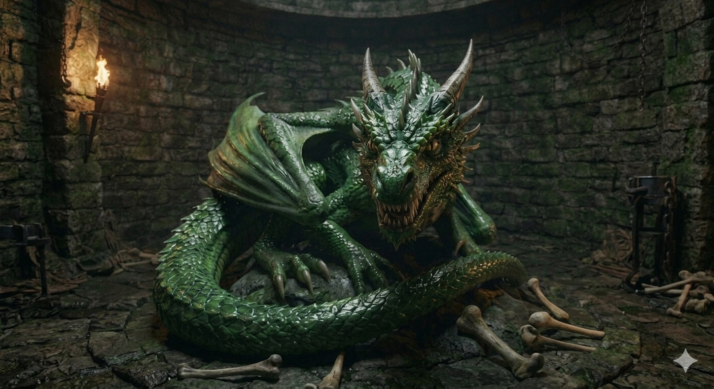

# Phandelver and Below: The Shattered Obelisk

## Venomfang (RIP), <small>_green dragon (jovem)_</small>

**Venomfang** é um jovem dragão verde que se estabeleceu na antiga torre
abandonada, em [Thundertree](../../../locations/thundertree.md), e clama toda a
região como seus domínios.

[//]: # (### Relações)
[//]: # ()
[//]: # (* {Personagem}, {detalhe})

[//]: # (### Organizações)
[//]: # ()
[//]: # (* {Organização}, {detalhe})

### Locais

* [Thundertree](../../../locations/thundertree.md), ocupante da torre

### Referências

* [Sessão 7 Floresta](../../../sessions/07_floresta.md)
  * [Iarno](../iarno_albrek.md) menciona a existência do **dragão**
    ([Cena 5](../../../sessions/07_floresta.md#cena-5-arrependido))

####

* [Sessão 8 Venomfang](../../../sessions/08_venomfang.md)
  * [Reidoth](reidoth.md) conta o que sabe sobre o **dragão**
    ([Cena 2](../../../sessions/08_venomfang.md#cena-2-druida))
  * grupo enfrenta e derrota **Venomfang**
    ([Cena 4](../../../sessions/08_venomfang.md#cena-4-dragão))

[//]: # (####)
[//]: # ()
[//]: # (* [Sessão {X} {Título}])
[//]: # (  * {detalhe} &#40;[Cena {X}]&#41;)
