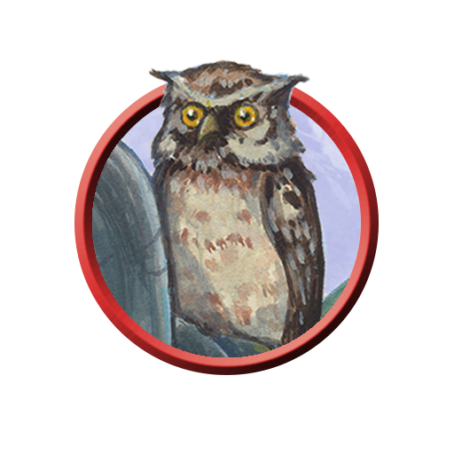

# Phandelver and Below: The Shattered Obelisk

## Bia, <small>_coruja_</small>

<!-- @formatter:off -->

<!-- @formatter:on -->
:construction:

Familiar spirit.
 

### Relações

* [Professor Ork](../professor.md), mestre

[//]: # (### Organizações)
[//]: # ()
[//]: # (* {Organização}, {detalhe})

[//]: # (### Locais)
[//]: # ()
[//]: # (* {Local}, {detalhe})

[//]: # (### Referências)
[//]: # ()
[//]: # (* [Sessão {X} {Título}])
[//]: # (  * {detalhe} &#40;[Cena {X}]&#41;)
