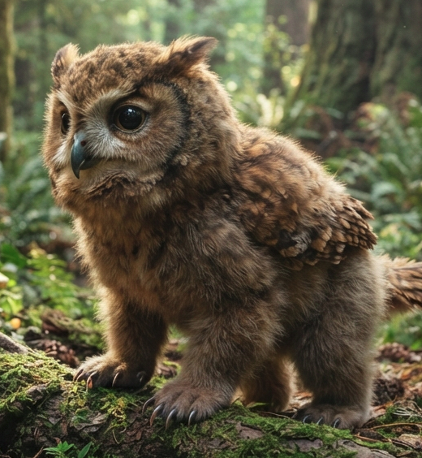

# Phandelver and Below: The Shattered Obelisk

## Pacato, <small>_owlbear (filhote)_</small>

<!-- @formatter:off -->

<!-- @formatter:on -->

:construction:

Companion.
 

### Relações

* [Ralf the Halfling](../ralf.md), tutor

[//]: # (### Organizações)
[//]: # ()
[//]: # (* {Organização}, {detalhe})

### Locais

* [Floresta Neverwinter], nascimento

### Referências

* [Sessão 9 Pacato](../../../sessions/09_pacato.md)
  * **Pacato** nasce na [Floresta Neverwinter]
    ([Cena 6](../../../sessions/09_pacato.md#cena-6-lobos))
