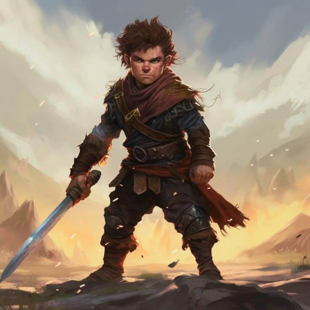

# Phandelver and Below: The Shattered Obelisk

## Ralf the Halfling, <small>_hafling_</small>

<!-- @formatter:off -->

<!-- @formatter:on -->

:construction:

Barbarian, Path of the Wild Heart.
 

### Relações

* [Professor Ork](professor.md), amigo
* [Silas 'Sapão' Raizforte](silas.md) (RIP), amigo
* [Jeremias 'Colina' Raizforte](jeremias.md), amigo

####

* [Pacato](companions/pacato.md), companheiro animal

[//]: # (### Organizações)
[//]: # ()
[//]: # (* {Organização}, {detalhe})

[//]: # (### Locais)
[//]: # ()
[//]: # (* {Local}, {detalhe})

### Itens

* [sapinho de jade]
* [tapa-olho cravejado de pedras]
* livro ["Criaturas Extraordinárias"](../../items/books/remarkable_creatures.md)

#### Passados

* [ovo de owlbear](../../items/objects/owlbear_egg.md) &ndash; _eclodido_

[//]: # (### Referências)
[//]: # ()
[//]: # (* [Sessão {X} {Título}])
[//]: # (  * {detalhe} &#40;[Cena {X}]&#41;)
