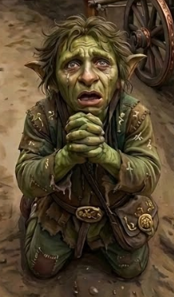

# Phandelver and Below: The Shattered Obelisk

# # Flip, <small>_goblin_</small>

<!-- @formatter:off -->

<!-- @formatter:on -->

_[Texto]_ :construction:
 

### Associações

* [Klarg](klarg.md) (RIP)
  * antigo chefe
* [Grol](grol.md)
  * soberano

### Organizações

* [Cragmaw Goblins](../../../organizations/cragmaw_goblins.md)
  * membro fugitivo

### Locais

* [Esconderijo Cragmaw](../../../locations/cragmaw_hideout.md)
  * antiga base, fugitivo

### Aparições

* [Sessão 1 Goblins](../../../sessions/01_goblins.md)
  * [Cena 5](../../../sessions/01_goblins.md#cena-5-klarg)
    * foge do [Esconderijo Cragmaw](../../../locations/cragmaw_hideout.md)
        
* [Sessão 2 Phandalin](../../../sessions/02_phandalin.md)
  * [Cena 4](../../../sessions/02_phandalin.md#cena-4-interrogatório)
    * capturado na [Estrada Triboar](../../../locations/triboar_trail.md),
      interrogado e liberado
    * diz que
      * o [Castelo Cragmaw](../../../locations/cragmaw_castle.md) fica
        na [Floresta de Neverwinter](../../../locations/neverwinter_wood.md),
        mas não sabe o local exato
      * tem medo do [Spider](../spider.md), pois ele "manda"
        em [Grol](grol.md)
