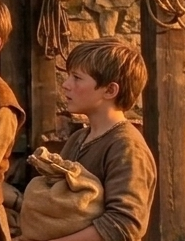

# Phandelver and Below: The Shattered Obelisk

## Thistle, <small>_humano_</small>

<!-- @formatter:off -->

<!-- @formatter:on -->

_[Texto]_ :construction:
 

### Relações

* [Ander](ander.md), irmão

[//]: # (### Organizações)
[//]: # ()
[//]: # (* _[Organização]_, _[detalhe]_)

### Locais

* [Phandalin](../../../../locations/phandalin.md), morador
  * [Venda da Barthen](../../../../locations/phandalin/barthens_provisions.md),
    funcionário

### Referências

* [Sessão 2 Phandalin](../../../../sessions/02_phandalin.md)
  * [Cena 6](../../../../sessions/02_phandalin.md#cena-6-venda-da-barthen)
    * funcionário
      da [Venda da Barthen](../../../../locations/phandalin/barthens_provisions.md)
