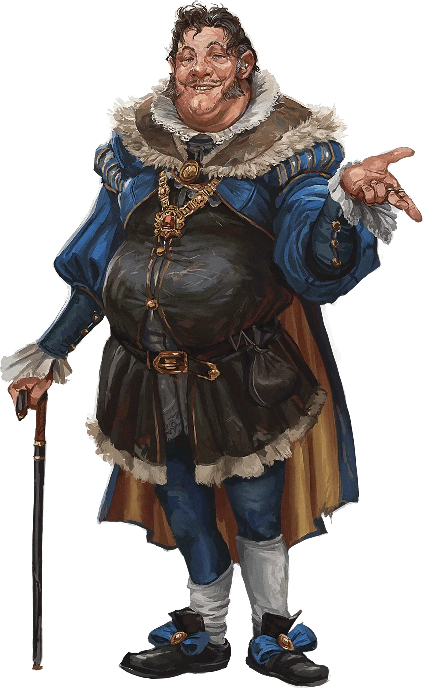

# Phandelver and Below: The Shattered Obelisk

## Harbin Wester, <small>_humano_</small>

<!-- @formatter:off -->

<!-- @formatter:on -->

_[Texto]_ :construction:
 

[//]: # (### Relações)
[//]: # ()
[//]: # (* _[Character]_, _[detalhe]_)

[//]: # (### Organizações)
[//]: # ()
[//]: # (* _[Organização]_, _[detalhe]_)

### Locais

* [Phandalin](../../../locations/phandalin.md), morador, prefeito e mercador
  * [Prefeitura](../../../locations/phandalin/townmasters_hall.md), prefeito e
    morador

### Referências

* [Sessão 2 Phandalin](../../../sessions/02_phandalin.md)
  * [Daran](daran_edermath.md) diz que **Harbin** está recrutando voluntários
    para lidar com os ataques
    na [Estrada Triboar](../../../locations/triboar_trail.md)
    ([Cena 9](../../../sessions/02_phandalin.md#cena-9-pomar-edermath))
  * **Harbin** recebe o grupo
    na [Prefeitura](../../../locations/phandalin/townmasters_hall.md)
    ([Cena 11](../../../sessions/02_phandalin.md#cena-11-prefeitura))
  * **Harbin** faz acordo para atuarem como força de segurança provisória
    em [Phandalin](../../../locations/phandalin.md)
    ([Cena 11](../../../sessions/02_phandalin.md#cena-11-prefeitura))

####

* [Sessão 3 Redbrands](../../../sessions/03_redbrands.md)
  * **Harbin** recebe o bandido prisioneiro
    ([Cena 1](../../../sessions/03_redbrands.md#cena-1-gigante-adormecido))
  * **Harbin** orienta o grupo a levar os mortos para
    o [Santuário da Fortuna](../../../locations/phandalin/shrine_of_luck.md)
    ([Cena 1](../../../sessions/03_redbrands.md#cena-1-gigante-adormecido))
  * **Harbin** menciona que [Irmã Garaele] não se encontra na cidade
    ([Cena 1](../../../sessions/03_redbrands.md#cena-1-gigante-adormecido))
