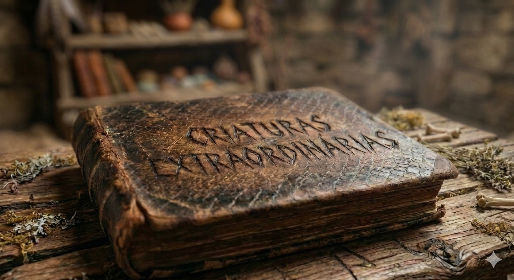

# Phandelver and Below: The Shattered Obelisk

## Criaturas Extraordinárias

:construction: {Texto}

### Capítulos

* [Owlbear](remarkable_creatures/chapter_owlbear.md)

[//]: # (### Autor&#40;es&#41;)
[//]: # ()
[//]: # (* {Personagem}, {detalhe})

### Proprietários

* [Reidoth](../../casting/npcs/thundertree/reidoth.md), proprietário anterior
* [Ralf](../../casting/npcs/thundertree/reidoth.md), ganho de Reidoth

[//]: # (### Personagens)
[//]: # ()
[//]: # (* {Personagem}, {detalhe})

[//]: # (### Locais)
[//]: # ()
[//]: # (* {Local}, {detalhe})

### Referências

* [Sessão 9 Olie](../../sessions/09_olie.md)
  * [Reidoth](../../casting/npcs/thundertree/reidoth.md) deu o livro
    para [Ralf](../../casting/pcs/ralf.md)
    ([Cena 1](../../sessions/09_olie.md#cena-1-descanso))
