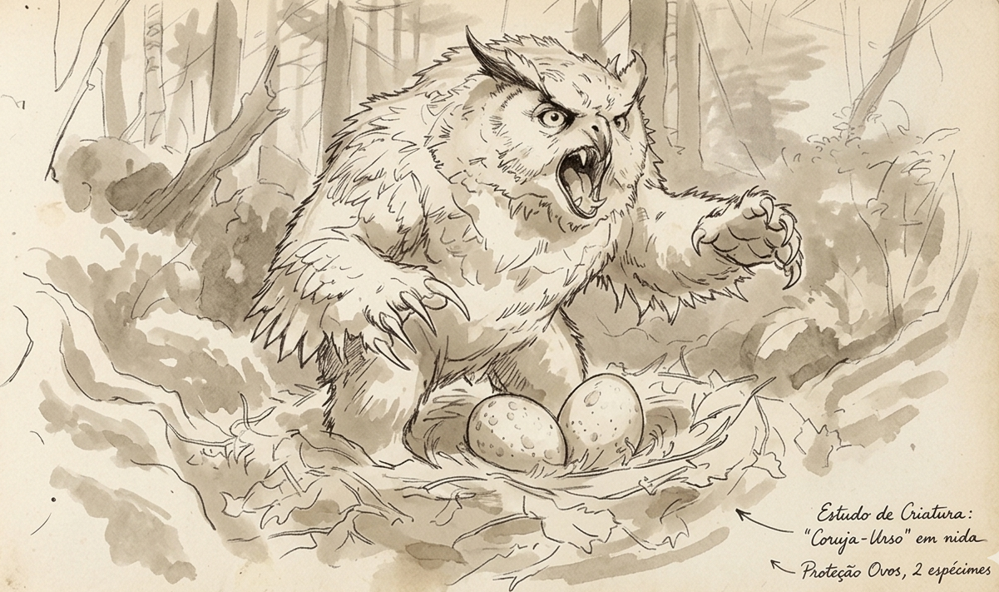
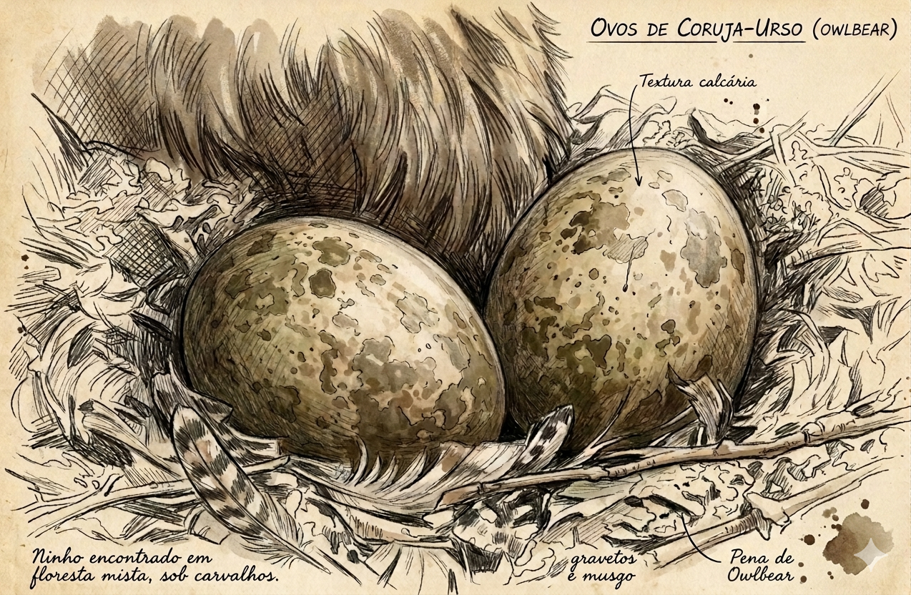
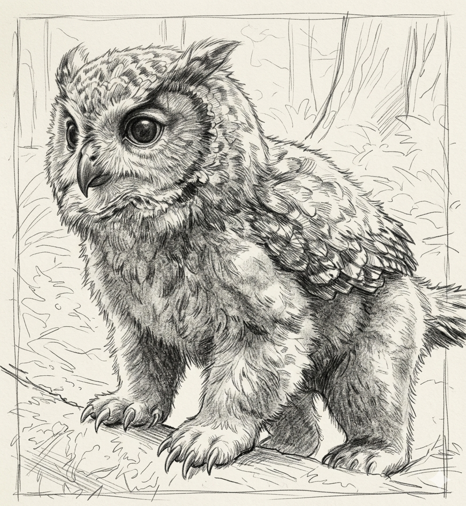
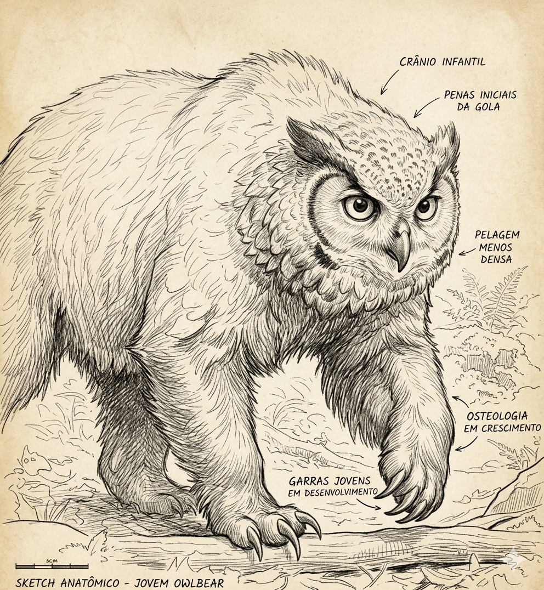
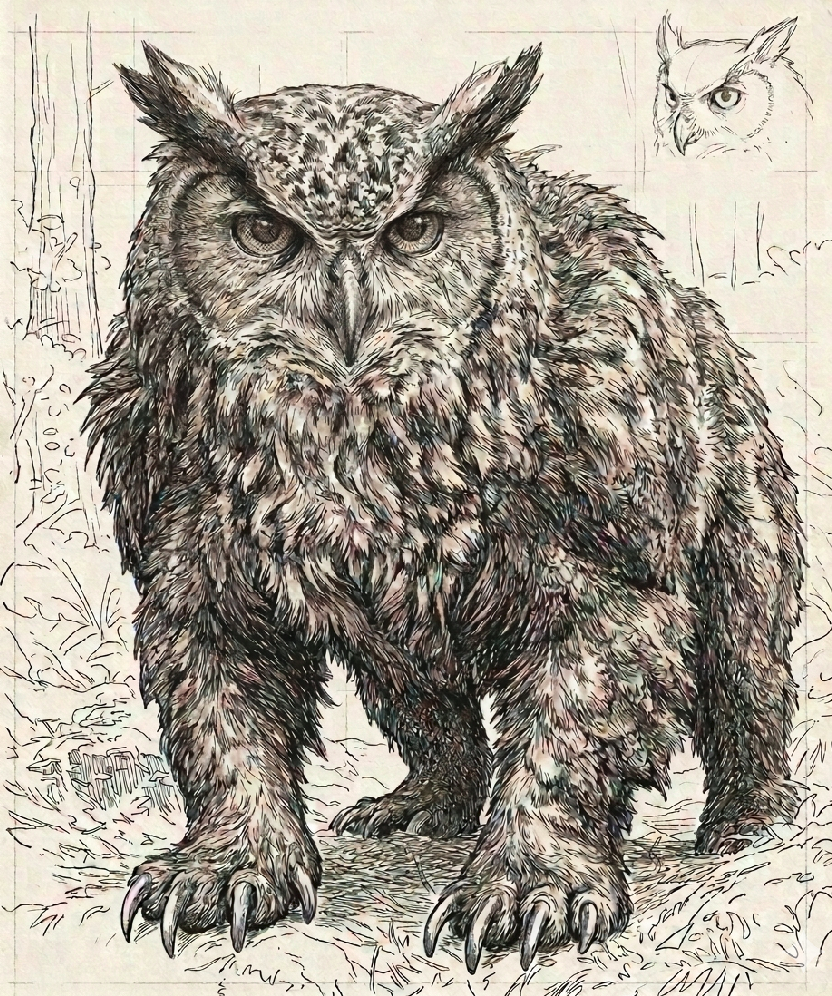

# Phandelver and Below: The Shattered Obelisk

## Criaturas Extraordinárias - Owlbear

* [Introdução](#introdução)
* [Desenvolvimento](#desenvolvimento)
* [Alimentação](#alimentação)
* [Treinamento](#treinamento)
* [Comportamento](#comportamento)
  * [Combate](#combate)
  * [Montaria](#montaria)

### Introdução

Os **Owlbears** são criaturas mágicas, criadas há muito tempo um mago insano que
fez experimentos com o cruzamento de uma coruja com um urso. Muitos dizem que,
assim que obteve êxito, o criador morreu nas garras de sua própria criação.

Eles, portanto, não são animais comuns, são monstruosidades. Têm uma
agressividade inata, uma fome insaciável e são muito teimosos.

### Desenvolvimento

O ciclo de desenvolvimento do **owlbear** é extremamente acelerado, indo de um
ovo até um adulto em menos de 2 meses, o que requer grande dedicação de quem o
está criando, de modo a suprir suas necessidades de alimentação enquanto ainda é
vulnerável (ver [Alimentação](#alimentação)).

#### Ovo

<!-- @formatter:off -->

<!-- @formatter:on -->

:construction: {Texto}
 

    - ovo muito valioso no mercado negro/exótico (~2000 gp)
      - muitos podem querer roubá-lo
      - cheiro caracterísco pode atrair predadores

    - criar a partir do ovo
      - "desafio monumental, perigoso e caro"

    - encubação
      - ovo deve ser mantido aquecido constantemente
      - "o ideal seria que você fosse um Owlbear"
      - opções
        - Prestidigitation: pode aquecer objeto por 1 hora
        - Heating Stone (item mágico)
        - mantas grossas perto do fogo
        - bolsas de água quente
      - evitar choques físicos

#### Filhote

<!-- @formatter:off -->

<!-- @formatter:on -->

O bebê **owlbear**, em seus primeiros dias, embora já seja capaz de andar e até
mesmo bicar e arranhar assim que deixa o ovo, ainda é muito frágil e dependente
de cuidados, e tente a seguir sua "mãe" de perto todo o tempo, a menos que
deixada aos cuidados de um outro membro da "família".

Ainda não é capaz de caçar seu próprio alimento de modo que é necessário
garantir esta necessidade diariamente (ver [Alimentação](#alimentação)).
 

#### Jovem

<!-- @formatter:off -->

<!-- @formatter:on -->

Após cerca de uma semana, o filhote já está bem maior, e começa a desenvolver
sua musculatura e a penugem começa a dar lugar às penas.

O jovem **owlbear** agora começa a ganhar alguma autonomia, ao mesmo tempo que
testa seus limites e a autoridade de seus cuidadores. Já pode acompanhar seu
treinador na caça de sua comida, embora ainda não seja de muita ajuda. Com o
progresso do seu treinamento, pode chegar um momento em que ele já pode caçar
seu próprio alimento, sem grande risco de se ferir gravemente no processo.
 

#### Adulto

<!-- @formatter:off -->

<!-- @formatter:on -->

Após cerca de um mês do aparecimento das primeiras penas, o **owlbear** já
desenvolveu seu tamanho final e sua plumagem já está completamente trocada. A
partir deste ponto, se ainda não foi domesticado, o treinamento se torna muito
mais difícil e perigoso.

O adulto é completamente autônomo, mas também voluntarioso e temperamental.
Mesmo estando domesticado ainda pode ser uma criatura bastante difícil de se
fazer obedecer.
 

### Alimentação

O crescimento acelerado do **owlbear** é sustentado por uma dieta que deve ser
prioritariamente baseada em carne fresca, exigindo bastante esforço de seu
criador para manter a criatura com o mínimo de estresse alimentar.

No início da sua vida, quando ainda filhote, dois ou três ratos por dia devem
ser suficientes para aplacar a fome do recém-nascido. Nesta fase, ainda é
possível oferecer substituir a carne fresca por porções de ração de viagem: o
equivalente a duas rações devem ser suficientes.

Mas ao chegar a adolescência, para suportar o rápido desenvolvimento muscular da
criatura, sua alimentação deve ser reforçada, demandando animais maiores, com
uma galinha ou um coelho por dia. Já um owlbear adulto vai precisar de pelo
menos uma ovelha a cada dois dias.

Até o owlbear estar desenvolvido o suficiente para ter autonômia para buscar sua
própria alimentação &mdash; ou em situações que não tenha acesso a este tipo de
recurso &mdash;, seus cuidadores devem se responsabilizar por garantir sua
nutrição. Se a criatura não estiver bem nutrida, ficará irritada, tornando-se
ainda mais agressiva e perigosa.

Algumas opções para suprir a dieta diária são:

* a caça &ndash; talvez a opção ideal, pois, além de garantir a carne fresca,
  pode ser bastante útil no processo de treinamento;

####

* inimigos mortos &ndash; deixar a criatura se alimentar dos inimigos derrotados
  em combate pode parecer reprovável, mas é pode ser a única opção em situações
  que a caça não possível;

####

* frutinhas mágicas (_goodberries_) &ndash; uma única destas frutinhas supre as
  necessidades nutricionais da criatura por um dia, provocando saciedade, mas
  ela ainda sentirá que está com a barriga vazia, o que pode deixá-la
  estressada.

### Treinamento

O treinamento de um **owlbear** é uma jornada árdua e intensa, com sessões
diárias e consistentes, desde os primeiros dias de vida da criatura. Um dia sem
treinamento pode representar um retrocesso no processo, e ainda assim, pode
haver dias bons e dias ruins, então esteja preparado para se machucar no
processo.

Sendo criaturas teimosas e agressivas, fatores de instabilidade &mdash; como
alternância de treinadores, má alimentação, participação de combates antes do
tempo &mdash; podem dificultar o progresso.

### Comportamento

Uma vez que esteja domesticado, o **owlbear** vai considerar seu treinador e
seus aliados como sua família, e não irá atacá-los exceto se provocado ou sob
estresse extremo.

Costuma obedecer a comandos simples de seu treinador, a menos que sejam muito
contra seus instintos &mdash; lembre-se que ainda é uma criatura selvagem por
natureza. Outros membros de sua "família" também podem lhe dar comandos, embora,
nestes casos, ele seja mais propenso a teimosia.

#### Combate

Mesmo domesticado, um **owlbear**, seja jovem ou adulto, ainda é muito agressivo
e teimoso, podendo ser difícil de controlar em combate. Normalmente ele vai agir
por conta própria, por instinto, atacando quem vê como a ameaça mais próxima até
que tenha sido eliminada, perseguindo-a se for necessário, antes de passar a
próxima. Só vai desengajar de um combate por conta própria, se estiver muito
ferido.

Seu treinador pode dar comandos básicos no sentido de direcionar suas ações, mas
isso requer um comando firme, verbal ou gestual. A criatura treinada tende a
obedecer a estes comandos, desde que não sejam muito contrários a seus
instintos.

Um **owlbear** ainda não totalmente domesticado, se envolvido em um combate,
normalmente vai agir por instinto. Até pode receber comandos, mas, além de ser
mais propenso a desobediência, pode gerar estresse na criatura, o que tende a
dificultar seu progresso no treinamento.

#### Montaria

Um **owlbear** adulto que já tenha sido domesticado, com um pouco mais treino
adicional, pode vir aceitar ser montado, mas apenas por seu treinador, e mesmo
assim esta não é uma atividade livre de riscos.

Embora possa ser montado sem uma sela, é recomentado que se use uma sela, que
aumenta o conforto do montador, já que anatomicamente os owlbears não foram
selecionados para isso, e reduz boa parte dos riscos, principalmente de queda.

Mas não é qualquer sela que pode ser usada. Será necessário confeccionar uma
sela especialmente desenvolvida para a criatura, sendo necessário inclusive
tirar suas medidas para um ajuste preciso &mdash; recomenda-se cuidado para quem
for realizar esta tarefa, pois a criatura muito provavelmente não vai gostar de
ser tão intimamente tocada.

Uma vez que se tenha uma sela apropriada, a atividade de selar a criatura também
pode ser desafiadora, pelo menos até que ela se acostume &mdash; o que pode
levar tempo &mdash; e aceite o adereço.

Mesmo que o **owlbear** esteja treinado para aceitar a montaria, isso nunca será
uma coisa de que ele vai gostar, e o montador sempre vai precisar "convencê-lo"
a se deixar montar &mdash; pode estar num dia ruim e simplesmente se recusar. E,
nisso, a falta de uma sela certamente vai dificultar. Para desmontar é sempre
bem mais fácil.

Uma vez montado, se manter sobre a criatura não é muito mais complicado que
montar um cavalo. Claro, se ela estiver selada! Sem uma sela, a estória é outra:
qualquer situação um pouco mais extrema, como correr, escalar ou atacar (seja
quem for que estiver atacando, montaria ou montador), certamente, irá exigir
mais do montador. Comandar o movimento da criatura em combate sem sela é
igualmente mais desafiador.

E, falando em combate, montada ou não, a criatura sempre vai agir por contra
própria, aceitando ou não os comandos do seu treinador
(ver [Combate](#combate)).

