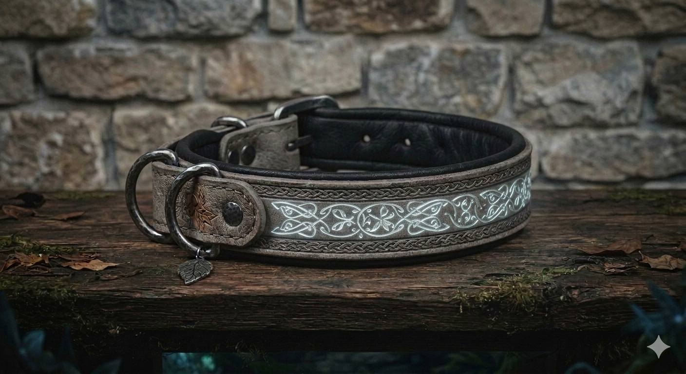

# Phandelver and Below: The Shattered Obelisk

## Coleira da Matilha Fantasma, <small>_wondrous item, uncommon_</small>

Esta **coleira** é feita de couro resistente cinza-claro e adornada com runas
élficas prateadas que brilham levemente no escuro. Quando colocada em seu
companheiro, sua pelagem parece soltar sutis fios de fumaça espectral ao se
mover rapidamente.

### Propriedades

* requires Attunement by someone with a companion

####

* **Shared Attunement.** This item is worn by your companion, but the attunement
  process must be performed by you during a _Short_ or _Long Rest_. It occupies
  one of your _Attunement_ slots.

####

* **Pack Tactics.** While the companion is within 30 feet of you, you share a
  mental hunting bond. It has _Advantage_ on attack rolls against a creature if
  you are within 5 feet of that creature, and you don't have the _Incapacitated_
  condition.

####

* **Phantom Flank.** Once per _Short Rest_, when the dog misses an attack roll
  against a creature within 5 feet of you, the spirit of the pack distracts the
  foe. You can use your _Reaction_ to immediately make one weapon attack against
  that same creature.

### Locais

* [Castelo Cragmaw](../../locations/cragmaw_castle.md), hobgoblins

[//]: # (### Referências)
[//]: # ()
[//]: # (* [Sessão {X} {Título}])
[//]: # (  * {detalhe} &#40;[Cena {X}]&#41;)
