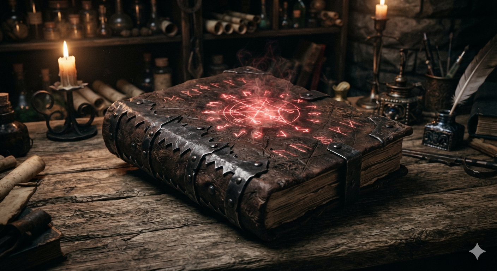

# Phandelver and Below: The Shattered Obelisk

## Grimório de Cinzas e Sangue, <small>_wondrous item, uncommon_</small>

Este pesado **grimório** é encadernado na pele crua e marcada de uma besta
monstruosa, com a lombada reforçada por placas de ferro serrilhadas. Runas que
brilham com uma tênue luz vermelha fumegante estão gravadas na capa. Para usar
este grimório, você deve segurá-lo com pelo menos uma das mãos.

### Propriedades

* requires Attunement by a Wizard

####

* **Spellcasting Focus.** You can use this grimoire as a _Spellcasting Focus_
  for your Wizard spells. While holding it, you gain a +1 bonus to Constitution
  _saving throws_ made to maintain your _Concentration_.

####

* **Academic Fury.** The grimoire has 1 charge, and it regains this expended
  charge daily at dawn. When you cast an Evocation spell that deals damage, you
  can expend the charge to channel your own ferocity. If you do, you add your
  _Proficiency Bonus_ to one damage roll of the spell. Additionally, you can
  change the spell's damage type to Fire or Force damage for that casting.

####

* **Frontline Retaliation.** When a creature within 5 feet of you fails a
  _saving throw_ against one of your Wizard cantrips, you can use your
  _Reaction_ to physically slam your grimoire against them or release a pulse of
  kinetic energy. The creature is pushed up to 10 feet horizontally away from
  you.

### Locais

* [Castelo Cragmaw](../../locations/cragmaw_castle.md), armazém

[//]: # (### Referências)
[//]: # ()
[//]: # (* [Sessão {X} {Título}])
[//]: # (  * {detalhe} &#40;[Cena {X}]&#41;)
