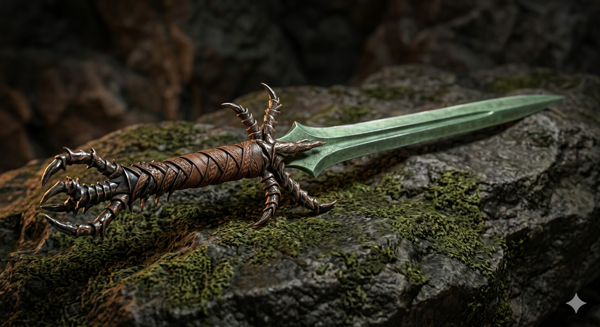

# Phandelver and Below: The Shattered Obelisk

## Lâmina Leroy, <small>_weapon (shortsword), uncommon_</small>

Esta **espada** possui uma lâmina fina e esverdeada e um cabo envolto em couro
trançado que lembra as escamas das patas de um inseto. Quando empunhada por um
bárbaro em combate, ela pulsa com uma energia vibrante e inquietante. Na base da
lâmina, em letras diminutas embora refinadas, é possível se ler um nome: "Leroy
J".

### Sintonização

* requires Attunement by a Barbarian

### Propriedades

* shortsword +1

####

* **Furious Leap.** While your _Rage_ feature is active, you can take a _Bonus
  Action_ to leap up to 20 feet horizontally in a straight line. This movement
  does not expend your current Speed and does not provoke _Opportunity Attacks_.

####

* **Pounce.** If you move at least 10 feet using the _Furious Leap_ and hit a
  creature with this weapon immediately after landing, the attack deals an extra
  1d6 _Force_
  damage.

### Locais

* [Castelo Cragmaw](../../locations/cragmaw_castle.md),
  com [Lhupo](../../casting/npcs/cragmaw/castle/lhupo.md) (RIP)

### Referências

* [Sessão 11 Barricadas](../../sessions/11_barricadas.md)
  * **espada** encontrada
    no [Castelo Cragmaw](../../locations/cragmaw_castle.md)
    ([Cena 1](../../sessions/11_barricadas.md#cena-1-altar))

####

* [Sessão 12 Gundren](../../sessions/12_gundren.md)
  * [Ralf](../../casting/pcs/ralf.md) se sintoniza com **espada**
    ([Cena 4](../../sessions/12_gundren.md#cena-4-partida)) 
