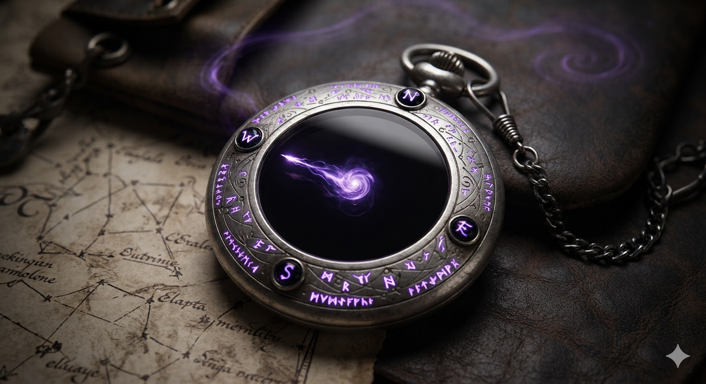

# Phandelver and Below: The Shattered Obelisk

## Bússola do Vazio, <small>_wondrous item, uncommon_</small>

Este dispositivo tem o tamanho de um relógio de bolso é feito de prata escovada
e obsidiana polida, gravado com runas élficas brilhantes. Em vez de ponteiros
mecânicos, uma minúscula faísca de energia psíquica violeta flutua no centro.
 

### Sintonização

* requires Attunement by a Soulknife Rogue

### Propriedades

####

* **Planar Needle.** The psychic spark inside the compass always points toward
  the nearest planar rift or the safest and most direct route of escape from
  your current location or combat encounter. You have Advantage on Wisdom
  (Survival)
  checks made to navigate or find paths out of dangerous areas.

####

* **Extended Blades.** When you use your Psychic Blades feature to make a ranged
  attack, the normal and long range of the blades increases by 30 feet.

####

* **Astral Step.** When you take the Disengage action using your Cunning Action
  feature, you can teleport up to 30 feet to an unoccupied space you can see.
  Once you use this benefit, you can’t do so again until you finish a Long Rest.

####

* **Flickerback Beacon.** When you reach level 5 in the Rogue class, you can use a
  Bonus Action to expend one Psionic Energy die and roll it. You teleport a
  number of feet equal to 5 times the number rolled to an unoccupied space you
  can see, leaving a shimmering psychic echo behind. Until the end of your next
  turn, you can use your Reaction to instantly swap places with that echo,
  causing it to vanish.

[//]: # (### Locais)
[//]: # ()
[//]: # (* {Local}, {detalhe})

[//]: # (### Referências)
[//]: # ()
[//]: # (* [Sessão {X} {Título}])
[//]: # (  * {detalhe} &#40;[Cena {X}]&#41;)
