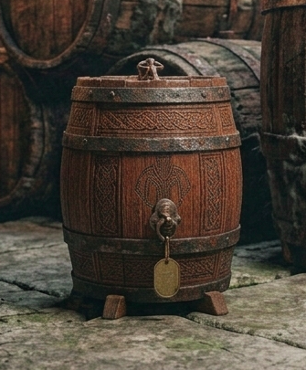

# Phandelver and Below: The Shattered Obelisk

## Barril de Aguardente Anão

<!-- @formatter:off -->

<!-- @formatter:on -->

Um dos barris entre os demais chama a atenção, não pelo tamanho, pelo contrário,
já que é um barril pequeno, mas feito com madeira de carvalho de alta qualidade
e finamente trabalhada por anões. Ele está cheio e o líquido em seu interior
exala um odor, ao mesmo tempo, pungente e adocicado, como o de um bom
aguardente.

Os goblins provavelmente o menosprezaram por seu tamanho e por não saber
valorizar sua qualidade.
 

### Locais

* [Castelo Cragmaw](../../locations/cragmaw_castle.md), armazém 

### Referências

* [Sessão 10 Castelo](../../sessions/10_castelo.md)
  * **barril** encontrado
    no [Castelo Cragmaw](../../locations/cragmaw_castle.md)
    ([Cena 2](../../sessions/10_castelo.md#cena-2-faelar))
