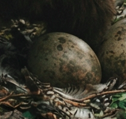

# Phandelver and Below: The Shattered Obelisk

## Ovo de Owlbear

<!-- @formatter:off -->

<!-- @formatter:on -->

:construction: {Texto}
 

### Locais

* [Floresta Neverwinter](../../locations/neverwinter_wood.md), encontrado

### Referências

* [Sessão 7 Floresta](../../sessions/07_floresta.md)
  * Ralf leva um **ovo** da owlbear
    ([Cena 3](../../sessions/07_floresta.md#cena-3-owlbear))

####

* [Sessão 8 Venomfang](../../sessions/08_venomfang.md)
  * [Reidoth](../../casting/npcs/thundertree/reidoth.md) dá dicas de cuidados
    com o **ovo**
    ([Cena 2](../../sessions/08_venomfang.md#cena-2-druida))

[//]: # (####)
[//]: # ()
[//]: # (* [Sessão {X} {Título}])
[//]: # (  * {detalhe} &#40;[Cena {X}]&#41;)
