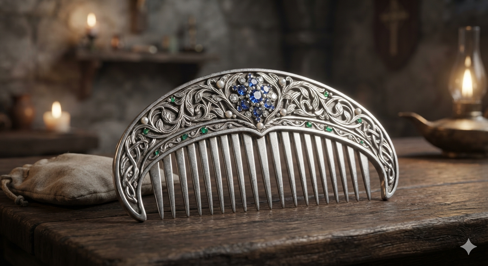

# Phandelver and Below: The Shattered Obelisk

## Pente de Prata

O **pente de prata** cravejado de pedras preciosas
da [Irmã Garaele](../../casting/npcs/phandalin/sister_garaele.md) foi cobiçado
por [Agatha](../../casting/npcs/agatha.md), quando a elfa foi barganhar uma
informação com a banshee.

Depois o grupo deixou o pente com a criatura para conseguir a informação
desejada pela clériga.
 

### Locais

* [Santuário da Fortuna](../../locations/phandalin/luck_shrine.md), pertencente
  a [Irmã Garaele](../../casting/npcs/phandalin/sister_garaele.md)
* [Covil da Agatha](../../locations/agathas_lair.md), deixado
  com [Agatha](../../casting/npcs/agatha.md)

### Referências

* [Sessão 6 Despedidas](../../sessions/06_wyvern_tor.md)
  * grupo recebe o **pente de prata**
    de [Irmã Garaele](../../casting/npcs/phandalin/sister_garaele.md)
    ([Cena 2](../../sessions/06_wyvern_tor.md#cena-2-despedidas))

####

* [Sessão 7 Wyvern Tor](../../sessions/07_floresta.md)
  * grupo deixa o **pente de prata** com [Agatha](../../casting/npcs/agatha.md)
    ([Cena 2](../../sessions/07_floresta.md#cena-2-agatha))

[//]: # (####)
[//]: # ()
[//]: # (* [Sessão {X} {Título}])
[//]: # (  * {detalhe} &#40;[Cena {X}]&#41;)
