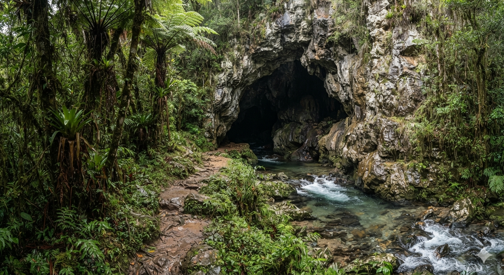

# Phandelver and Below: The Shattered Obelisk

## Esconderijo Cragmaw

_[_Texto_]_ :construction:

### Personagens

* [Klarg](../casting/npcs/cragmaw/klarg.md) (RIP), antigo chefe local
* [Yeemik](../casting/npcs/cragmaw/yeemik.md), novo líder local
* goblins
* lobos

### Organizações

* [Cragmaw Goblins](../organizations/cragmaw_goblins.md), ocupantes

### Locais

* [Estrada Triboar](triboar_trail.md)
  * trilha para o esconderijo fica há um dia de viagem a leste
    de [Phandalin](phandalin.md)
  * o esconderijo fica a cerca de 1 milha ao norte da estrada

### Referências

* [Sessão 1 Goblins](../sessions/01_goblins.md)
  * grupo encontra e explora o **Esconderijo Cragmaw**
    ([Cenas 2 a 5](../sessions/01_goblins.md#cena-2-caverna))
  * grupo derrota [Klarg](../casting/npcs/cragmaw/klarg.md) em combate
    ([Cena 5](../sessions/01_goblins.md#cena-5-klarg))

####

* [Sessão 2 Phandalin](../sessions/02_phandalin.md)
  * grupo liberta [Sildar](../casting/npcs/sildar_hallwinter.md)
    ([Cena 2](../sessions/02_phandalin.md#cena-2-troca))
