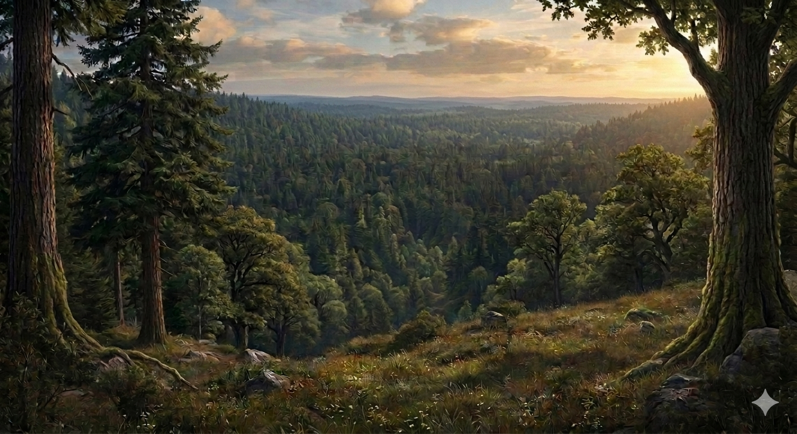

# Phandelver and Below: The Shattered Obelisk

## Floresta Neverwinter

:construction: {Texto}
 

[//]: # (### Personagens)
[//]: # ()
[//]: # (* {Personagem}, {detalhe})

[//]: # (### Organizações)
[//]: # ()
[//]: # (* {Organização}, {detalhe})

### Locais

* [Castelo Cragmaw](cragmaw_castle.md)
  * sede dos [Cragmaw Goblins](../organizations/cragmaw_goblins.md)
  * localização exata desconhecido

####

* [Covil da Agatha](agathas_lair.md)
  * localização indicada
    pela [Irmã Garaele](../casting/npcs/phandalin/sister_garaele.md)
  * próximo a [Conyberry](conyberry.md)

### Referências

* [Sessão 2 Phandalin](../sessions/02_phandalin.md)
  * [Flip](../casting/npcs/cragmaw/flip.md) diz que
    o [Castelo Cragmaw](cragmaw_castle.md) fica na **Floresta Neverwinter**
    ([Cena 4](../sessions/02_phandalin.md#cena-4-interrogatório))
  * [Daran](../casting/npcs/phandalin/daran_edermath.md) diz que
    o [Castelo Cragmaw](cragmaw_castle.md) fica na **Floresta Neverwinter**
    ([Cena 9](../sessions/02_phandalin.md#cena-9-pomar-edermath))

####

* [Sessão 5 Perda](../sessions/05_perda.md)
  * [Droop](../casting/npcs/cragmaw/droop.md) diz que
    o [Castelo Cragmaw](cragmaw_castle.md) fica na **Floresta Neverwinter**
    ([Cena 2](../sessions/05_perda.md#cena-2-perda))
  * [Irmã Garaele](../casting/npcs/phandalin/sister_garaele.md) diz que
    o [Covil da Agatha](agathas_lair.md) fica na **Floresta Neverwinter**
    ([Cena 4](../sessions/05_perda.md#cena-4-irmã-garaele))

####

* [Sessão 6 Wyvern Tor](../sessions/06_wyvern_tor.md)
  * [Irmã Garaele](../casting/npcs/phandalin/sister_garaele.md) indica como
    encontrar o [Covil da Agatha](agathas_lair.md) na **Floresta Neverwinter**
    ([Cena 2](../sessions/06_wyvern_tor.md#cena-2-despedidas))

####

* [Sessão 7 Floresta](../sessions/07_floresta.md)
  * [Brughor](../casting/npcs/cragmaw/brughor.md) indica a localização
    do [Castelo Cragmaw](cragmaw_castle.md) na **Floresta Neverwinter**
    ([Cena 1](../sessions/07_floresta.md#cena-1-brughor))
  * grupo entra na **Floresta Neverwinter** para encontrar
    o [Covil da Agatha](agathas_lair.md)
    ([Cena 2](../sessions/07_floresta.md#cena-2-agatha))
  * grupo procura pelo [Castelo Cragmaw](cragmaw_castle.md) na **Floresta
    Neverwinter**
    ([Cena 3 a 4](../sessions/07_floresta.md#cena-3-owlbear))
