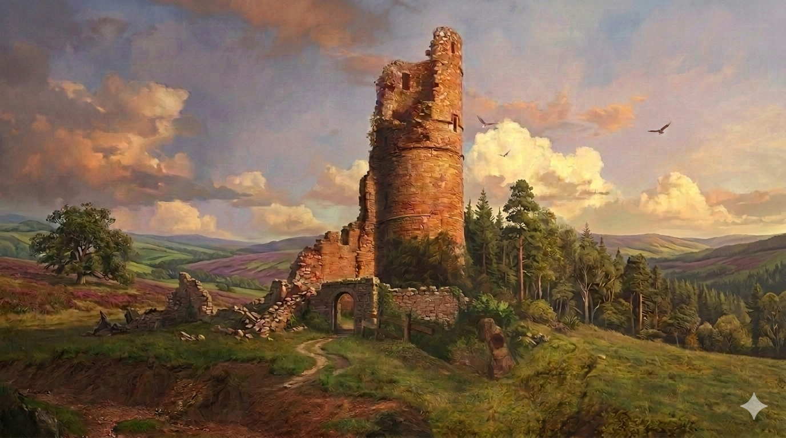

# Phandelver and Below: The Shattered Obelisk

## Poço da Velha Coruja

:construction: {Texto}
 

### Personagens

* [Hamun Kost](../casting/npcs/hamun_kost.md), necromante

[//]: # (### Organizações)
[//]: # ()
[//]: # (* {Organização}, {detalhe})

[//]: # (### Locais)
[//]: # ()
[//]: # (* {Local})
[//]: # (  * {detalhe})

### Referências

* [Sessão 6 Wyvern Tor](../sessions/06_wyvern_tor.md)
  * grupo conhece [Hamun](../casting/npcs/hamun_kost.md), o necromante, no
    **Poço da Velha Coruja**
    ([Cena 4](../sessions/06_wyvern_tor.md#cena-4-necromante))

####

* [Sessão 7 Floresta](../sessions/07_floresta.md)
  * grupo não encontra [Hamun](../casting/npcs/hamun_kost.md) ao passar
    novamente pelo **Poço da Velha Coruja**
    ([Cena 1](../sessions/07_floresta.md#cena-1-brughor))
