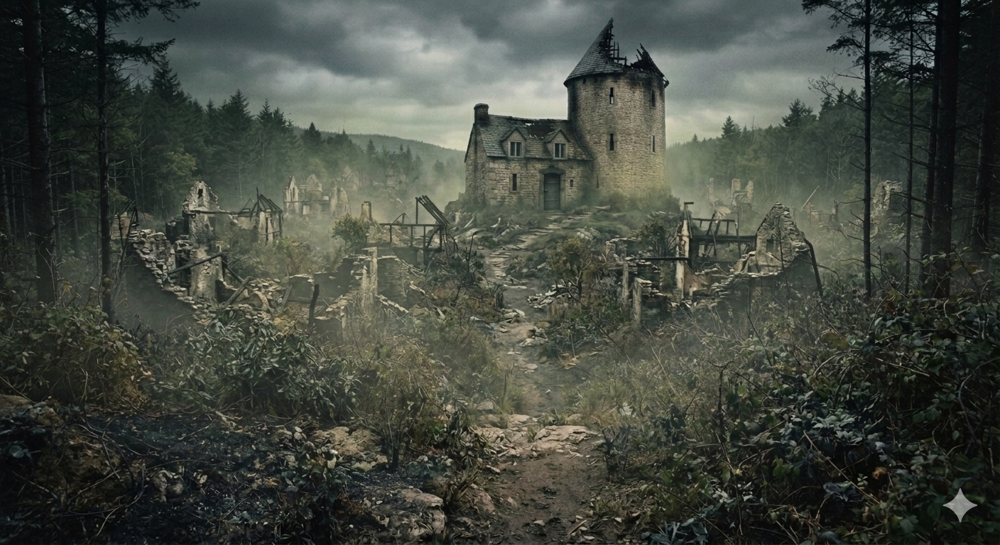

# Phandelver and Below: The Shattered Obelisk

## Thundertree

Ao se aproximam da vila, percebem que aparenta estar abandonada, com suas ruas e
casas tomadas pela vegetação, sufocadas por trepadeiras e arbustos. Algumas
poucas construções preservam telhados precários, mas a maioria já desabou há
muito tempo com seus interiores expostos às intempéries.

Mais a frente, no meio do povoado, ergue-se uma colina íngreme, sobre a qual se
destaca uma torre de pedra com o telhado parcialmente desabado e uma casa anexa.

:construction:

### Personagens

* [Iarno 'Glasstaff' Albrek](../casting/npcs/iarno_albrek.md), prisioneiro
* [dragão](../casting/npcs/thundertree/dragao.md), ocupante da torre
* [druida]
* cultistas, ocupantes

[//]: # (### Organizações)
[//]: # ()
[//]: # (* {Organização}, {detalhe})

[//]: # (### Locais)
[//]: # ()
[//]: # (* {Local})
[//]: # (  * {detalhe})

### Referências

* [Sessão 7 Floresta](../sessions/07_floresta.md)
  * Bia avista a vila de **Thundertree** a distância
    ([Cena 4](../sessions/07_floresta.md#cena-4-buscas))
  * grupo chega a vila de **Thundertree**
    ([Cena 5](../sessions/07_floresta.md#cena-5-arrependido))

[//]: # (####)
[//]: # ()
[//]: # (* [Sessão {X} {Título}])
[//]: # (  * {detalhe} &#40;[Cena {X}]&#41;)