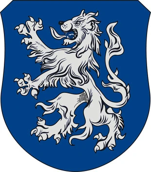

# Phandelver and Below: The Shattered Obelisk

## Lionshield Coster

<!-- @formatter:off -->

<!-- @formatter:on -->

_[Texto]_ :construction:
 

### Membros

* [Linene Graywind](../characters/npcs/phandalin/linene_graywind.md),
  representante local em [Phandalin](../locations/phandalin.md)

### Locais

* [Posto da Lionshield Coster](../locations/phandalin/lionshield_coster_post.md),
  em [Phandalin](../locations/phandalin.md)

### Referências

* [Sessão 1 Goblins](../sessions/01_goblins.md)
  * [Cena 5](../sessions/01_goblins.md#cena-5-klarg)
    * brasão está em boa parte da carga roubada
* [Sessão 2 Phandalin](../sessions/02_phandalin.md)
  * [Cena 10](../sessions/02_phandalin.md#cena-10-lionshield-coster)
    * grupo visita o posto comercial
