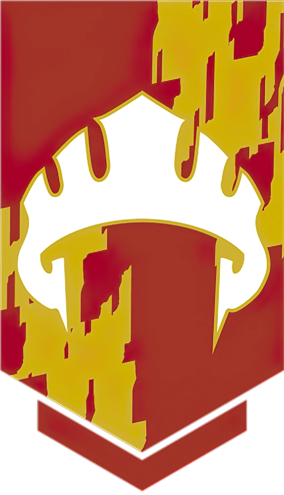

# Phandelver and Below: The Shattered Obelisk

## Lords' Alliance

<!-- @formatter:off -->

<!-- @formatter:on -->

_[Texto]_ :construction:
 

### Membros

* [Sildar Hallwinter](../characters/npcs/sildar_hallwinter.md), representante
  em [Phandalin](../locations/phandalin.md)
* [Iarno Albrek](../characters/npcs/iarno_albrek.md), representante
  em [Phandalin](../locations/phandalin.md) desaparecido

[//]: # (### Locais)
[//]: # ()
[//]: # (* _[Local]_)
[//]: # (  * _[detalhe]_)

### Referências

* [Sessão 0 Prólogo](../sessions/00_prologo.md)
  * [Cena 1](../sessions/00_prologo.md#cena-1-trabalho)
    * brasão nos trajes de [Sildar](../characters/npcs/sildar_hallwinter.md)

####
* [Sessão 2 Phandalin](../sessions/02_phandalin.md)
  * [Cena 9](../sessions/02_phandalin.md#cena-9-pomar-edermath)
    * [Daran](../characters/npcs/phandalin/daran_edermath.md) fica 
      satisfeito que tenham mandado [Sildar](../characters/npcs/sildar_hallwinter.md)