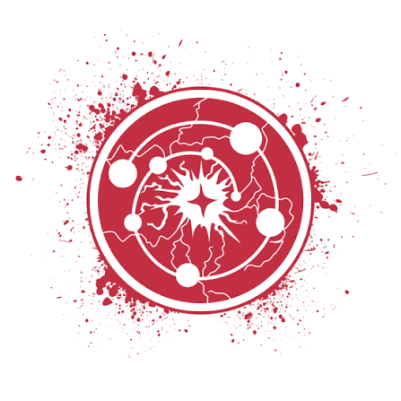

# Phandelver and Below: The Shattered Obelisk

## Red Wizards

<!-- @formatter:off -->

<!-- @formatter:on -->

_[_Texto_]_ :construction:
 

### Membros

* [Hamun Kost](../casting/npcs/hamun_kost.md), necromante

[//]: # (### Locais)
[//]: # ()
[//]: # (* _[_Local_]_)
[//]: # (  * _[_detalhe_]_)

[//]: # (### Relações)
[//]: # ()
[//]: # (* _[_Organização_]_, _[_detalhe_]_)

### Referências

* [Sessão 6 Wyvern Tor](../sessions/06_wyvern_tor.md)
  * Professor reconhece [Hamun Kost](../casting/npcs/hamun_kost.md) como um
    **Red Wizard**
    ([Cena 4](../sessions/06_wyvern_tor.md#cena-4-necromante))
