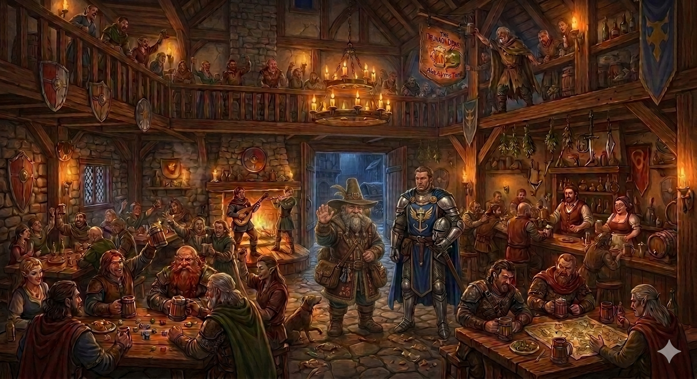
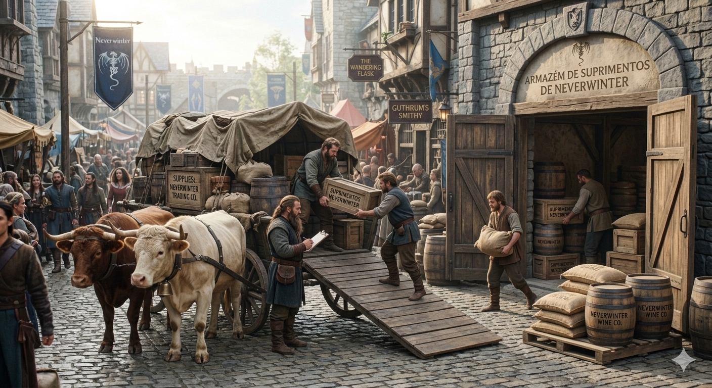
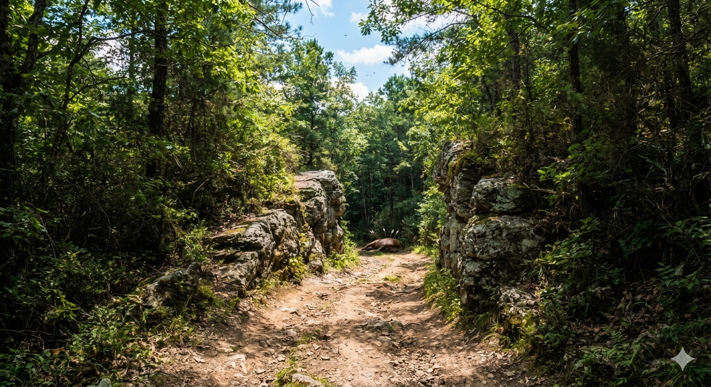

# Phandelver and Below: The Shattered Obelisk

## Sessão 0 - Prólogo

_data_ : 2026-03-16 \
_próxima_: [Sessão 1 - Goblins](01_goblins.md)

### Cenas

* [Cena 1 - Trabalho](#cena-1---trabalho)
* [Cena 2 - Partida](#cena-2---partida)
* [Cena 3 - Corpos](#cena-3---corpos)

### Participações

* [Gundren Rockseeker](../characters/npcs/gundren_rockseeker.md)
* [Sildar Hallwinter](../characters/npcs/sildar_hallwinter.md)

### Cenários

* [Neverwinter](../locations/neverwinter.md)
  * uma taverna
  * um depósito de mercadorias
* [Phandalin](../locations/phandalin.md)
  * mencionada
* [Triboar Trail](../locations/triboar_trail.md)
  * viagem

---

### Cena 1 - Trabalho

Um antigo amigo, [Gundren Rockseeker](../characters/npcs/gundren_rockseeker.md),
um anão mercador, sabendo que o grupo estava
em [Neverwinter](../locations/neverwinter.md), mandou um recado combinando um
encontro em uma conhecida taverna.

No horário combinado, o grupo já se encontra na taverna quando vem entrar o anão
que já conhecem acompanhando de um homem alto, já de meia-idade, mas ainda
forte. O homem aparenta ser um militar e carrega uma insignia
da [Lord's Alliance](../organizations/lords_alliance.md).

O anão logo os localiza na taverna cheia e, com um grande sorriso e os braços
abertos, se aproxima. Cumprimentando o grupo, logo apresenta seu
amigo, [Sildar Hallwinter](../characters/npcs/sildar_hallwinter.md), que
retribui com um aceno só sóbrio, mas permanece calado.

Após uma troca inicial de amenidades, o anão traz o ponto que o motivou seu
encontro com o grupo:
ele está procurando um grupo de pessoas que possa fazer a escolta de uma carga
de provisões que ele precisa levar até uma cidade
próxima, [Phandalin](../locations/phandalin.md).

Segundo ele, é para ser uma viagem bastante tranquila de 4 ou 5 dias, e que só
está mesmo buscando esta ajuda por muita insistência do amigo Sildar, que é
"preocupado demais". Ele mesmo já fez este trajeto inúmeras vezes sem nenhum
problema, mas que só porque tem surgindo boatos, que julga exagerados, de alguns
ataques isolados de bandoleiros está todo mundo surtando. Eles pretendem sair na
manhã seguinte logo cedo, e ele está oferecendo um pagamento de 5 gp para cada
um, a serem pagos chegando ao destino.

O grupo aceita o pagamento e combinam os detalhes do encontro e partida para a
manhã seguinte.

Em um dado momento, Sildar se volta para Gundren e cochicha algo em seu ouvido.
Sapão ouve apenas algo sobre outro compromisso. Gundren, sobressaltado, se
desculpa pela pressa e partem, alegando que precisam acertar ainda alguns
preparativos para a viagem.

---

### Cena 2 - Partida

Na manhã seguinte, o grupo está esperando no local combinado para a partida
quando o Gundren e Sildar chegam meio apresados, trazendo dois cavalos.

Gundren explica que houve uma pequena alteração nos planos e que ele e o amigo
precisarão chegar em Phandalin mais cedo, e por isso irão a cavalo na frente.
Com isso esperam chegar ao destino na manhã do quarto dia.

O grupo demonstra alguma preocupação em viajarem sós, mas Gundren, sempre
otimista, reafirma que não é para haver nenhum problema e que espera
encontrá-los em Phandalin dali a cinco dias. Pelo "inconveniente" o anão aumenta
o pagamento prometido para 10 gp para cada. A carga deverá ser entrega na Venda
da Barthen, onde receberão o pagamento, e eles, Gundren e Sildar deverão estar
instalados na Hospedaria Stonehill.

O grupo é apresentado à carroça puxada por dois grandes bois, recebem instruções
básicas de como guiá-los e partem pouco depois de Gundren e Sildar.

---

### Cena 3 - Corpos

Após três dias de viagem tranquilos pela movimentada High Road, o grupo inicia o
quarto dia saindo da estrada principal para entrar
na [Triboar Trail](../locations/triboar_trail.md).

Quando estão próximos do meio-dia, antes de uma curva os bois se agitam e param,
se recusando a seguir. O grupo parando para escutar atentamente ouve um leve
farfalhar da vegetação do lado esquerdo da estrada. O Professor manda sua coruja
fazer um reconhecimento aéreo, mas não percebe nada de estranho.

Ralf se adianta sorrateiramente pela estrada e ao ultrapassar a curva vê dois
cavalos caídos, aparentemente mortos no meio da estrada. Chama os companheiros
que avançam cautelosos, com Sapão mais para trás trazendo os bois com a carroça
pelas rédeas.

Quando se aproximam mais, agora podem reconhecer os cavalos que levavam Gundren
e Sildar. Sem muito tempo para investigar a cena, uma flecha passa zunindo
próxima a Ralf, revelando um goblin escondido na vegetação.

