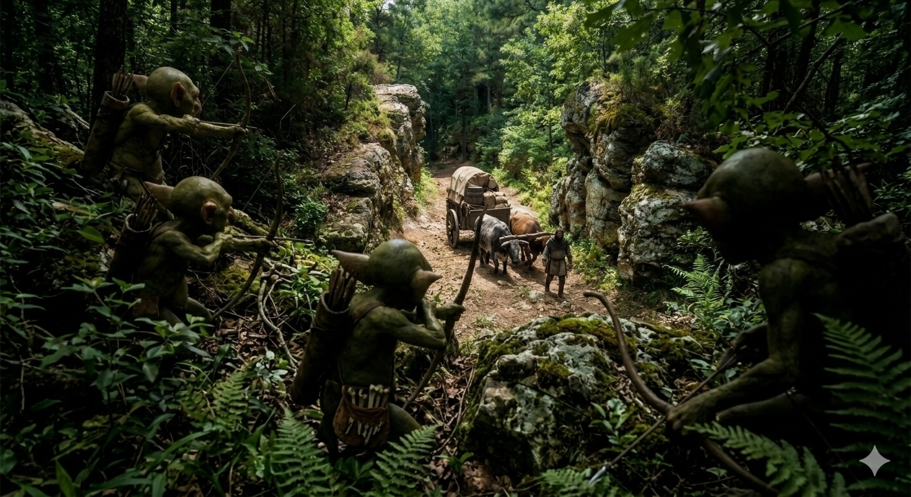
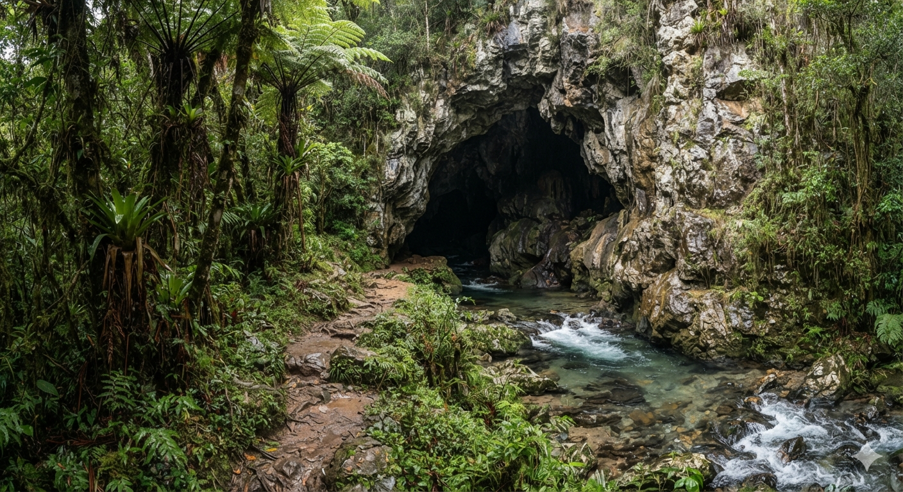
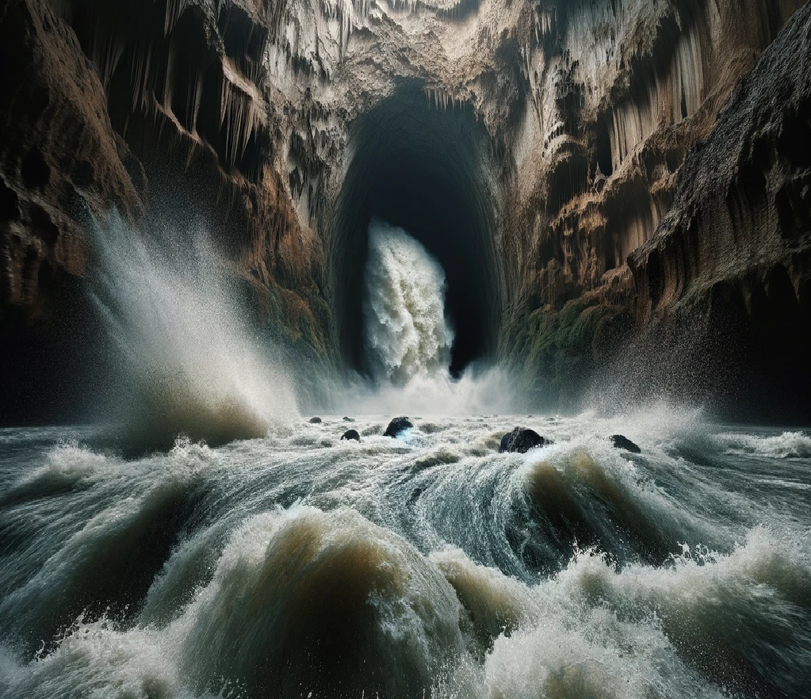

# Phandelver and Below: The Shattered Obelisk

## Sessão 1 - Goblins

_data_ : 2026-03-31 \
_anterior_ : [Sessão 0 - Prólogo](00_prologo.md) \
_próxima_ : [Sessão 2 - Phandalin]

### Cenas

* [Cena 1 - Emboscada](#cena-1---emboscada)
* [Cena 2 - Caverna](#cena-2---caverna)
* [Cena 3 - Água!](#cena-3---água)
* [Cena 4 - Negociação](#cena-4---negociação)
* [Cena 5 - Klarg!](#cena-5---klarg)

### Participações

* goblins
* lobos
* [Yeemik, o goblin](../characters/npcs/cragmaw/yeemik_goblin.md)
  * candidato a líder
* [Sildar Hallwinter](../characters/npcs/sildar_hallwinter.md)
  * prisioneiro
* [Gundren Rockseeker](../characters/npcs/gundren_rockseeker.md)
  * mencionado
* [Klarg, o bugbear](../characters/npcs/cragmaw/klarg_bugbear.md)
  * líder

### Cenários

* [Triboar Trail](../locations/triboar_trail.md)
  * emboscada
* [Esconderijo Cragmaw](../locations/cragmaw_hideout.md)

---

### Cena 1 - Emboscada

Ao se aproximarem dos cavalos mortos, o grupo pode identificar que realmente são
aqueles usados [Gundren](../characters/npcs/gundren_rockseeker.md)
e [Sildar](../characters/npcs/sildar_hallwinter.md), mas logo são surpreendidos
por uma flecha que passa zunindo próxima a Ralf.

Da direção de onde a flecha veio se revela um goblin que estava escondido na
vegetação em um local elevado. Quase que simultaneamente ouve-se um grito, em
goblin, que os aventureiros não compreendem, mas que soa como um xingamento.

Em seguida dois outros goblins saem dos arbustos, um de cada lado da estrada e
correm na direção de Ralf que está a frente. O primeiro dos goblins está
xingando em direção ao que disparou a flecha, se mostrando bastante contrariado.

O combate inicia. Professor chega cair, mas com a ajuda de Sapão, logo voltou a
ativa. Quando os dois goblins com cimitarras são derrotados, aquele das flechas
se vira e foge em no meio do mato.

Ralf chega a correr na sua direção, mas este desapareceu na vegetação densa.

Enquanto isso, Sapão e Professor, investigam o local, encontrado as bolsas dos
cavalos vazias e uma caixa de mapas, também vazia, caída próximo. Em um dos
goblins caídos, encontram um papel amarrotado com garranchos em goblin, que não
entendem, e um desenho tosco de um anão com um chapelão.

---

### Cena 2 - Caverna

Sapão, ao investigar o rastro deixado pelo goblin fugitivo, encontra uma trilha.
Pelos rastros, calcula que cerca de uma dúzia de goblins têm usado a trilha com
frequência.

Além das pegadas mais leves dos goblins, dois pares de pegadas mais profundas e
irregulares sugerem que duas criaturas maiores passaram por esta mesma trilha
bem recentemente.

Seguindo a trilha, evitam uma armadilha tosca, e chegam a entrada de uma caverna
na base da montanha a cerca de uma milha do local da emboscada. Um riacho raso
flui da entrada da caverna e é margeado por densos arbustos. Um caminho estreito
e seco entra na caverna à direita do riacho.

Ao se aproximarem, deparam com dois goblins que estão distraídos no posto de
guarda.

Há um momento de tensão entre os dois grupos, com trocas de ameaças. Os goblins
exigem quem os invasores devem ir embora, mas o grupo insiste que estão
procurando por um anão que pode estar com eles. Enquanto discutem os goblins
fogem para dentro da caverna.

A coruja do Professor entra na caverna e vê um dos goblins fugindo para o
interior, enquanto o outro foi para uma sala lateral onde está soltando três
lobos presos a correntes.

O grupo entra e briga com este goblin e com os lobos, matando o goblin e lobo
que já estava liberto. Os outros dois permanecem presos, e o grupo percebe que
estando assim, os lobos embora rosnando não conseguem atacar quem estiver na
entrada do canil.

---

### Cena 3 - Água!

O grupo entre um pouco mais na caverna que sobe fazendo uma curva para a
direita. A esquerda há uma passagem cheia de entulho, mas que parece levar a um
patamar mais alto. Mais a frente é possível ver que uma ponte a cerca de 15 pés
unindo passagens a direita e a esquerda.

O riacho que desce pelo túnel abafa os sons da caverna, mas ainda assim é
possível ouvir o som distante e ritmado de batidas como as de um martelo batendo
em pedra.

O teto da caverna é cheio de estalactites, mas é bem alto, dando bastante espaço
para a coruja voar a frente. Ao chegar a curva sobre a ponte, ela volta
rapidamente, alertando o Professor mentalmente: "Água!!!".

Simultaneamente, o grupo ouve o barulho de pedras caindo e rolando, seguido do
rugido de uma cachoeira forte. O grupo consegue correr para fora da caverna a
tempo de escapar por pouco da enxurrada. A água chega a alcançar Ralf, mas ele
consegue se agarrar evitando que fosse arrastado.

---

### Cena 4 - Negociação

O grupo se recupera do susto e entra novamente na caverna cautelosamente. A
coruja segue na frente e avisa sobre um "lago". O grupo vê um goblin espiando do
alto da ponte e fugindo para dentro a direita.

Sapão escala a parede da caverna alcançando a ponte e jogando uma corda para
ajudar seus amigos a subir. A coruja, ainda a frente, vê que para a direita
goblins e lobos estão de prontidão aguardando.

Se esgueirando para o lado esquerdo da ponte, Ralf vê que há outra sala com
goblins, mas antes que a luz de sua lanterna possa revelar todo o espaço e ver
quantos estão ali, uma voz que parece ser a de um líder ordena que pare, caso
contrário "[Yeemik](../characters/npcs/cragmaw/yeemik_goblin.md) matar humano!".

Ralf propõe pagar um resgate pelo "humano", ao que o líder pede 50 gp, mas Ralf
diz que não tem este dinheiro todo e oferece 5 gp. O líder fala, então, que
"libertar humano, se trazer cabeça
de [Klarg](../characters/npcs/cragmaw/klarg_bugbear.md)". Nisso uma voz humana,
que parece ser a de Sildar, grita dizendo que não devem confiar neles, "é mais
importante resgatarem Gundren". Fica, então, claro que o anão não está com
eles.

Discutindo com Yeemik, Ralf entende que Klarg é o líder do grupo, mas que eles
estão insatisfeitos com sua liderança e gostariam de tomar seu lugar.

Sabendo que Gundren não está do lado esquerdo, o grupo decide investigar o lado
esquerdo da caverna. Enquanto isso o Professor envia sua coruja para vigiar o
lado direito, e podem enfim saber que a sala tem cinco goblins e um humano, que
está bastante ferido.

---

### Cena 5 - Klarg!

A passagem do lado direito leva o grupo a uma sala com duas piscinas de água,
uma delas agora vazia, deparam com dois goblins e dois lobos. Eles brigam e
vencem estes goblins, embora um deles tenha conseguido fugir para um outra sala
mais acima.

Ao avançarem para esta próxima sala, deparam com apenas um lobo, que rosna para
eles em um canto. O fundo da sala está cheio de caixas e sacos de suprimentos
diversos.

Quando Ralf avança para atacar o lobo, sai de trás de algumas caixas um bugbear
que logo o ataca, tentando intimidar o grupo "Klarg ordena que invasores vão
embora!".

A princípio Klarg parece estar sozinho, mas após bradar que seus "Lacaios
covardes expulsem invasores da caverna de Klarg!", três goblins relutantes
deixam seus esconderijos, se juntam a defesa de seu líder.

Sapão e Professor chegam a cair em combate, mas conseguem se recuperam e juntos
ferir bastante o bugbear - que estava tendo bastante azar nas investidas
de sua maça de espinhos.

O goblins, vendo que seu líder está prestes a cair, fogem. E, pouco depois, um
golpe fatal de Ralf liquida com o bugbear e outro do Professor elimina seu lobo.

Investigando a sala, não há sinal do anão. Apenas caixas e sacos de provisões de
inúmeras caravanas saqueadas (um brasão de um escudo com um leão azul,
identifica a maioria da carga como sendo
da [Lionshield Coster](../organizations/lionshield_coster.md)).

O grupo bastante ferido e esgotado precisa decidir o que fazer: ir para o
resgate de Sildar? ou recuar para se recuperar?