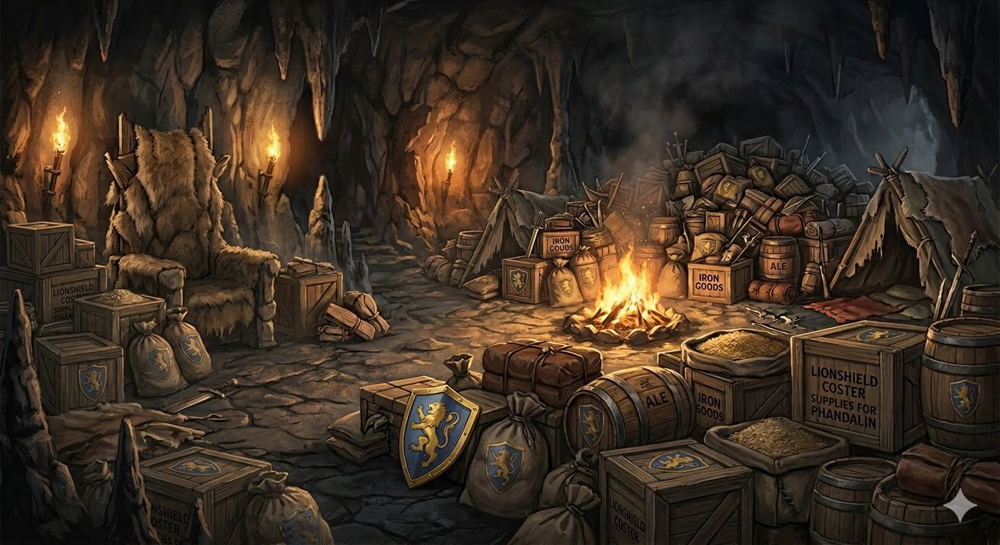
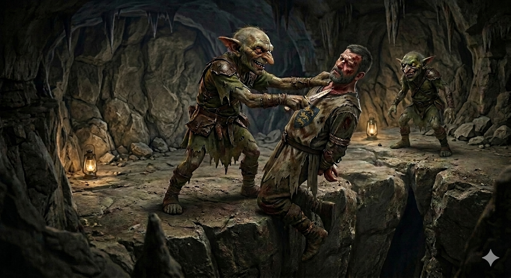

# Phandelver and Below: The Shattered Obelisk

## Sessão 2 Phandalin

_data_ : 2026-04-13 \
_anterior_ : [Sessão 1 Goblins](01_goblins.md) \
_próxima_ : [Sessão 3 Redbrands]

### Cenas

* [Cena 1 Decisões](#cena-1-decisões)
* [Cena 2 Troca](#cena-2-troca)
* [Cena 3 Sildar](#cena-3-sildar)
* [Cena 4 Interrogatório](#cena-4-interrogatório)
* [Cena 5 Phandalin](#cena-5-phandalin)
* [Cena 6 Conversas](#cena-6-conversas)

### Participações

* [Yeemik, o goblin](../characters/npcs/cragmaw/yeemik_goblin.md)
* [Sildar Hallwinter](../characters/npcs/sildar_hallwinter.md)
* goblins
* lobos

#### Mencionados

* [Klarg, o bugbear](../characters/npcs/cragmaw/klarg_bugbear.md) (RIP)
* [Gundren Rockseeker](../characters/npcs/gundren_rockseeker.md)
* [Grol, o rei](../characters/npcs/cragmaw/grol_rei.md)
* [Spider](../characters/npcs/spider.md)

### Cenários

* [Esconderijo Cragmaw](../locations/cragmaw_hideout.md)

#### Mencionados

* [Castelo Cragmaw](../locations/cragmaw_castle.md)

---

### Cena 1 Decisões

Após derrotarem [Klarg](../characters/npcs/cragmaw/klarg_bugbear.md), o grupo
investiga a sala onde estão guardados os carregamentos roubados
pelos [Cragmaw](../organizations/cragmaw_goblins.md):
muitas caixas e sacos de suprimentos, com o símbolo
da [Lionshield Coster](../organizations/lionshield_coster.md).

Em meio às caixas também encontram um baú destrancado contendo cerca de duas mil
moedas (cerca de uma a cada dez é sp, sendo a maioria cp), duas poções de cura,
e uma estatueta de jade na forma de um pequeno sapo com olhos dourados, que Ralf
leva no bolso. Mas nenhum sinal do
anão [Gundren](../characters/npcs/gundren_rockseeker.md).

Após Sapão e Professor tomarem as poções de cura e se recuperarem, se preparam
para levar o corpo de Klarg
para [Yeemik](../characters/npcs/cragmaw/yeemik_goblin.md) do outro lado da
caverna.

Sapão houve rosnados e sons de ossos triturados vindos do canto da sala que
corresponde ao topo da chaminé do canil, de onde vê os dois lobos restantes
comendo alguma coisa. Chegam a pensar que Gundren estaria ali, mas ao chamarem
não obtêm nenhuma resposta, exceto rosnados. Optam por ignorá-los, e seguem para
o outro lado da caverna.

---

### Cena 2 Troca

Ao se aproximarem da câmara a oeste da caverna, ouvem que os goblins parecem já
estar comemorando por antecipação.

Chegando na entrada, são saldados
por [Yeemik](../characters/npcs/cragmaw/yeemik_goblin.md) e seus companheiros,
que urram de alegria ao ver o corpo
de [Klarg](../characters/npcs/cragmaw/klarg_bugbear.md). Há um impasse quando o
grupo pede que [Sildar](../characters/npcs/sildar_hallwinter.md)
seja liberto: Yeemik quer um pagamento de 50 gp, ou "humano morre!".

Perguntado sobre o anão, Yeemik informa que Klarg tinha ordens
de [Grol, o rei](../characters/npcs/cragmaw/grol_rei.md), para
capturar [Gundren](../characters/npcs/gundren_rockseeker.md) e enviá-lo
ao [Castelo Cragmaw](../locations/cragmaw_castle.md). E ainda acrescenta que o
rei estaria atendendo a um pedido de um tal
de [Spider](../characters/npcs/spider.md), que ele não conhece.

Após alguma discussão sobre o valor do resgate pedido, Ralf volta a câmara de
Klarg de onde traz um tanto de moedas que enganam Yeemik e seu grupo. Ao jogar o
saco de moedas dentro sala, o goblin joga Sildar do patamar, caindo
desacordando. "Intrusos poder levar humano nojento!"

Em meio a risadas dos goblins, Ralf entra na sala e arrasta Sildar para fora.
Após curar Sildar, o grupo sai às pressas da caverna.

---

### Cena 3 Sildar

_[Imagem]_

_[Texto]_

:construction:

---

### Cena 4 Interrogatório

_[Imagem]_

_[Texto]_

:construction:

---

### Cena 5 Phandalin

_[Imagem]_

_[Texto]_

:construction:

---

### Cena 6 Conversas

_[Imagem]_

_[Texto]_

:construction:
