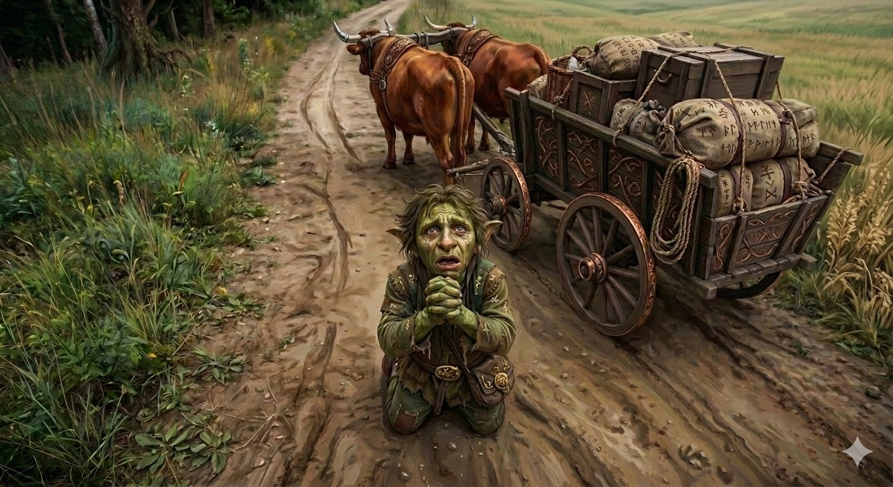
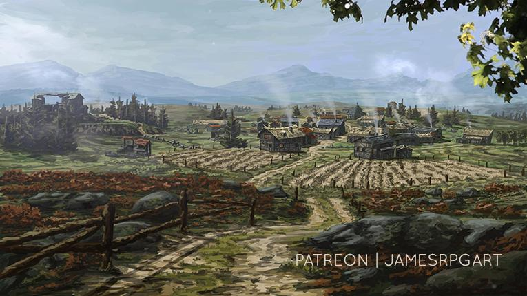

# Phandelver and Below: The Shattered Obelisk

## Sessão 2 Phandalin

_data_ : 2026-04-13 \
_anterior_ : [Sessão 1 Goblins](01_goblins.md) \
_próxima_ : [Sessão 3 Redbrands]

### Cenas

* [Cena 1 Decisões](#cena-1-decisões)
* [Cena 2 Troca](#cena-2-troca)
* [Cena 3 Sildar](#cena-3-sildar)
* [Cena 4 Interrogatório](#cena-4-interrogatório)
* [Cena 5 Phandalin](#cena-5-phandalin)
* [Cena 6 Venda da Barthen](#cena-6-venda-da-barthen)
* [Cena 7 Hospedaria Stonehill](#cena-7-hospedaria-stonehill)
* [Cena 8 Pomar Edermath](#cena-8-pomar-edermath)
* [Cena 9 Lionshield Coster](#cena-9-lionshield-coster)
* [Cena 10 Prefeitura](#cena-10-prefeitura)
* [Cena 11 Ferraria e Carpintaria](#cena-11-ferraria-e-carpintaria)
* [Cena 12 Carp](#cena-12-carp)

### Participações

* [Sildar Hallwinter](../characters/npcs/sildar_hallwinter.md)

#### No [Esconderijo Cragmaw](../locations/cragmaw_hideout.md)

* [Yeemik](../characters/npcs/cragmaw/yeemik.md)
* [Flip](../characters/npcs/cragmaw/flip.md)
* goblins
* lobos

#### Em [Phandalin](../locations/phandalin.md)

* [Elmina Barthen](../characters/npcs/phandalin/elmina_barthen.md)
  * [Ander](../characters/npcs/phandalin/ander.md)
  * [Thistle](../characters/npcs/phandalin/thistle.md)

#### Mencionados

* [Gundren Rockseeker](../characters/npcs/gundren_rockseeker.md)
* [Klarg](../characters/npcs/cragmaw/klarg.md) (RIP)
* [Grol](../characters/npcs/cragmaw/grol.md)
* [Spider](../characters/npcs/spider.md)
* [Ruxithid](../characters/npcs/ruxithid.md)

### Cenários

* [Esconderijo Cragmaw](../locations/cragmaw_hideout.md)
* [Phandalin](../locations/phandalin.md)
  * [Venda da Barthen](../locations/phandalin/barthens_provisions.md)

#### Mencionados

* [Castelo Cragmaw](../locations/cragmaw_castle.md)

---

### Cena 1 Decisões

Após derrotarem [Klarg](../characters/npcs/cragmaw/klarg.md), o grupo investiga
a sala onde estão guardados os carregamentos roubados
pelos [Cragmaw](../organizations/cragmaw_goblins.md):
muitas caixas e sacos de suprimentos, com o símbolo
da [Lionshield Coster](../organizations/lionshield_coster.md).

Em meio às caixas também encontram um baú destrancado contendo cerca de duas mil
moedas (cerca de uma a cada dez é sp, sendo a maioria cp), duas poções de cura,
e uma estatueta de jade na forma de um pequeno sapo com olhos dourados, que Ralf
leva no bolso. Mas nenhum sinal do
anão [Gundren](../characters/npcs/gundren_rockseeker.md).

Após Sapão e Professor tomarem as poções de cura e se recuperarem, se preparam
para levar o corpo de Klarg para [Yeemik](../characters/npcs/cragmaw/yeemik.md)
do outro lado da caverna.

Sapão houve rosnados e sons de ossos triturados vindos do canto da sala que
corresponde ao topo da chaminé do canil, de onde vê os dois lobos restantes
comendo alguma coisa. Chegam a pensar que Gundren estaria ali, mas ao chamarem
não obtêm nenhuma resposta, exceto rosnados. Optam por ignorá-los, e seguem para
o outro lado da caverna.

---

### Cena 2 Troca

Ao se aproximarem da câmara a oeste da caverna, ouvem que os goblins parecem já
estar comemorando por antecipação.

Chegando na entrada, são saldados
por [Yeemik](../characters/npcs/cragmaw/yeemik.md) e seus companheiros, que
urram de alegria ao ver o corpo de [Klarg](../characters/npcs/cragmaw/klarg.md).
Há um impasse quando o grupo pede
que [Sildar](../characters/npcs/sildar_hallwinter.md)
seja liberto: Yeemik quer um pagamento de 50 gp, ou "humano morre!".

Perguntado sobre o anão, Yeemik informa que Klarg tinha ordens
de [Grol](../characters/npcs/cragmaw/grol.md), o rei, para
capturar [Gundren](../characters/npcs/gundren_rockseeker.md) e enviá-lo
ao [Castelo Cragmaw](../locations/cragmaw_castle.md). E ainda acrescenta que o
rei estaria atendendo a um pedido de um tal
de [Spider](../characters/npcs/spider.md), que ele não conhece.

Após alguma discussão sobre o valor do resgate pedido, Ralf volta a câmara de
Klarg de onde traz um tanto de moedas que enganam Yeemik e seu grupo. Ao jogar o
saco de moedas dentro sala, o goblin joga Sildar do patamar, caindo
desacordando. "Intrusos poder levar humano nojento!"

Em meio a risadas dos goblins, Ralf entra na sala e arrasta Sildar para fora.
Após curar Sildar, o grupo sai às pressas da caverna.

---

### Cena 3 Sildar

Já fora da caverna, [Sildar](../characters/npcs/sildar_hallwinter.md), salvo do
perigo de morte, mas ainda ferido e desarmado, conta que ele
e [Gundren](../characters/npcs/gundren_rockseeker.md) foram capturados por um
grupo de cerca de uma dúzia de goblins, incluindo uns "goblins estranhos" com
crânios alongados e que tinham armas e olhos com um brilho esverdeado.

Após terem sido capturados, um destes goblins estranhos teria se dirigido a
Sildar e dito algo como "você não ser
quem [Ruxithid](../characters/npcs/ruxithid.md) procurar", e foram embora.

Após serem arrastados para o esconderijo, Gundren foi separado dele e, pelo que
pode entender, ele seria levado para
o [Castelo Cragmaw](../locations/cragmaw_castle.md) a pedido de um
certo [Spider](../characters/npcs/spider.md).

Sobre Gundren, o que sabe é que o ele e seus irmãos estavam há tempos procurando
por uma mina lendária na região, e parece que Gundren teria encontrado um mapa
ou algo do tipo. Ele teme que agora esta informação esteja com os
[Cragmaw](../organizations/cragmaw_goblins.md) e com este Spider.

---

### Cena 4 Interrogatório

De volta a estrada, o grupo surpreende três goblins fugitivos que estão mexendo
na carroça. Os três fogem ao serem surpreendidos, mas um deles é ferido e,
alcançado por Sapão, se rende.
"[Flip](../characters/npcs/cragmaw/flip.md) não quer morrer!"

Interrogado, Flip informa que sabe que
o [Castelo Cragmaw](../locations/cragmaw_castle.md) fica na floresta a nordeste
dali, mas não sabe exatamente onde -
"Só [Klarg](../characters/npcs/cragmaw/klarg.md) sabia". Também menciona os
"goblins estranhos" e diz ter medo deles. Também não sabe quem é Spider, mas já
ouviu falar dele "Tenho medo dele... [Spider](../characters/npcs/spider.md)
mandar em [Grol](../characters/npcs/cragmaw/grol.md)"

Após ser ameaçado é liberado e corre para o mato, sem olhar para trás, por onde
seus companheiros haviam fugido.

---

### Cena 5 Phandalin

A estrada emerge de uma encosta arborizada, e o grupo
avista [Phandalin](../locations/phandalin.md) pela primeira vez. A cidade
consiste em quarenta ou cinquenta construções simples de madeira, algumas
erguidas sobre antigas fundações de pedra.

Ruínas antigas — muros de pedra desmoronados cobertos de hera e sarças — cercam
as casas e lojas mais novas, mostrando que esta deve ter sido uma cidade muito
maior em séculos passados.

A maioria dos edifícios mais novos fica nas laterais da antiga estrada de
carroças, que se alarga formando uma espécie de rua principal lamacenta à medida
que sobe em direção a uma mansão em ruínas na encosta leste da cidade.

### Cena 6 Venda da Barthen

_[Imagem]_ :construction:

É fim da tarde e a cidade parece se preparar para a noite. Logo na entrada na
cidade o grupo vê uma casa comercial, com uma placa onde se lê
"[Venda da Barthen](../locations/phandalin/barthens_provisions.md)". Na frente
da loja, uma jovem e dois adolescentes estão levando as mercadorias para dentro
antes de fechar a loja.

O grupo se apresenta e
conhecem [Elmina Barthen](../characters/npcs/phandalin/elmina_barthen.md) a dona
da loja e seus dois empregados, [Ander](../characters/npcs/phandalin/ander.md)
e [Thistle](../characters/npcs/phandalin/thistle.md). Dizem que estão trazendo
as provisões enviadas
por [Gundren Rockseeker](../characters/npcs/gundren_rockseeker.md), ao que
Elmina demonstra ansiedade por ter notícias do amigo.

Ao ser informada de que ele foi capturado por goblins na estrada, a jovem fica
desolada, e diz que estava ansiosa para reencontrá-lo e saber mais sobre suas
descobertas recentes. Ela não tem ideia do que seriam, mas que devem ter relação
com as minas.

Elmina conta que os irmãos de Gundren, [Tharden] e [Nundro], também devem estar
ansiosos e ficarão muito abalados ao saber do sequestro do irmão. Eles vivem
acampados fora da cidade, sempre em lugares diferentes, explorando, mas vêm a
cidade frequentemente para se reabastecer - "a última vez foi há uns dez dias,
provavelmente devem aparecer em um dia ou dois"

Um dos garotos, Ander, sugere se o sequestro poderia ter alguma relação com os
[Redbrands], um grupo de arruaceiros que tem arrumado confusão na vila. Eles
ouviram falar que eles frequentam o "[Gigante Adormecido]", um bar sujo nos
limites da cidade.

Barthen paga os 30 gp combinados pelo transporte da carga, e fica de avisar o
grupo se os irmãos Rockseeker aparecerem.

---

### Cena 7 Hospedaria Stonehill

_[Imagem]_ :construction:

No centro da cidade, ergue-se um grande e recém-construído bar de beira de
estrada, feito de pedra e madeira rústica. O salão principal está cheio de
moradores locais bebendo canecas de cerveja ou cidra, todos observam com
curiosidade o grupo de forasteiros que entram.

Logo são recebidos por [Toblen Stonehill], o proprietário, que amigável e jovial
logo oferece seus serviços. Após acertarem os detalhes da hospedagem - [Sildar]
tem um quarto para si, e o grupo combina dividir outro - Toblen pergunta o que
os traz a cidade "viéram para a mineração?"

O grupo fala da carga e do sequestro do anão e todos, inclusive um grupo de
moradores sentados a uma mesa próxima, ficam chocados. Uma gnoma, que se
apresenta como [Freda, a tecelã], fala que isso "tem cheiro de coisa dos
Redbrands. Eles tão incomodando todos da cidade já faz uns dois meses". "Só não
mexem com a [Halia], do [Entreposto]", interviu o homem baixo da mesa ao
lado, [Lanar, o minerador], "ela sim é uma mulher durona!"

Perguntados sobre o [Castelo Cragmaw], ninguém sabe dar informações,
mas [Elsa, a anã bartender], sugerem que talvez [Daran] saiba de alguma coisa.
"Ele é 'antigo' e sabe de muita coisa".

A noite passa tranquila e no dia seguinte, enquanto tomam o café da manhã, e
pensam sobre o que farão a seguir, um garoto de cerca de 10 anos entra correndo
no salão, chamando: "Papai! Papai! A [Carp] disse que quase foi pega por uns
bandidos. Ela encontrou alguma coisa na floresta!  Posso ir lá explorar com
ela?"

\"Já disse para vocês ficarem longe destes bandidos, [Pip]! Você viu o que houve
com a família do carpinteiro? Vocês ainda vão arrumar confusão pra gente!"

---

### Cena 8 Pomar Edermath

_[Imagem]_ :construction:

Após discutir um pouco sobre os próximos passos, o grupo decide procurar o tal
[Daran Edermath] que poderia ter informações sobre a localização
do [Castelo Cragmaw]. Se informam na hospedaria que ele é um velho que cuida do
pomar de maçãs que fica no limite oeste da cidade.

Chegando ao local - um pequeno chalé ao lado de um velho pomar de macieiras
coberto de mato e hera. Um velho está de costas para eles cortando e arrancando
mato próximo da casa. Quando se aproximam, ele se vira vêm que é um velho elfo
negro, um draw, que deve ter mais de 500 anos.

Daran é um aventureiro aposentado que, após uma juventude de aventuras no sul,
voltou a região onde nasceu para ter uma vida calma.

Perguntado pelo Castelo Cragmaw, diz que já ouviu falar. "Parece que fica em
algum lugar na [Floresta de Neverwinter] ao norte da [Trilha de Triboar], há
mais de 20 milhas na direção nordeste". Nunca esteve lá e não sabe precisar onde
fica, apenas que é meio escondido. Além disso, tem havido muitos ataques de
bandidos na Trilha, tanto a leste quando a oeste.

A propósito, soube que o [Harbin Wester], o prefeito, está procurando
voluntários para lidar com estes ataques na estrada, mas que deveria estar mais
preocupado com os arruaceiros que estão mais perto, na cidade. "O prefeito é
popular e tal, mas é um 'bundão' e tem medo dos [Redbrands], então prefere lidar
com o problema que está mais longe."

Grupo pergunta porque a guarda da cidade não faz nada, e Daran explica que a
cidade não tem uma guarda. "Até existem algumas celas na prefeitura, mas o
prefeito só serve mesmo para resolver coisas pequenas como brigas de vizinhos e
coisas assim".

"A [Lords' Alliance] já deveria ter enviado alguém para a cidade faz tempo!".
Quando o grupo menciona [Sildar] que chegou com eles, o ranzinza Daran demonstra
pela primeira vez algo parecido com alegria: "Antes tarde do que nunca!"

---

### Cena 9 Lionshield Coster

_[Imagem]_ :construction:

Voltando do pomar, o grupo, enquanto ruma para a prefeitura onde pretendem
conversar com o prefeito, nota na praça central um modesto posto comercial onde,
acima da porta da frente, há uma placa em forma de escudo de madeira com um leão
azul pintado. Reconhecem o emblema da [Lionshield Coster], uma grande companhia
mercante com sede em [Yartar], e que tem negócios por toda a [Sword Coast], e é
mesmo escudo que viram entre as cargas saqueadas no [Esconderijo Cragmaw].

Resolvem entrar e conhecem [Linene Graywind], uma mulher de 30 e poucos anos,
responsável pelo novo posto da companhia na região.

O grupo conta de seu encontro com os [Cragmaw Goblins] na estrada e sobre a
carga que encontraram no seu esconderijo. Linene diz que tem sofrido muito com
os ataques na estrada e que estaria interessada em recuperar a carga roubada,
mas que precisaria alguém disposto a isso, ainda mais sabendo que ainda há
goblins no local.

O grupo exita, mas diz que poderia fazer o serviço de terminar a limpeza do
local, mas que ela precisaria conseguir quem ajudasse a carregar tudo. Ficam de
combinar os detalhes mais tarde.

---

### Cena 10 Prefeitura

_[Imagem]_ :construction:

[Daran] havia explicado que [Phandalin](../locations/phandalin.md) não possui um
governo oficial propriamente dito, mas que a vila elege um "prefeito"5
anualmente, que atua como juiz em disputas pequenas e mantém os registros mais
importantes.

Ao chegarem a porta do prédio da "[Prefeitura]" - na verdade, a casa do prefeito
[Harbin Weber] - a primeira coisa que vêm é o cartaz pregado ao lado da porta.

> A prefeitura de Phandalin procura por bravos voluntários que capturem os
> bandidos que têm atacado caravanas e viajantes na [Trilha de Triboar], na
> direção de [Conyberry], a leste.
>
> Foi reportado que o grupo de bandidos é formado por bugbears, goblins e ao
> menos um ogre foi visto. Também há rumores de "goblins estranhos" - o que
> quer que isso signifique.
>
> Cautela é recomendada.
>
> Recompensa: 100 gp

Batendo, são recebidos pelo próprio prefeito, um homem baixo e gorducho, com
sorriso e bigode fartos. Mencionando o cartaz, falam sobre o ataque que sofreram
vindo de Neverwinter, a oeste, e de como limparam um esconderijo deles.

Harbin reconhece então o grupo como os heróis que salvaram o nobre [Sildar], que
por acaso está ali com ele.

Levados para dentro, encontram Sildar sentado à mesa do prefeito, estudando uma
papelada. Ele explica que sua missão era buscar notícias de seu colega, um
certo [Iarno Albrek] - descrito como "um humano baixo, de barba escura, na casa
dos 30 anos". Iarno havia sido enviado a cidade há dois meses, mas desapareceu,
logo após informar a sede de sua chegada. Sildar teme que Iarno possa ter sido
capturado pelos [Redbrands].

Sildar está preocupado, pois sua missão parece ser bem mais complexa do que
tinha imaginado, "mas vamos ver o que pode ser feito!", diz apontando para a
papelada sobre a mesa.

O grupo questiona sobre a atuação dos Redbrands, que, pelo que tinham entendido,
seriam apenas arruaceiros sem grande periculosidade. Mas Sildar conta que soube
por [Toblen], da hospedaria, que o carpinteiro [Thel Dendral], após enfrentar um
grupo dos bandidos que importunava sua esposa, foi assassinado e que sua família
desapareceu naquela mesma noite. "Eles não estão me parecendo assim tão
inofensivos".

O grupo então se oferece para servir como uma força de segurança provisória na
cidade - até recebem uma carta de autorização do prefeito para isso, e combinam
uma recompensa de 100 gp pela captura do líder dos Redbrands, um certo
[Glasstaff], além das despesas de hospedagem e alimentação pagadas pela
prefeitura.

---

### Cena 11 Ferraria e Carpintaria

_[Imagem]_ :construction:

Saindo da prefeitura, o grupo decide procurar pelo ferreiro da cidade, um certo
[Joe Smithe], que sendo novo na região, não faz ideia de onde fica o tal
[Castelo Cragmaw], mas que não gosta dos [Redbrands]: "um bando de
encrenqueiros".

Mas, após tentar entender o que os forasteiros querem, concorda em forjar os
distintivos para que o grupo possa se identificar como a nova "força de
segurança" da cidade.

Deixando a oficina do ferreiro, o grupo passa na [casa do carpinteiro], mas
encontram o lugar vazio e abandonado. Algumas cadeiras caídas, pratos na mesa e
panelas no fogão, indicam que houve alguma, mas pouca, resistência e a família
deixou o lugar - teriam sido levados? - sem preparativos.

---

### Cena 12 Carp

_[Imagem]_ :construction:

De volta a [hospedaria], para almoçar e discutir o que fazer, vêem entrar [Pip],
o filho do estalajadeiro, com uma menina halfling, que está tagarelando,
contando de como escapou "por muito pouco dos bandidos malvados".

Sapão chama as crianças e pergunta sobre o que foi que ela viu. [Carp], a
garota, fica deslumbrada com os "grandes heróis" e quer saber de suas aventuras.
"Um dia, quando eu for maior, também serei uma grande aventureira, e conhecerei
o mundo, e lutarei contra dragões. Vocês já devem ter matado um dragão, né? E
encontrarei grandes tesouros, e..."

Trazendo a menina de volta a realidade, pedem para ela contar de sua aventura na
floresta. Ele então conta com empolgação sobre como estava brincando de aventura
na floresta que fica atrás da fazenda onde mora com sua mãe, e como encontrou um
"túnel secreto, que fica escondido atrás de arbustos e pedras". Mas bem na hora
que estava começando a entrar para explorar, viu que alguns bandidos estavam
vindo lá de dentro, mas ela conseguiu se esconder e "por um triz eles não me
viram".

"Posso levar vocês lá, se vocês quiserem. O lugar é perigoso, mas vocês são
heróis corajosos, e não têm medo de bandidos malvados. Ah! Também vi um goblins
estranhos praqueles lados num outro dia."

Após fazerem ela prometer que não voltará lá sozinha, combinam de se encontrar
na manhã seguinte para que ela os leve até o local.