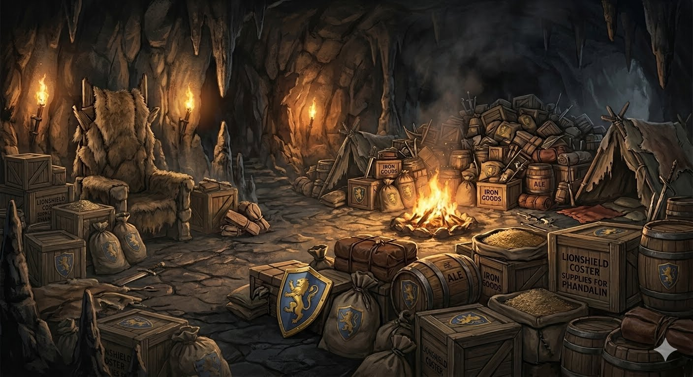
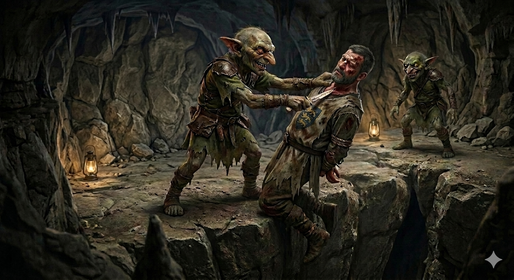
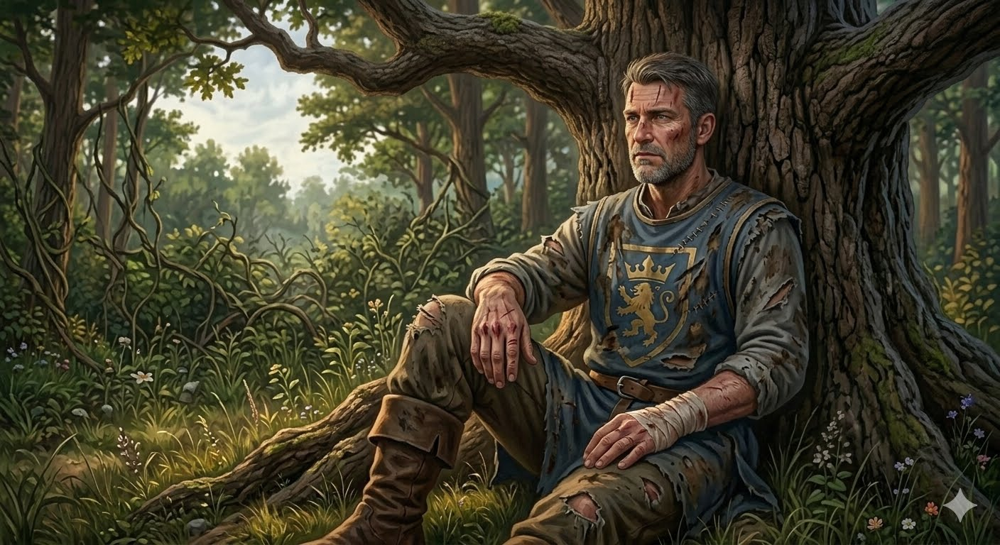
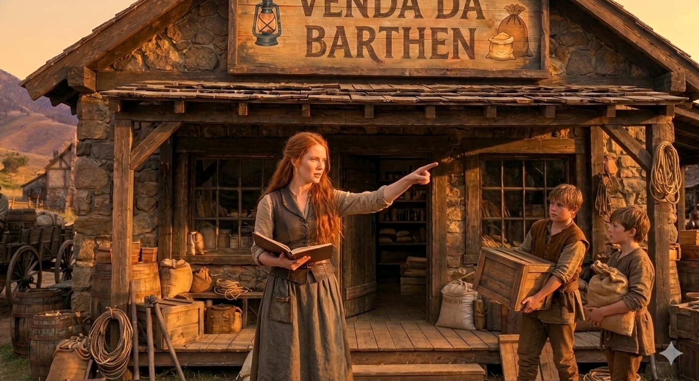
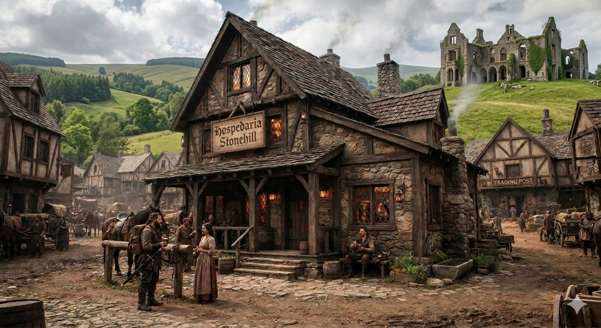

# Phandelver and Below: The Shattered Obelisk

## Sessão 2 Phandalin

_data_ : 2026-04-13 \
_anterior_ : [Sessão 1 Goblins](01_goblins.md) \
_próxima_ : [Sessão 3 Redbrands](03_redbrands.md)

* Cenas
  * [Cena 1 Decisões](#cena-1-decisões)
  * [Cena 2 Troca](#cena-2-troca)
  * [Cena 3 Sildar](#cena-3-sildar)
  * [Cena 4 Interrogatório](#cena-4-interrogatório)
  * [Cena 5 Phandalin](#cena-5-phandalin)
  * [Cena 6 Venda da Barthen](#cena-6-venda-da-barthen)
  * [Cena 7 Hospedaria Stonehill](#cena-7-hospedaria-stonehill)
  * [Cena 8 Pip](#cena-8-pip)
  * [Cena 9 Pomar Edermath](#cena-9-pomar-edermath)
  * [Cena 10 Lionshield Coster](#cena-10-lionshield-coster)
  * [Cena 11 Prefeitura](#cena-11-prefeitura)
  * [Cena 12 Ferraria e Carpintaria](#cena-12-ferraria-e-carpintaria)
  * [Cena 13 Carp](#cena-13-carp)

####

* [Elenco](#elenco)
* [Cenários](#cenários)
* [Itens](#itens)

---

### Cena 1 Decisões

Após derrotarem [Klarg](../casting/npcs/cragmaw/klarg.md), o grupo investiga a
sala onde estão guardados os carregamentos roubados
pelos [Cragmaw](../organizations/cragmaw_goblins.md):
muitas caixas e sacos de suprimentos, com o símbolo
da [Lionshield Coster](../organizations/lionshield_coster.md).

Em meio às caixas também encontram um baú destrancado contendo cerca de duas mil
moedas (cerca de uma a cada dez é sp, sendo a maioria cp), duas poções de cura,
e uma estatueta de jade na forma de um pequeno sapo com olhos dourados, que Ralf
leva no bolso. Mas nenhum sinal do
anão [Gundren](../casting/npcs/gundren_rockseeker.md).

Após Sapão e Professor tomarem as poções de cura e se recuperarem, se preparam
para levar o corpo de Klarg para [Yeemik](../casting/npcs/cragmaw/yeemik.md)
do outro lado da caverna.

Sapão houve rosnados e sons de ossos triturados vindos do canto da sala que
corresponde ao topo da chaminé do canil, de onde vê os dois lobos restantes
comendo alguma coisa. Chegam a pensar que Gundren estaria ali, mas ao chamarem
não obtêm nenhuma resposta, exceto rosnados. Optam por ignorá-los, e seguem para
o outro lado da caverna.

---

### Cena 2 Troca

Ao se aproximarem da câmara a oeste da caverna, ouvem que os goblins parecem já
estar comemorando por antecipação.

Chegando na entrada, são saldados
por [Yeemik](../casting/npcs/cragmaw/yeemik.md) e seus companheiros, que urram
de alegria ao ver o corpo de [Klarg](../casting/npcs/cragmaw/klarg.md). Há um
impasse quando o grupo pede que [Sildar](../casting/npcs/sildar_hallwinter.md)
seja liberto: Yeemik quer um pagamento de 50 gp, ou "humano morre!".

Perguntado sobre o anão, Yeemik informa que Klarg tinha ordens
de [Grol](../casting/npcs/cragmaw/grol.md), o rei, para
capturar [Gundren](../casting/npcs/gundren_rockseeker.md) e enviá-lo
ao [Castelo Cragmaw](../locations/cragmaw_castle.md). E ainda acrescenta que o
rei estaria atendendo a um pedido de um tal
de [Spider](../casting/npcs/mentions/spider.md), que ele não conhece.

Após alguma discussão sobre o valor do resgate pedido, Ralf volta a câmara de
Klarg de onde traz um tanto de moedas que enganam Yeemik e seu grupo. Ao jogar o
saco de moedas dentro sala, o goblin joga Sildar do patamar, caindo
desacordando. "Intrusos poder levar humano nojento!"

Em meio a risadas dos goblins, Ralf entra na sala e arrasta Sildar para fora.
Após curar Sildar, o grupo sai às pressas da caverna.

---

### Cena 3 Sildar

Já fora da caverna, [Sildar](../casting/npcs/sildar_hallwinter.md), salvo do
perigo de morte, mas ainda ferido e desarmado, conta que ele
e [Gundren](../casting/npcs/gundren_rockseeker.md) foram capturados por um grupo
de cerca de uma dúzia de goblins, incluindo uns "goblins estranhos" com crânios
alongados e que tinham armas e olhos com um brilho esverdeado.

Após terem sido capturados, um destes goblins estranhos teria se dirigido a
Sildar e dito algo como "você não ser
quem [Ruxithid](../casting/npcs/mentions/ruxithid.md) procurar", e foram embora.

Após serem arrastados para o esconderijo, Gundren foi separado dele e, pelo que
pode entender, ele seria levado para
o [Castelo Cragmaw](../locations/cragmaw_castle.md) a pedido de um
certo [Spider](../casting/npcs/mentions/spider.md).

Sobre Gundren, o que sabe é que o ele e seus irmãos estavam há tempos procurando
por uma mina lendária na região, e parece que Gundren teria encontrado um mapa
ou algo do tipo. Ele teme que agora esta informação esteja com os
[Cragmaw](../organizations/cragmaw_goblins.md) e com este Spider.

---

### Cena 4 Interrogatório

De volta a estrada, o grupo surpreende três goblins fugitivos que estão mexendo
na carroça. Os três fogem ao serem surpreendidos, mas um deles é ferido e,
alcançado por Sapão, se rende.
"[Flip](../casting/npcs/cragmaw/flip.md) não quer morrer!"

Interrogado, Flip informa que sabe que
o [Castelo Cragmaw](../locations/cragmaw_castle.md) fica na floresta a nordeste
dali, mas não sabe exatamente onde -
"Só [Klarg](../casting/npcs/cragmaw/klarg.md) sabia". Também menciona os
"goblins estranhos" e diz ter medo deles. Também não sabe quem é Spider, mas já
ouviu falar dele "Tenho medo dele... [Spider](../casting/npcs/mentions/spider.md)
mandar em [Grol](../casting/npcs/cragmaw/grol.md)"

Após ser ameaçado é liberado e corre para o mato, sem olhar para trás, por onde
seus companheiros haviam fugido.

---

### Cena 5 Phandalin

A estrada emerge de uma encosta arborizada, e o grupo
avista [Phandalin](../locations/phandalin.md) pela primeira vez. A cidade
consiste em quarenta ou cinquenta construções simples de madeira, algumas
erguidas sobre antigas fundações de pedra.

Ruínas antigas — muros de pedra desmoronados cobertos de hera e sarças — cercam
as casas e lojas mais novas, mostrando que esta deve ter sido uma cidade muito
maior em séculos passados.

A maioria dos edifícios mais novos fica nas laterais da antiga estrada de
carroças, que se alarga formando uma espécie de rua principal lamacenta à medida
que sobe em direção a uma mansão em ruínas na encosta leste da cidade.

### Cena 6 Venda da Barthen

É fim da tarde e a cidade parece se preparar para a noite. Logo na entrada na
cidade o grupo vê uma casa comercial, com uma placa onde se lê
"[Venda da Barthen](../locations/phandalin/barthens_provisions.md)". Na frente
da loja, uma jovem e dois adolescentes estão levando as mercadorias para dentro
antes de fechar a loja.

O grupo se apresenta e
conhecem [Elmina Barthen](../casting/npcs/phandalin/barthens/elmina_barthen.md)
a dona da loja e seus dois
empregados, [Ander](../casting/npcs/phandalin/barthens/ander.md)
e [Thistle](../casting/npcs/phandalin/barthens/thistle.md). Dizem que estão
trazendo as provisões enviadas
por [Gundren Rockseeker](../casting/npcs/gundren_rockseeker.md), ao que Elmina
demonstra ansiedade por ter notícias do amigo.

Ao ser informada de que ele foi capturado por goblins na estrada, a jovem fica
desolada, e diz que estava ansiosa para reencontrá-lo e saber mais sobre suas
descobertas recentes. Ela não tem ideia do que seriam, mas que devem ter relação
com as minas.

Elmina conta que os irmãos de
Gundren, [Tharden](../casting/npcs/mentions/tharden_rockseeker.md)
e [Nundro](../casting/npcs/mentions/nundro_rockseeker.md), também devem estar ansiosos e
ficarão muito abalados ao saber do sequestro do irmão. Eles vivem acampados fora
da cidade, sempre em lugares diferentes, explorando, mas vêm a cidade
frequentemente para se reabastecer. "A última vez foi há uns dez dias,
provavelmente devem aparecer em um dia ou dois"

Um dos garotos, Ander, sugere se o sequestro poderia ter alguma relação com os
[Redbrands](../organizations/redbrands.md), um grupo de arruaceiros que tem
arrumado confusão na vila. Eles ouviram falar que eles frequentam o
"[Gigante Adormecido](../locations/phandalin/sleeping_giant.md)", um bar sujo
nos limites da cidade.

Barthen paga os 30 gp combinados pelo transporte da carga, e fica de avisar o
grupo se os irmãos Rockseeker aparecerem.

---

### Cena 7 Hospedaria Stonehill

No centro da cidade, ergue-se a
"[Hospedaria Stonehill](../locations/phandalin/stonehill_inn.md)", um prédio
grande e recém-construído, feito de pedra e madeira rústica. O salão principal
está cheio de moradores locais bebendo canecas de cerveja ou cidra, todos se
voltam curiosos para o grupo de forasteiros que entram.

Logo são recebidos
por [Toblen Stonehill](../casting/npcs/phandalin/stonehill/toblen_stonehill.md),
o proprietário, que amigável e jovial logo oferece seus serviços. Após acertarem
os detalhes da hospedagem &mdash; [Sildar](../casting/npcs/sildar_hallwinter.md)
tem um quarto reservado para si, e o grupo combina de dividir outro &mdash;
Toblen puxa conversa, perguntando o que traz os forasteiros a cidade, "Estão
aqui pela mineração?"

Falam da carga e do sequestro do anão e todos, inclusive um grupo de moradores
sentados a uma mesa próxima, ficam chocados. Uma gnoma, que se apresenta
como [Freda](../casting/npcs/phandalin/stonehill/freda.md), a tecelã, fala que
isso "tem cheiro de coisa dos [Redbrands](../organizations/redbrands.md). Eles
tão incomodando todos da cidade já tem uns dois meses". "Só não mexem com
a [Halia](../casting/npcs/phandalin/halia_thornton.md),
do [Entreposto dos Mineradores](../locations/phandalin/miners_exchange.md)",
completou o homem baixo do lado oposto da
mesa, [Lanar](../casting/npcs/phandalin/stonehill/lanar.md), o minerador,
"Ela, sim, é uma mulher durona!"

Perguntados sobre o [Castelo Cragmaw](../locations/cragmaw_castle.md), ninguém
sabe dar informações, mas [Elsa](../casting/npcs/phandalin/stonehill/elsa.md), a
anã bartender, sugere que
talvez [Daran Edermath](../casting/npcs/phandalin/daran_edermath.md) saiba de
alguma coisa. "Ele é 'antigo' e sabe de muita coisa".

---

### Cena 8 Pip

[//]: # (:construction: {Imagem})

A noite passa tranquila e no dia seguinte, enquanto tomam o café da manhã, e
pensam sobre o que farão a seguir, um garoto de cerca de 10 anos entra correndo
no salão, chamando: "Papai! Papai!
A [Carp](../casting/npcs/phandalin/alderleaf/carp_alderleaf.md) disse que quase
foi pega por uns bandidos. Ela encontrou alguma coisa na floresta! Posso ir lá
explorar com ela?"

\"Já disse para vocês ficarem longe destes
bandidos, [Pip](../casting/npcs/phandalin/stonehill/pip_stonehill.md)!
Você viu o que houve com a família do
carpinteiro [Thel](../casting/npcs/phandalin/dendrar/thel_dendrar.md)? Vocês
ainda vão arrumar confusão pra gente!"

---

### Cena 9 Pomar Edermath

[//]: # (:construction: {Imagem})

Após discutir um pouco sobre os próximos passos, o grupo decide procurar o tal
[Daran Edermath](../casting/npcs/phandalin/daran_edermath.md) que poderia ter
informações sobre a localização
do [Castelo Cragmaw](../locations/cragmaw_castle.md). Se informam na hospedaria
que ele é um velho que cuida
do [pomar de maçãs](../locations/phandalin/edermath_orchard.md) que fica no
limite noroeste da cidade.

Chegando ao local, um pequeno chalé ao lado de um velho pomar de macieiras
coberto de mato e hera, um velho está encurvado de costas para eles cortando e
arrancando mato próximo da casa. Quando se aproximam, o homem se vira e veem que
se trata de um velho elfo negro, um drow, que deve ter mais de 500 anos.

Daran é um aventureiro aposentado que, após uma juventude de aventuras no sul,
voltou a região onde nasceu para ter uma vida calma.

Perguntado pelo Castelo Cragmaw, diz que já ouviu falar. "Parece que fica em
algum lugar na [Floresta Neverwinter](../locations/neverwinter_wood.md)", mas
não sabe precisar onde fica, apenas que é meio escondido. Além disso, tem havido
muitos ataques de bandidos na [Estrada Triboar](../locations/triboar_trail.md),
tanto a leste quando a oeste.

A propósito, soube que
o [Harbin Wester](../casting/npcs/phandalin/harbin_wester.md), o prefeito, está
procurando voluntários para lidar com estes ataques na estrada, mas que deveria
estar mais preocupado com os arruaceiros que estão mais perto, na cidade. "O
prefeito é popular e tal, mas é um 'bundão' e tem medo
dos [Redbrands](../organizations/redbrands.md), então prefere lidar com o
problema que está mais longe."

Grupo pergunta porque a guarda da cidade não faz nada, e Daran explica que a
cidade não tem uma guarda. "Até existem algumas celas na prefeitura, mas o
prefeito só serve mesmo para resolver coisas pequenas como brigas de vizinhos e
coisas assim".

Daran explicou que a cidade, na realidade, não tem um governo oficial: a vila
elege um "prefeito" anualmente, que atua como juiz em disputas pequenas e mantém
os registros mais importantes.
"A [Lords' Alliance](../organizations/lords_alliance.md) já deveria ter enviado
alguém para a cidade faz tempo!". Quando o grupo
menciona [Sildar](../casting/npcs/sildar_hallwinter.md) que chegou com eles, o
ranzinza Daran demonstra pela primeira vez algo parecido com satisfação:
"Antes tarde do que nunca!"

---

### Cena 10 Lionshield Coster

[//]: # (:construction: {Imagem})

Voltando do pomar, o grupo, enquanto ruma para a prefeitura onde pretendem
conversar com o prefeito, nota na praça central um modesto posto comercial onde,
acima da porta da frente, há uma placa em forma de escudo de madeira com um leão
azul pintado. Reconhecem o emblema
da [Lionshield Coster](../organizations/lionshield_coster.md), uma grande
companhia mercante, o mesmo escudo que viram entre as cargas saqueadas
no [Esconderijo Cragmaw](../locations/cragmaw_hideout.md).

Resolvem entrar e
conhecem [Linene Graywind](../casting/npcs/phandalin/linene_graywind.md), uma
mulher de 30 e poucos anos, responsável pelo novo posto da companhia na região.

O grupo conta de seu encontro com
os [Cragmaw Goblins](../organizations/cragmaw_goblins.md) na estrada e sobre a
carga que encontraram no seu esconderijo. Linene diz que tem sofrido muito com
os ataques na estrada, que não recebe nenhuma carga há semanas, e que estaria
interessada em recuperar ao menos parte da carga roubada, mas que precisaria
alguém disposto a isso, ainda mais sabendo que ainda há goblins no local.

O grupo exita, mas diz que poderia fazer o serviço de terminar a limpeza do
local, mas que ela precisaria conseguir quem ajudasse a carregar tudo. Ficam de
combinar os detalhes mais tarde.

---

### Cena 11 Prefeitura

[//]: # (:construction: {Imagem})

Ao chegarem a porta do prédio
da [Prefeitura](../locations/phandalin/townmasters_hall.md), que, na verdade, é
a residência do
prefeito [Harbin Weber](../casting/npcs/phandalin/harbin_wester.md), a primeira
coisa que veem é o cartaz pregado a uma tábua ao lado da porta.

> A prefeitura de [Phandalin](../locations/phandalin.md) procura por bravos
> voluntários que capturem os
> bandidos que têm atacado caravanas e viajantes
> na [Estrada Triboar](../locations/triboar_trail.md), na
> direção de [Conyberry](../locations/conyberry.md), a leste.
>
> Foi reportado que o grupo de bandidos é formado por bugbears, goblins e ao
> menos um ogre foi visto. Também há rumores de "goblins estranhos" &mdash; o
> que quer que isso signifique.
>
> Cautela é recomendada.
>
> Recompensa: 100 gp

Batendo, são recebidos pelo próprio prefeito, um homem baixo, com sorriso e
pança fartos. Mencionando o cartaz, falam sobre o ataque que sofreram vindo de
Neverwinter, a oeste, e de como limparam um esconderijo deles.

Harbin reconhece então o grupo como os heróis que salvaram o
nobre [Sildar](../casting/npcs/sildar_hallwinter.md), que por acaso está ali com
ele.

Levados para dentro, encontram Sildar sentado à mesa do prefeito, estudando uma
papelada. Ele explica que sua missão era buscar notícias de seu colega, um certo
[Iarno Albrek](../casting/npcs/iarno_albrek.md), "um homem baixo, de barba
escura, na casa dos 30 anos". Iarno havia sido enviado a cidade há dois meses,
mas desapareceu, logo após informar a sede de sua chegada. Sildar teme que Iarno
possa ter sido capturado pelos [Redbrands](../organizations/redbrands.md).

Sildar está preocupado, pois sua missão parece ser bem mais complexa do que
tinha imaginado, "mas vamos ver o que pode ser feito!", diz apontando para a
papelada sobre a mesa.

O grupo questiona sobre a atuação dos Redbrands, que, pelo que tinham entendido,
seriam apenas arruaceiros sem grande periculosidade. Mas Sildar conta que soube
por [Toblen](../casting/npcs/phandalin/stonehill/toblen_stonehill.md), da
hospedaria, que o
carpinteiro [Thel Dendrar](../casting/npcs/phandalin/dendrar/thel_dendrar.md),
após enfrentar um grupo dos bandidos que importunava sua esposa, foi assassinado
e que sua família desapareceu naquela mesma noite. "Eles não estão me parecendo
assim tão inofensivos".

O grupo então se oferece para servir como uma força de segurança provisória na
cidade &mdash; até recebem uma carta de autorização do prefeito para isso, e
combinam uma recompensa de 100 gp pela captura do líder dos Redbrands, um certo
[Glasstaff](../casting/npcs/redbrands/glasstaff.md), além das despesas de
hospedagem e alimentação pagadas pela prefeitura.

---

### Cena 12 Ferraria e Carpintaria

[//]: # (:construction: {Imagem})

Saindo da prefeitura, o grupo decide procurar pelo ferreiro da cidade, um certo
[Joe Smithe](../casting/npcs/phandalin/joe_smithe.md), que sendo novo na região,
não faz ideia de onde fica o tal
[Castelo Cragmaw](../locations/cragmaw_castle.md), mas que não gosta
dos [Redbrands](../organizations/redbrands.md): "um bando de encrenqueiros".

Mas, após tentar entender o que os forasteiros querem, concorda em forjar os
distintivos para que o grupo possa se identificar como a nova "força de
segurança" da cidade.

Deixando a oficina do ferreiro, o grupo passa
na [Carpintaria](../locations/phandalin/woodworker_shop.md), mas encontram o
lugar vazio e abandonado. Algumas cadeiras caídas, pratos na mesa e panelas no
fogão, indicam que houve alguma, mas pouca, resistência quando a família foi
levada do lugar, sem tempo para quaisquer preparativos.

---

### Cena 13 Carp

[//]: # (:construction: {Imagem})

De volta a [hospedaria](../locations/phandalin/stonehill_inn.md), para almoçar e
discutir o que fazer, veem
entrar [Pip](../casting/npcs/phandalin/stonehill/pip_stonehill.md), o filho do
estalajadeiro, com uma menina halfling, que está tagarelando, contando de como
escapou "por muito pouco dos bandidos malvados".

Sapão chama as crianças e pergunta sobre o que foi que ela
viu. [Carp](../casting/npcs/phandalin/alderleaf/carp_alderleaf.md), a garota,
fica deslumbrada com os "grandes heróis" e quer saber de suas aventuras.
"Um dia, quando eu for maior, também serei uma grande aventureira, e conhecerei
o mundo, e lutarei contra dragões. Vocês já devem ter matado um dragão, né? E
encontrarei grandes tesouros, e..."

Trazendo a menina de volta a realidade, pedem para ela contar de sua aventura na
floresta. Ele então conta com empolgação sobre como estava brincando de aventura
na [Mata Tresendar](../locations/phandalin/tresendar_wood.md) que fica atrás
da [fazenda](../locations/phandalin/alderleaf_farm.md) onde mora com sua
mãe, [Qelline](../casting/npcs/phandalin/alderleaf/qelline_alderleaf.md), e ao
sul da [Mansão Tresendar](../locations/phandalin/tresendar_manor.md), e como
encontrou um "túnel secreto, que fica escondido atrás de uns arbustos e pedras".
Mas bem na hora que estava começando a entrar para explorar, viu que alguns
bandidos de capa vermelha, os [Redbrands](../organizations/redbrands.md),
estavam vindo lá de dentro, mas ela conseguiu se esconder e "por um triz eles
não me viram".

"Posso levar vocês lá, se vocês quiserem. O lugar é perigoso, mas vocês são
heróis corajosos, e não têm medo de bandidos malvados. Ah! Também vi um goblins
estranhos praqueles lados num outro dia."

Após fazerem ela prometer que não voltará lá sozinha, combinam de se encontrar
na manhã seguinte para que ela os leve até o local.

---

### Elenco

* [Sildar Hallwinter](../casting/npcs/sildar_hallwinter.md), representante
  da [Lords' Alliance](../organizations/lords_alliance.md)

#### No [Esconderijo Cragmaw](../locations/cragmaw_hideout.md)

* [Yeemik](../casting/npcs/cragmaw/yeemik.md), novo chefe
* [Flip](../casting/npcs/cragmaw/flip.md), goblin interrogado
* goblins
* lobos

#### Em [Phandalin](../locations/phandalin.md)

* [Elmina Barthen](../casting/npcs/phandalin/barthens/elmina_barthen.md), dona
  da venda
  * [Ander](../casting/npcs/phandalin/barthens/ander.md), funcionário da venda
  * [Thistle](../casting/npcs/phandalin/barthens/thistle.md), funcionário da
    venda
* [Toblen Stonehill](../casting/npcs/phandalin/stonehill/toblen_stonehill.md),
  dono da hospedaria
  * [Freda](../casting/npcs/phandalin/stonehill/freda.md), tecelã
  * [Lanar](../casting/npcs/phandalin/stonehill/lanar.md), minerador
  * [Elsa](../casting/npcs/phandalin/stonehill/elsa.md), bartender da hospedaria
  * [Pip Stonehill](../casting/npcs/phandalin/stonehill/pip_stonehill.md), filho
    de Toblen
* [Daran Edermath](../casting/npcs/phandalin/daran_edermath.md), velho do pomar
* [Linene Graywind](../casting/npcs/phandalin/linene_graywind.md), representante
  da [Lionshield Coster](../organizations/lionshield_coster.md)
* [Harbin Wester](../casting/npcs/phandalin/harbin_wester.md), prefeito
* [Joe Smithe](../casting/npcs/phandalin/joe_smithe.md), ferreiro
* [Carp Alderleaf](../casting/npcs/phandalin/alderleaf/carp_alderleaf.md), amiga
  de Pip

#### Mencionados

* [Gundren Rockseeker](../casting/npcs/gundren_rockseeker.md), mercador
  sequestrado
* [Tharden Rockseeker](../casting/npcs/mentions/tharden_rockseeker.md), irmão de Gundren
* [Nundro Rockseeker](../casting/npcs/mentions/nundro_rockseeker.md), irmão de Gundren

####

* [Cragmaw Goblins](../organizations/cragmaw_goblins.md)
  * [Klarg](../casting/npcs/cragmaw/klarg.md) (RIP), antigo chefe
  * [Grol](../casting/npcs/cragmaw/grol.md), rei

####

* [Spider](../casting/npcs/mentions/spider.md), vilão
* [Ruxithid](../casting/npcs/mentions/ruxithid.md), desconhecido

####

* [Phandalin](../locations/phandalin.md)
  * [Halia Thornton](../casting/npcs/phandalin/halia_thornton.md), mestre da
    guilda dos mineiradores
  * [Qelline Alderleaf](../casting/npcs/phandalin/alderleaf/qelline_alderleaf.md),
    fazendeira
  * [Thel Dendrar](../casting/npcs/phandalin/dendrar/thel_dendrar.md) (RIP),
    carpinteiro

####

* [Iarno Albrek](../casting/npcs/iarno_albrek.md), representante
  da [Lords' Alliance](../organizations/lords_alliance.md) desaparecido

####

* [Redbrands](../organizations/redbrands.md)
  * [Glasstaff](../casting/npcs/redbrands/glasstaff.md), líder criminoso

### Cenários

* [Estrada Triboar](../locations/triboar_trail.md)
  * [Esconderijo Cragmaw](../locations/cragmaw_hideout.md)

####

* [Phandalin](../locations/phandalin.md)
  * [Venda da Barthen](../locations/phandalin/barthens_provisions.md)
  * [Hospedaria Stonehill](../locations/phandalin/stonehill_inn.md)
  * [Pomar Edermath](../locations/phandalin/edermath_orchard.md)
  * [Posto da Lionshield Coster](../locations/phandalin/lionshield_coster_post.md)
  * [Prefeitura](../locations/phandalin/townmasters_hall.md)
  * [Ferraria](../locations/phandalin/blacksmith_shop.md)
  * [Carpintaria](../locations/phandalin/woodworker_shop.md)

#### Mencionados

* [Castelo Cragmaw](../locations/cragmaw_castle.md)

####

* [Phandalin](../locations/phandalin.md)
  * [Gigante Adormecido](../locations/phandalin/sleeping_giant.md)
  * [Entreposto dos Mineradores](../locations/phandalin/miners_exchange.md)
  * [Fazenda Alderleaf](../locations/phandalin/alderleaf_farm.md)
  * [Mansão Tresendar](../locations/phandalin/tresendar_manor.md)
  * [Mata Tresendar](../locations/phandalin/tresendar_wood.md)

####

* [Estrada Triboar](../locations/triboar_trail.md)
  * [Conyberry](../locations/conyberry.md)

### Itens

* [Venda da Barthen](../locations/phandalin/barthens_provisions.md)
  * [Elmina](../casting/npcs/phandalin/barthens/elmina_barthen.md)
    * 30 gp (pagamento pela carga)

####

* [Esconderijo Cragmaw](../locations/cragmaw_hideout.md)
  * [Klarg](../casting/npcs/cragmaw/klarg.md)
    * ~2000 moedas
      * ~50 moedas &ndash; _deixadas
        com [Yeemik](../casting/npcs/cragmaw/yeemik.md)_
      * 1652 cp, 146 sp
    * 2 poções de healing &ndash; _consumidas_
    * [sapinho de jade]
