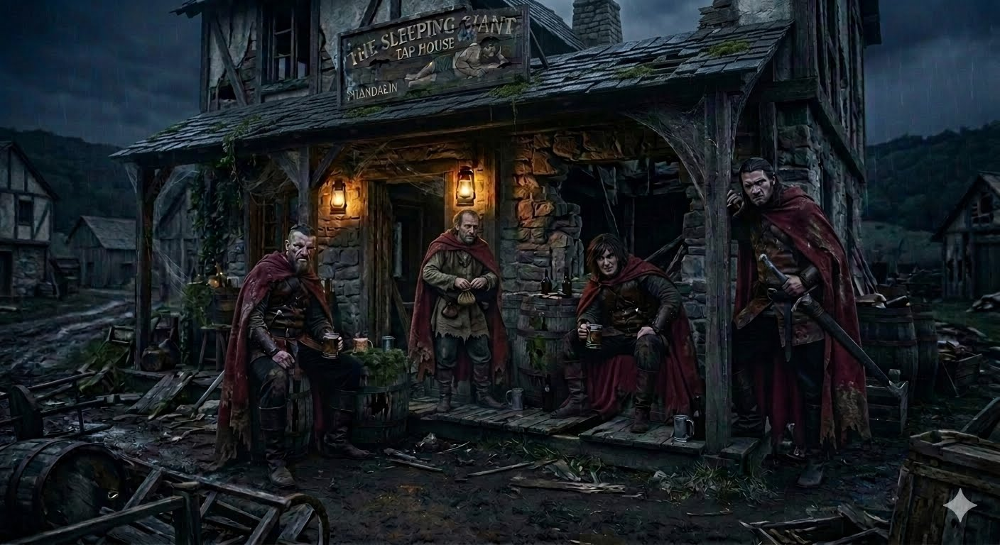
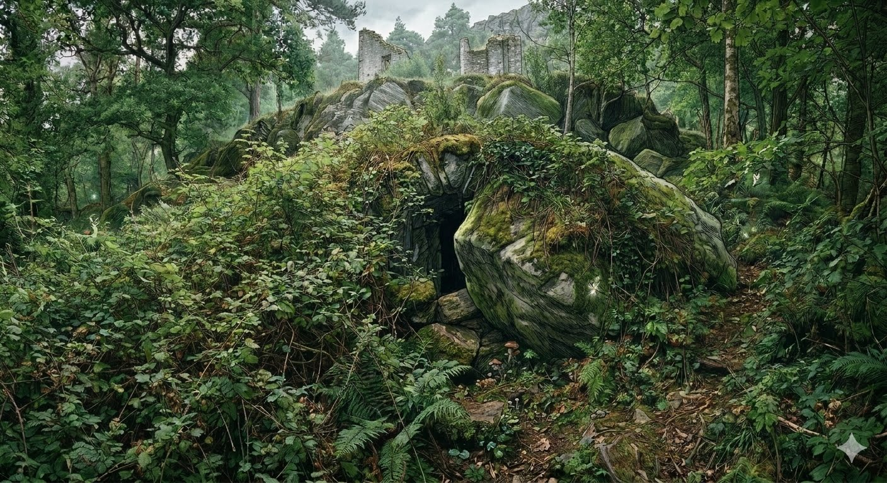
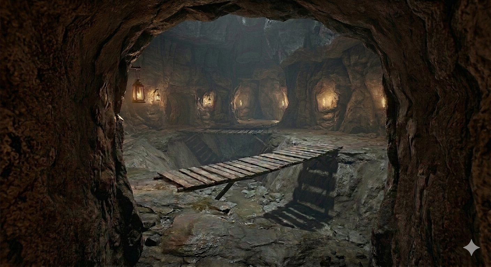
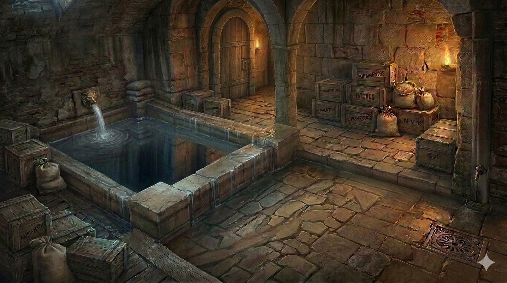
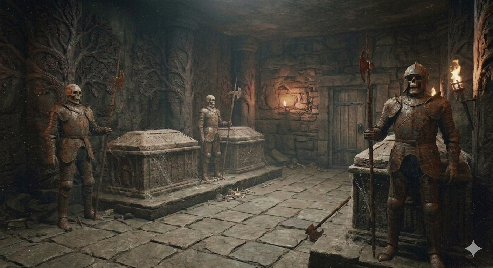

# Phandelver and Below: The Shattered Obelisk

## Sessão 3 Redbrands

_data_ : 2026-04-27 \
_anterior_ : [Sessão 2 Phandalin](02_phandalin.md) \
_próxima_ : [Sessão 4 Glasstaff]

### Cenas

* [Cena 1 Gigante Adormecido](#cena-1-gigante-adormecido)
* [Cena 2 Túnel Secreto](#cena-2-túnel-secreto)
* [Cena 3 Uma Voz](#cena-3-uma-voz)
* [Cena 4 Cisterna](#cena-4-cisterna)
* [Cena 5 Cripta](#cena-5-cripta)

### Elenco

#### No [Gigante Adormecido](../locations/phandalin/sleeping_giant.md)

* [Redbrands](../organizations/redbrands.md)
  * bandidos
* [Greska](../characters/npcs/phandalin/greska.md), ogre taverneiro

#### Em [Phandalin](../locations/phandalin.md)

* [Harbin Wester](../characters/npcs/phandalin/harbin_wester.md), prefeito
* [Carp Alderleaf](../characters/npcs/phandalin/alderleaf/carp_alderleaf.md),
  garota halfling
* [Pip Stonehill](../characters/npcs/phandalin/stonehill/pip_stonehill.md),
  garoto humano
* [Qelline Alderleaf](../characters/npcs/phandalin/alderleaf/qelline_alderleaf.md),
  mãe de Carp

#### No [Esconderijo Redbrand](../locations/phandalin/redbrand_hideout.md)

* [Redbrands](../organizations/redbrands.md)
  * bandidos
* prisioneiros
  * duas mulheres e um rapaz

#### Mencionados

* [Irmã Garaele](../characters/npcs/phandalin/sister_garaele.md), responsável
  pelo [Santuário da Fortuna](../locations/phandalin/shrine_of_luck.md)

### Cenários

* [Gigante Adormecido](../locations/phandalin/sleeping_giant.md)
* [Prefeitura](../locations/phandalin/townmasters_hall.md)
* [Santuário da Fortuna](../locations/phandalin/shrine_of_luck.md)
* [Hospedaria Stonehill](../locations/phandalin/stonehill_inn.md)
* [Fazenda Alderleaf](../locations/phandalin/alderleaf_farm.md)
* [Mata Tresendar](../locations/phandalin/tresendar_wood.md)
* [Esconderijo Redbrand](../locations/phandalin/redbrand_hideout.md)

#### Mencionados

* [Mansão Tresendar](../locations/phandalin/tresendar_manor.md)

---

### Cena 1 Gigante Adormecido

:construction:

Ao anoitecer o grupo decide investigar
o [Gigante Adormecido](../locations/phandalin/sleeping_giant.md), o bar que
todos dizem que os [Redbrands](../organizations/redbrands.md) costumam
frequentar. Pedem orientações sobre a sua localização na estalagem, e, embora
sejam desencorajados, o grupo está decidido a cumprir com seu novo papel de
garantidores da lei na cidade.

Ao se aproximarem do local - que é pouco mais que os escombros de uma antiga
taverna de estrada -, quatro humanos desgrenhados e mal-humorados, usando capas
vermelhas imundas, estão na varanda do estabelecimento, empoleirados em barris
de cerveja, bebendo, encaram os forasteiros.

Um dos rufiões, já se levantando, cospe no chão. "Ora, ora", diz ele. "Aqui está
uma ninhada de cachorrinhos. O que vocês querem aqui, cachorrinhos? Venham aqui
latir para nós?"

Este e mais dois saem para a rua, enquanto o quarto permanece na varanda. Há uma
pequena discussão em que o grupo insiste que são a nova autoridade na cidade, ao
que os rufiões debocham e, entre ameaças, diz que o grupo deve deixar a cidade e
a região imediatamente. "Nós somos a 'autoridade' aqui! Vão embora com o rabo
entre as pernas se valorizam suas vidas!"

Com o impasse, nenhum lado quer ceder, irrompe um combate. Os bandidos, bem
falastrões, começam bem, mas logo ficam sérios quando a maré vira e acabam
derrotados. O quarto homem, que permaneceu observando da varanda todo este
tempo, primeiro rindo, depois preocupado e temeroso, foge para trás do bar
gritando que vai trazer reforços. Ralf chega a tentar persegui-lo, mas ele
escapa na noite.

Dentro do bar, o grupo encontra o taverneiro, um ogre grandalhão e aborrecido,
que mergulha copos na água suja que está na pia, e os enxuga com um pano
encardido. Após pedir cervejas e serem atendidos - o ogre usa os mesmos copos
que vinha "lavando" -, o grupo se apresenta, e o ogre, que se apresenta como
[Greska](../characters/npcs/phandalin/greska.md), parece se divertir muito
quando dizem que estão ali para livrar a cidade dos bandidos. Greska diz que o
Redbrands são seus únicos clientes e o dinheiro deles é tão bom quanto o de
qualquer outro, e que não se importa com o que fazem fora de seu
estabelecimento. Diz que acha que eles se escondem "pros lados da
velha [Mansão Tresendar](../locations/phandalin/tresendar_manor.md)".

Dos homens derrotados, dois estão mortos, mas um está apenas inconsciente.

Quando o grupo bate a porta
da [Prefeitura](../locations/phandalin/townmasters_hall.md), são atendidos por
um prefeito [Harbin](../characters/npcs/phandalin/harbin_wester.md) já de
camisola. Explicam a situação e, sobre protestos de que foi acordado, o grupo é
levado até o porão onde trancam o bandido inconsciente em uma cela. Também
deixam as espadas apreendidas em uma sala da prefeitura, agora um arsenal
improvisado.

O prefeito os orienta a levar o corpo para o cemitério que fica atrás
do [Santuário da Fortuna](../locations/phandalin/shrine_of_luck.md), do outro
lado da praça, mas já adianta que a [Irmã Garaele] não se encontra na cidade. No
templo, realmente não encontram ninguém, e deixam os corpos para que alguém os
enterre no dia seguinte.

---

### Cena 2 Túnel Secreto

:construction:

Na manhã seguinte, quando o grupo desce para tomar seu café da manhã
na [hospedaria](../locations/phandalin/stonehill_inn.md), já
encontram [Carp](../characters/npcs/phandalin/alderleaf/carp_alderleaf.md), a
garota halfling, ansiosa a espera. Ao seu
lado, [Pip](../characters/npcs/phandalin/stonehill/pip_stonehill.md), o filho do
estalajadeiro, está cabisbaixo, claramente contrariado e infeliz.

Após tomar café, apressados por uma garota inquieta ao lado, ela os leva até uma
[fazenda](../locations/phandalin/alderleaf_farm.md) no extremo sudeste da vila.
"É aqui que eu moro com minha
mãe, [Qelline](../characters/npcs/phandalin/alderleaf/qelline_alderleaf.md), mas
é melhor não a incomoda ela agora."
Contornam a casa, atravessam um campo de canteiros de hortaliças diversas e
chegam a uma densa mata, conhecida
como [Mata Tresendar](../locations/phandalin/tresendar_wood.md) já além dos
limites da cidade.

Após algum tempo seguindo por trilhas que a garota indica, o grupo chega ao sopé
de um morro - no alto é possível ver parte das ruínas da velha
[Mansão Tresendar](../locations/phandalin/tresendar_manor.md).

A garota segue acompanhando o sopé para um lado, e depois muda de ideia. "Não!
Acho que é pra lá!". Após procurar um pouco aponta o lugar, que a princípio
parece ser apenas pedras grandes e alguns arbustos, mas olhando com atenção logo
se revela a entrada de uma caverna estreita.

O grupo chega a procurar por rastros, mas quem quer que esteja usando a passagem
cuida para manter o lugar em segredo.

---

### Cena 3 Uma Voz

:construction:

Após levar [Carp](../characters/npcs/phandalin/alderleaf/carp_alderleaf.md)
e [Pip](../characters/npcs/phandalin/stonehill/pip_stonehill.md) de volta
a [Fazenda Alderleaf](../locations/phandalin/alderleaf_farm.md), e deixá-la aos
cuidados
da [Sra. Alderleaf](../characters/npcs/phandalin/alderleaf/qelline_alderleaf.md),
o grupo retorna a entrada escondida.

Sempre com a coruja Bia investigando a frente, o grupo segue um túnel estreito e
chega a um grande salão de caverna natural cortado por uma fenda no sentido
norte-sul.

Duas pontes rústicas que atravessam a fenda que tem por volta de 20 pés de
profundidade, embora suas paredes pareçam ser facilmente escaláveis. Do alto é
possível ver alguns ossos incluindo de pelo menos dois crânios de goblins
estranhamente alongados e um esqueleto humano ainda praticamente completo. Bia,
ao descer voando pela fenda, relata apenas "Frio!"

Explorando o lugar, veem que há duas passagens a esquerda e uma a direita, todas
elas corredores bem construídos, além do que parece ser uma oficina do outro
lado do salão, depois da fenda.

Sem nenhum aviso uma voz estridente e sussurrante rompe o silêncio do lugar,
"[Ssnark] tem fome... Carne fresca...", seguindo uma risada insana. O grupo olha
em volta, procurando sem sucesso a origem da voz. Ao olhar para o fundo da
fenda, a voz retorna, "Homenzinhos burros! Ssnark não está aí embaixo. Mas podem
descer... Não vão descer, não?... Desçam..." Neste momento percebem que a voz
não vem do ambiente, mas está falando diretamente em suas cabeças.

Ansiosos por deixar este lugar sinistro e curiosos ao notar que a passagem da
direita leva a um beco sem saída, o que não faz sentido, resolvem explorar esta
direção.

---

### Cena 4 Cisterna

:construction:

Investigando o final do corredor, facilmente encontram uma passagem secreta que
leva a uma sala de teto alto com uma grande cisterna de água fresca. Ao redor da
sala, junto às paredes, dezenas de caixas e barris contendo carne seca, cereais,
frutas, vinho e cerveja - tudo em bom estado de conservação, deixando claro que
é um depósito que vem sendo usado.

No lado oposto da sala, duas escadas levam a um patamar, onde é possível ver uma
porta. Contornando a cisterna, há outra porta, que Ralf abre impetuosamente,
surpreendendo três bandidos de capas vermelhas, que interrompem a conversa e se
levantam de pronto das camas onde estavam sentados.

"Quem são vocês! O que estão fazendo aqui?"

"Hã... somos novos recrutas...", Ralf tenta emplacar.

"Ué!? Ninguém falou nada sobre novos recrutas!"

Enquanto dura o impasse, o grupo bloqueia a saída do quarto, e um combate
inicia. Rapidamente um dos bandidos cai desacordado por uma pancada de Ralf, e
os outros dois são colocados para dormir pela magia de Sapão.

Retiram as capas dos três que são deixados amarrados e fecham a porta.

---

### Cena 5 Cripta

:construction:

Explorando mais a sala da cisterna, o grupo nota uma porta abaixo de uma das
escadas, que leva a corredor largo que leva uma grande porta dupla decorada.

Seguindo pelo corredor, Ralf e Sapão quase caem em um fosso escondido sob
algumas pedras soltas do piso. Passando por pequenas saliências laterais, o
grupo ultrapassa a armadilha sem grande dificuldade.

Chegando mais próximo da porta ao fundo, notam que as suas folhas são revestidas
por placas de cobre esverdeadas pelo tempo, e mostram, em relevo, a figura de um
anjo melancólico.

Agora mais cautelosos, procuram por armadilhas antes de abrir a porta, que
revela uma sala com três sarcófagos. Ao lado de cada sarcófago, uma armadura
está de pé como que guardando quem quer que alí esteja depositado.

Examinando, sem abrir, as grandes caixas de pedra, veem que cada uma tem a tampa
esculpida com uma figura humana: dois homens e uma mulher, todos vestindo trajes
nobres.

No extremo norte da sala, duas portas. Quando se aproximam destas portas, as
armaduras se movem em sua direção revelando esqueletos animados em seu interior.
O susto é grande, mas tão inesperadamente quanto se moveram, as armaduras
pararam e, após observá-los por alguns segundos, retornaram a sua posição de
guarda original.

Agora atentos às armaduras, examinam as portas. Uma delas leva a um pequeno
corredor e a outra porta, esta trancada. Incapazes de arrombá-la decidem
investigar a outra.

Na outra porta, não ouvindo nada, abrem deparando com dois bandidos que
aparentemente já estavam de prontidão aguardando para atacar quem entrasse. Mas
ao verem as capas que o grupo está usando, demonstram uma certa confusão. "Quem
são vocês?", "Somos novos recrutas", "Ninguém avisa mais nada nesta organização?
Quem trouxe vocês?"

Os bandidos querem que o grupo permaneça naquele local, enquanto um deles vai
averiguar. Agora, o grupo pode notar que o lugar é um tipo de prisão, com duas
selas. Em uma, duas mulheres encolhidas estão abraçadas a um canto, e na outra,
um rapaz adolescente está sentado abraçando os próprios joelhos.

A tensão aumenta e parece que um combate é inevitável.
 
---