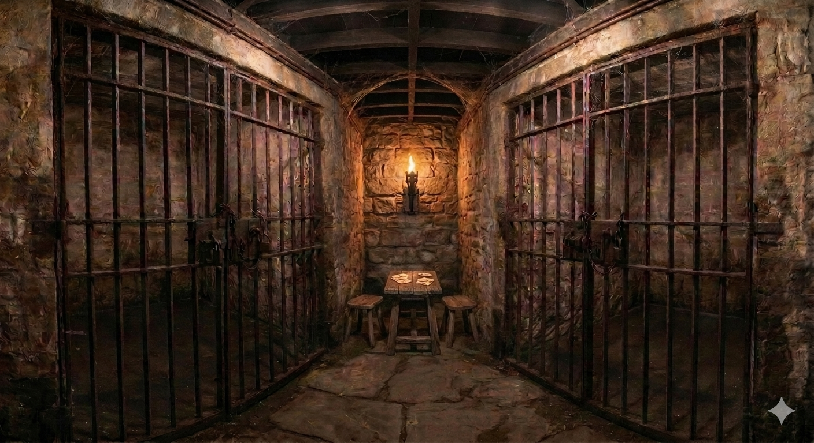
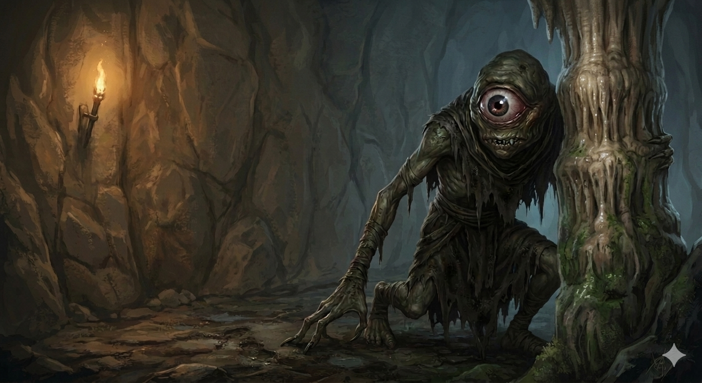
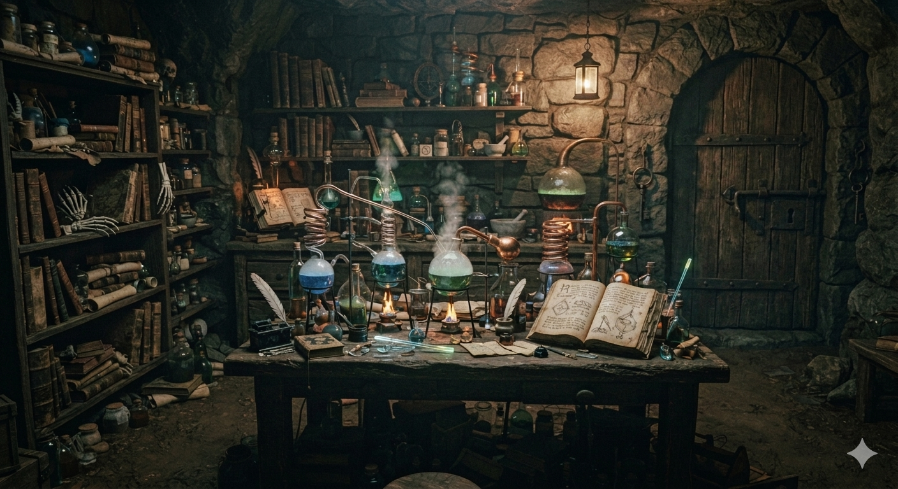
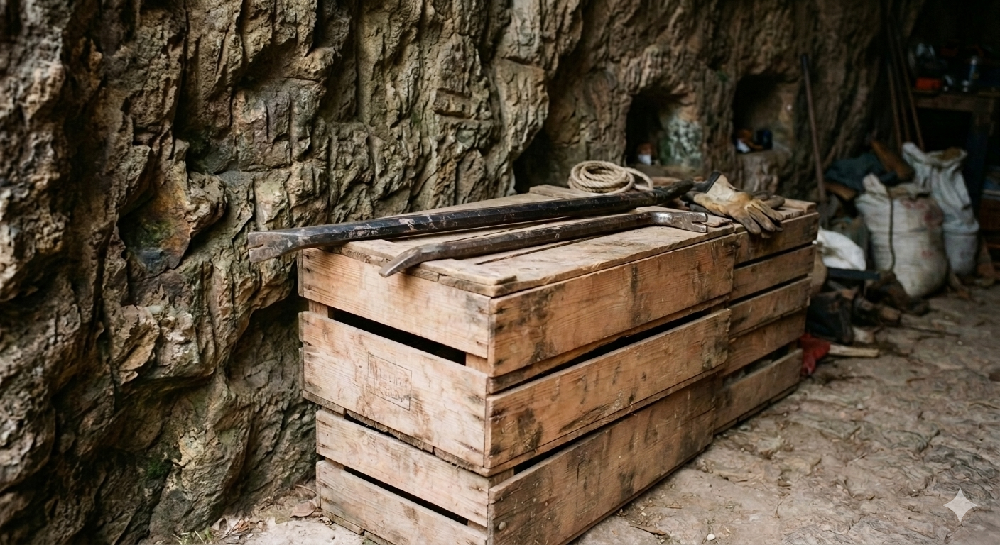

# Phandelver and Below: The Shattered Obelisk

## Sessão 4 Glasstaff

_data_ : 2026-05-11 \
_anterior_ : [Sessão 3 Redbrands](03_redbrands.md) \
_próxima_ : [Sessão 5 Perda](05_perda.md)

* Cenas
  * [Cena 1 Prisioneiros](#cena-1-prisioneiros)
  * [Cena 2 Ssnark](#cena-2-ssnark)
  * [Cena 3 Mago](#cena-3-mago)
  * [Cena 4 Pé-de-Cabra](#cena-4-pé-de-cabra)

####

* [Elenco](#elenco)
* [Cenários](#cenários)
* [Itens](#itens)

---

### Cena 1 Prisioneiros

Após alguns segundos de tensão, o combate inicia. Os dois guardas encurralados
na sala pequena parecem não ter muitas chances, mas o grupo é surpreendido por
trás, com a chegada de mais dois bandidos vindos da porta que era um
beco-sem-saída.

Professor, que estava mais atrás, é o primeiro a ser atacado por estes novos
adversários, e logo reconhece que são os mesmos bandidos que havia colocado para
dormir no quarto ao lado da cisterna. Parece que houve tempo suficiente para
acordarem, e se livrarem das suas amarras. Mas de onde vieram?

Mas este reforço não se mostra suficiente. Após três deles serem neutralizados,
o quarto bandido tenta fugir pelo mesmo corredor de onde veio, revelando que há
uma passagem secreta em frente a porta trancada. Ralf consegue ser rápido e o
encurralar justamente nesta passagem, derrotando enfim o último adversário.

Agora, com tudo mais calmo novamente, o grupo conversa com os prisioneiros. A
mulher mais velha se apresenta
como [Mirna Dendrar](../casting/npcs/phandalin/dendrar/mirna_dendrar.md),
esposa do carpinteiro
[Thel Dendrar](../casting/npcs/phandalin/dendrar/thel_dendrar.md), e "nossos
filhos [Nilsa](../casting/npcs/phandalin/dendrar/nilsa_dendrar.md)", uma
jovem de pouco mais de 18 anos,
"e [Nars](../casting/npcs/phandalin/dendrar/nars_dendrar.md)", um garoto de
12 anos.

Mirna conta como os [Redbrands](../organizations/redbrands.md) mataram seu
marido e levaram seu corpo, depois voltaram e levaram a família. "Acho que eles
pretendem nos vender como escravos."

Percebem então que não tem como abrir as celas. "Tem um 'mostro peludo de
orelhas grandes' que tem as chaves", informa Mirna.

"Fiquem calmos. Vamos procurar este monstro e voltamos para libertá-los."

"Vocês vão nos deixar aqui!?"

"Fiquem tranquilos! Estamos aqui para salvá-los. Vocês têm nossa palavra de que
vamos voltar."

---

### Cena 2 Ssnark

Passando pela passagem secreta revelada pelo bandido na sua tentativa de fuga, o
grupo se vê na oficina ao fundo da caverna da fenda. O lugar está atulhado de
caixotes, tanto vazios quanto cheios de itens roubados prontos para serem
contrabandeados &mdash; além de ferramentas para trabalhar com as caixas.

"Homenzinhos voltaram! Ah! Mas agora não são mais intrusos. Venham conversar com
[Ssnark](../casting/npcs/redbrands/ssnark.md)...", sussurra a voz novamente
direto na cabeça de cada um, e mais risadas insanas.

Bia, a coruja, sobrevoa a caverna, e vê a criatura atrás de uma das pilastras.
Nisso, a criatura se revela. Um ser escamoso, com braços e pernas longos, garras
e dentes afiadas, e, o mais notável, um único olho verde enorme que ocupa quase
toda sua cabeça.

Sapão rapidamente ataca de longe, iniciando o combate.

Ssnark fica bastante ferido e foge da briga, tentando negociar. "Mestre não quer
intrusos em seus aposentos", diz a criatura apontando para um dos corredores que
saem da caverna para oeste.

Quando o grupo faz menção se dirigir para este corredor, Ssnark corre para
bloquear o caminho, reiniciando o combate, e a criatura acaba derrotada.

---

### Cena 3 Mago

Explorando o corredor indicado por Ssnark, após descer um lance de escada,
encontram duas portas. Na porta da esquerda escutam risadas e xingamentos:
parece ser um grupo de homens bebendo e jogando.

Resolvem então verificar primeiro a outra porta, de onde ouvem apenas o tênue
som de líquido borbulhando. Ao abrir a porta ouvem o que parece ser o bater de
asas de um morcego, mas seja qual for o bicho que estivesse ali, já tinha se
escondido.

A sala é um laboratório de alquimia, com uma mesa central abarrotada de
equipamentos, tubos e jarros de vidro com líquidos de muitas cores fumegando e
borbulhando sobre chamas de lamparinas. Um livro aberto, que o Professor
reconhece como instruções para fazer algum tipo de poção, talvez de
invisibilidade. Professor guarda este livro.

Ralf ouve uma movimentação vinda da porta do outro lado da sala. Corre para
abrir a porta para encontrar um quarto. Apenas uma cama e uma pequena mesa cheia
de papéis. Sapão nota uma irregularidade na parede oposta, que revela uma
passagem secreta que foi deixada entreaberta.

Neste mesmo momento, Bia, que havia sido deixada vigiando na caverna, alerta
"Homem passando!"

O grupo corre em perseguição. A passagem se abre para uma escada que sobe até
outra passagem secreta, esta deixada aberta, que os leva novamente na oficina de
encaixotamento, a tempo de ver um homem usando um robe preto entrando no
corredor que leva a cisterna.

Sapão, a frente, chega na cisterna a tempo de ver o homem baixo e barbado, que
acabou de pegar algo dentro da água, tomar uma poção e sumir bem na sua frente.

Sapão percebe uma movimentação que parece subir as escadas. Neste momento, uma
criatura alada surge do nada, ataca e desaparece em seguida. Sem perder tempo,
Sapão sobe correndo, e vê a porta no patamar se abrir. Chega a tropeçar no mago
invisível ao alcançar a porta, mas é atacado novamente pela criatura alada, que
passa por ele, sumindo em seguida.

A porta revela uma escada que leva às ruínas do que deve ser da cozinha da
velha [Mansão Tresendar](../locations/phandalin/tresendar_manor.md).

Após procurarem sem sucesso por rastros do mago. As ruínas estão cheias de
rastros em muitas direções, mostrando que a entrada para o porão na cozinha está
sendo usada frequentemente por muitas pessoas.

O mago [Glasstaff](../casting/npcs/redbrands/glasstaff.md) e seu mascote
fugiram.

---

### Cena 4 Pé-de-Cabra

Enquanto lamentam a chance perdida de capturar o líder
dos [Redbrands](../organizations/redbrands.md), Professor se lembra que possui
um pé-de-cabra entre seu equipamento, o grupo volta para os prisioneiros. Com a
ajuda da ferramenta, Ralf consegue romper as correntes que prendem as grades das
celas.

Cautelosamente, conduzem a família Dendrar pela caverna até o túnel, onde são
orientados a seguir
pela [Mata Tresendar](../locations/phandalin/tresendar_wood.md) até
a [Fazenda Alderleaf](../locations/phandalin/alderleaf_farm.md). O
garoto [Nars](../casting/npcs/phandalin/dendrar/nars_dendrar.md) diz conhecer
bem a mata e consegue chegar a fazenda.

Aproveitam que agora têm uma ferramenta &mdash; ao passar pela oficina, não
notam que há dois pés-de-cabra sobre alguns caixotes &mdash;, conseguem abrir
também a porta que estava trancada, revelando o arsenal dos bandidos: lanças,
espadas de vários tamanhos, algumas bestas e setas. Uma dúzia de mantos
vermelhos demonstra a ambição de crescimento dos bandidos.

Sem poder carregar tudo, pegam apenas as seis bestas, planejando voltar mais
tarde para buscar o restante. Antes, precisam decidir como fazer para terminar
de livrar o lugar dos bandidos que ainda restam.

---

### Elenco

* [Mirna Dendrar](../casting/npcs/phandalin/dendrar/mirna_dendrar.md), viúva
  do
  carpinteiro [Thel Dendrar](../casting/npcs/phandalin/dendrar/thel_dendrar.md)
  (RIP)
  * [Nilsa Dendrar](../casting/npcs/phandalin/dendrar/nilsa_dendrar.md),
    filha de Mirna
  * [Nars Dendrar](../casting/npcs/phandalin/dendrar/nars_dendrar.md), filho
    de Mirna

####

* [Redbrands](../organizations/redbrands.md)
  * [Glasstaff](../casting/npcs/redbrands/glasstaff.md), líder
    * seu mascote
  * [Ssnark](../casting/npcs/redbrands/ssnark.md), criatura que guarda
    o [Esconderijo Redbrand](../locations/phandalin/redbrand_hideout.md)
  * bandidos

#### Mencionados

* [Thel Dendrar](../casting/npcs/phandalin/dendrar/thel_dendrar.md) (RIP),
  carpinteiro

### Cenários

* [Esconderijo Redbrand](../locations/phandalin/redbrand_hideout.md)
* [Mansão Tresendar](../locations/phandalin/tresendar_manor.md)

#### Mencionados

* [Mata Tresendar](../locations/phandalin/tresendar_wood.md)
* [Fazenda Alderleaf](../locations/phandalin/alderleaf_farm.md)

### Itens

* [Esconderijo Redbrand](../locations/phandalin/redbrand_hideout.md)
  * celas
    * 4 shortswords
    * 4 capas vermelhas
  * arsenal
    * 12 spears &ndash; _deixadas_
    * 6 shortswords &ndash; _deixadas_
    * 4 longswords &ndash; _deixadas_
    * 6 light crossbows
    * 8 quivers, 20 bolts cada &ndash; _deixadas_
