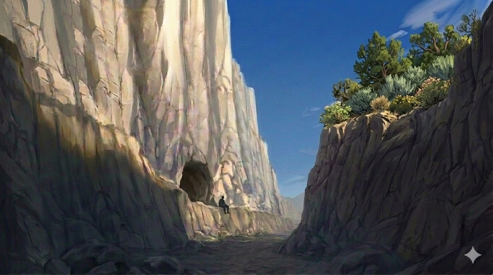

# Phandelver and Below: The Shattered Obelisk

## Sessão 6 Wyvern Tor

_data_ : 2026-06-08 \
_anterior_ : [Sessão 5 Perda](05_perda.md) \
_próxima_ : [Sessão 7 Floresta](07_floresta.md)

* Cenas
  * [Cena 1 Jeremias](#cena-1-jeremias)
  * [Cena 2 Despedidas](#cena-2-despedidas)
  * [Cena 3 Conyberry](#cena-3-conyberry)
  * [Cena 4 Necromante](#cena-4-necromante)
  * [Cena 5 Wyvern Tor](#cena-5-wyvern-tor)

####

* [Elenco](#elenco)
* [Cenários](#cenários)
* [Itens](#itens)

---

### Cena 1 Jeremias

[//]: # (:construction: {Imagem})

"Sapão?!? É você?"

"Alto lá, Frodo!", disse a silhueta na porta
da [Hospedaria Stonehill](../locations/phandalin/stonehill_inn.md), ao que o cão
obedeceu imediatamente, mantendo-se em estado de alerta. "Vocês falaram 'Sapão'?
Vocês conhecem meu primo?", continuou o elfo alto de cabelos longos que entrava
no salão.

"Eu sou Jeremias 'Colina' Raizforte e este é meu fiel companheiro, Frodo. Sou
primo de Silas 'Sapão' Raizforte. Soube
em [Neverwinter](../locations/neverwinter.md) que ele estaria nesta região.
Vocês são amigos dele?"

O grupo conta o que acabou de acontecer com o amigo, ao que o recém-chegado fica
profundamente consternado. Ao relatarem mais detalhes dos últimos acontecimentos
e dos objetivos do grupo, Jeremias de pronto se oferece para ajudar na caça aos
responsáveis e poder vingar o primo.

Jeremias, por sua vez conta que cruzou
na [Estrada Triboar](../locations/triboar_trail.md) com grupos que vinham em
sentido contrário, que relataram terem sido assaltados por bugbears, próximo
a [Conyberry](../locations/conyberry.md).

---

### Cena 2 Despedidas

[//]: # (:construction: {Imagem})

Pela manhã, encontram [Sildar](../casting/npcs/sildar_hallwinter.md) tomando
café na [Hospedaria](../locations/phandalin/stonehill_inn.md), que comenta que
andou perguntando por toda a cidade, e não obteve nenhuma pista da localização
do [Castelo Cragmaw](../locations/cragmaw_castle.md) e sugere que possam ter
mais sucesso se forem investigar os bandidos que seguem atacando
na [Estrada Triboar](../locations/triboar_trail.md), a leste, próximo
a [Conyberry](../locations/conyberry.md). [Irmã Garaele](../casting/npcs/phandalin/sister_garaele.md)
chegou de lá e pode ter visto alguma coisa.

O grupo vai até o [Santuário da Fortuna](../locations/phandalin/luck_shrine.md)
onde, enquanto Colina vela seu primo
Sapão, [Irmã Garaele](../casting/npcs/phandalin/sister_garaele.md) conta que foi
para Conyberry para procurar uma banshee
chamada [Agatha](../casting/npcs/agatha.md), em uma missão solicitada por seus
superiores nos [Harpers](../organizations/harpers.md). Seu objetivo era obter
alguma informação sobre o paradeiro
do [Grimório Bowgentle](../items/books/bowgentle_spellbook.md), conhecido livro
de magia do lendário mago [Bowgentle](../casting/npcs/mentions/bowgentle.md).
Agatha tem poderem divinatórios e pode responder a qualquer pergunta, mas
precisa ser convencida a isso.

Ela diz que subestimou a ganância da criatura e, ao não oferecer um presente em
troca de uma resposta, foi atacada e se salvou por pouco. A banshee tem especial
predileção por belos objetos, e antes de fugir percebeu que Agatha demonstrou
especial interesse pelo [pente de prata] que estava usando.

Irmã Garaele pediu então que, caso estejam mesmo indo para aquela região, tentem
obter a informação sobre o Grimório, com a banshee. Para ajudar na empreitada,
ofereceu ao grupo três poções de cura que podem ser úteis na viagem. "E, claro!
Levem também o pente de prata, para usarem na barganha. E tomem muito cuidado!"

Sobre os assaltantes, disse que realmente encontrou alguns goblins e bugbears,
mas que pode evitá-los, por não estar em condições de se arriscar.

Após alguns preparativos, no início da tarde, o grupo parte para o leste, rumo
a [Conyberry](../locations/conyberry.md), descrita como as ruínas de um antigo
posto de parada abandonado, e com as instruções de como encontrar
o [Covil da Agatha](../locations/agathas_lair.md) através uma trilha a norte,
que leva a [Floresta Neverwinter](../locations/neverwinter_wood.md).

---

### Cena 3 Conyberry

Próximo ao meio-dia do quarto dia de viagem sem incidentes
pela [Estrada Triboar](../locations/triboar_trail.md), o grupo chega às ruínas
de [Conyberry](../locations/conyberry.md), uma pequena vila que um dia foi pouco
mais que um posto de parada para viajantes, mas hoje é apenas um poço na beira
da estrada, no que parece ter sido uma praça, cercado por ruínas de umas poucas
construções.

Uma trilha é visivel ao norte segue entrando
na [Floresta Neverwinter](../locations/neverwinter_wood.md) logo adiante.
Segundo as orientações
de [Irmã Garaele](../casting/npcs/phandalin/sister_garaele.md), este é o caminho
que leva ao [Covil da Agatha](../locations/agathas_lair.md).

Ao se aproximarem do poço, rumando na direção da trilha, são atacados por dois
bugbears, que estavam escondidos entre as ruínas. Os bandidos acabam se
revelando pouco perigosos, sendo derrotados com relativa facilidade.

Procurando por rastros, encontram sinais de uma trilha na direção sul e optam
por segui-la, na esperança de localizar a base dos assaltantes.

---

### Cena 4 Necromante

Após algumas horas seguindo pela trilha, quando o sol já começa a baixar no
horizonte, avistam uma torre no alto de uma colina. Se aproximam, pensando que
pode ser um bom lugar para acampar. Tudo está quieto e, a princípio, não veem
ninguém, mas há uma barraca colorida montada ao lado de um poço bem no centro
das ruínas do que deve ter sido a guarnição de uma torre de observação.

Assim que entram na área das ruínas, sentem um forte cheiro de carne podre, e,
quando se aproximam cautelosamente do poço e da barraca, uma horda de zumbis sai
do que resta da torre, inícia um ataque.

Mas a briga mal havia começado quando um homem que sai da barraca e, com um
simples gesto de mão, faz os zumbis pararem o ataque e recuarem para próximo
dele.

"O que que está havendo aqui?"

O homem &mdash; alto, usando um manto vermelho, tem a cabeça raspada e o rosto
todo tatuado, mas um símbolo arcano se destaca em sua testa &mdash; se apresenta
como [Hamun Kost](../casting/npcs/hamun_kost.md) e que está ali
no [Poço da Velha Coruja](../locations/old_owl_well.md) estudando "assuntos de
seu interesse". O Professor reconhece sua aparência peculiar como uma
característica marcante dos [Red Wizards](../organizations/red_wizards.md), um
grupo de magos malígnos, ambiciosos e poderosos. O símbolo que carregam gravados
em suas testas indicam sua especialidade mágica &mdash; neste caso, necromancia.

Perguntado sobre os bandidos que estão na região, ele confirma que se escondem
por perto, mas não o evitam &mdash; diz isso fazendo um leve gesto na direção
dos zumbis, que permanecem imóveis próximos a ele, alheios a toda a conversa.

Ao saber que o grupo está a procura deles, diz que ficaria muito satisfeito em
se livrar definitivamente do problema, e indica que se escondem na base da
[Wyvern Tor](../locations/wyvern_tor.md), um enorme penhasco rochoso proeminente
a nordeste nas [Montanhas da Espada](../locations/sword_montains.md), e que já
visíveis no horizonte ao sul. Após fornecer mais detalhes sobre como localizar o
esconderijo dos bandidos, pede apenas que o grupo _não_ acampe próximo de seu
campo de estudos, "por gentileza."

---

### Cena 5 Wyvern Tor

No dia seguinte, após mais algumas horas de caminhada, chegam a base do penhasco
da [Wyvern Tor](../locations/wyvern_tor.md) e, seguindo as indicações do
necromante, encontram o esconderijo, no fim de uma ravina profunda. A entrada de
gruta está sendo vigiada por um bugbear, visivelmente entendiado.

O grupo se aproxima, escondido pela vegetação do lado oposto da ravina. Com um
feitiço, o Professor coloca o guarda para dormir, e, se aproximando com extrema
cautela, levam o guarda dormindo para longe do local, para ser acordado e
interrogado.

Se vendo sem opções, o bugbear diz que são um grupo
dos [Cragmaw Goblins](../organizations/cragmaw_goblins.md), mas que apenas seu
líder, um orc chamado [Brughor](../casting/npcs/cragmaw/brughor.md), sabe a
localização do [Castelo Cragmaw](../locations/cragmaw_castle.md). Deixando o
prisioneiro amarrado e amordaçado, o grupo volta para a entrada do esconderijo
do bando.

Atraindo os bandidos para a entrada da caverna, enfrentam mais alguns bugbears e
um ogre. O líder, que empunha um grande machado, fica atrás, bradando insultos e
ordens.

Com a providencial ajuda de uma teia conjurada pelo Professor, os inimigos são
atrasados e acabam derrotados, deixando seu líder sozinho e encurralado, na
pequena caverna que usavam para se abrigar.

Ao ver seu bando desmantelado, o orc líder se rende, atirando seu machado ao
chão, e tenta negociar por sua vida. Apesar de relutar, a princípio, em revelar
a localização do [Castelo Cragmaw](../locations/cragmaw_castle.md), uma vez
ameaçado, desenha no chão de terra da caverna um mapa rústico desenho apontando
a localização da sede
dos [Cragmaw Goblins](../organizations/cragmaw_goblins.md).

Desconfiados da informação, o grupo pretende levá-lo como prisioneiro, mas
[Brughor](../casting/npcs/cragmaw/brughor.md) não está nada satisfeito com este
arranjo.

---

### Elenco

* [Phandalin](../locations/phandalin.md)
  * [Sildar Hallwinter](../casting/npcs/sildar_hallwinter.md), aliado
  * [Irmã Garaele](../casting/npcs/phandalin/sister_garaele.md), clériga

####

* [Conyberry](../locations/conyberry.md)
  * bugbears

####

* [Poço da Velha Coruja](../locations/old_owl_well.md)
  * [Hamun Kost](../casting/npcs/hamun_kost.md),
    necromante [Red Wizard](../organizations/red_wizards.md)
  * zumbis

####

* [Wyvern Tor](../locations/wyvern_tor.md)
  * [Brughor](../casting/npcs/cragmaw/brughor.md), líder local
  * bugbears

#### Mencionados

* [Agatha](../casting/npcs/agatha.md), banshee
* [Bowgentle](../casting/npcs/mentions/bowgentle.md), mago lendário

### Cenários

* [Phandalin](../locations/phandalin.md)
  * [Hospedaria Stonehill](../locations/phandalin/stonehill_inn.md)
  * [Santuário da Fortuna](../locations/phandalin/luck_shrine.md)
* [Estrada Triboar](../locations/triboar_trail.md)
  * [Conyberry](../locations/conyberry.md)
* [Poço da Velha Coruja](../locations/old_owl_well.md)
* [Montanhas da Espada](../locations/sword_montains.md)
  * [Wyvern Tor](../locations/wyvern_tor.md)

#### Mencionados

* [Neverwinter](../locations/neverwinter.md)
* [Castelo Cragmaw](../locations/cragmaw_castle.md)
* [Floresta Neverwinter](../locations/neverwinter_wood.md)
  * [Covil da Agatha](../locations/agathas_lair.md)

### Itens

* [Santuário da Fortuna](../locations/phandalin/luck_shrine.md)
  * [Irmã Garaele](../casting/npcs/phandalin/sister_garaele.md)
    * 3 poções de healing (para ajudar na missão)

#### Mencionados

* [Santuário da Fortuna](../locations/phandalin/luck_shrine.md)
  * [Irmã Garaele](../casting/npcs/phandalin/sister_garaele.md)
    * [Grimório Bowgentle](../items/books/bowgentle_spellbook.md)
