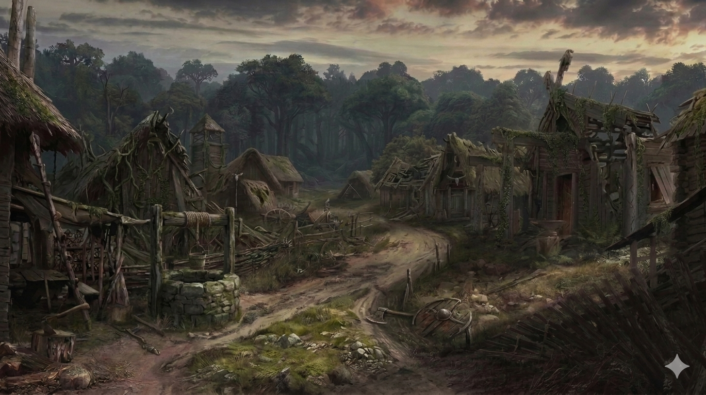
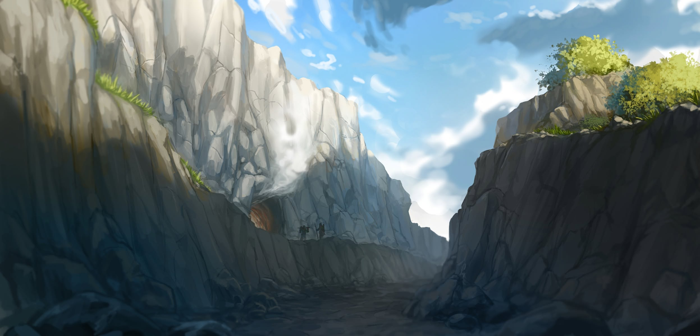

# Phandelver and Below: The Shattered Obelisk

## Sessão 6 Wyvern Tor

_data_ : 2026-06-08 \
_anterior_ : [Sessão 5 Perda](05_perda.md) \
_próxima_ : [Sessão 7 Busca]

### Cenas

:construction:

* [Cena 1 Jeremias](#cena-1-jeremias)
* [Cena 2 Despedidas](#cena-2-despedidas)
* [Cena 3 Conyberry](#cena-3-conyberry)
* [Cena 4 Necromante](#cena-4-necromante)
* [Cena 5 Wyvern Tor](#cena-5-wyvern-tor)

### Elenco

* [Sildar Hallwinter](../casting/npcs/sildar_hallwinter.md), aliado
* [Irmã Garaele](../casting/npcs/phandalin/sister_garaele.md), clériga

####

* [Conyberry]
  * bugbears

####

* [Poço da Velha Coruja]
  * [Hamun Kost](../casting/npcs/hamun_kost.md), necromante [Red Wizard]
  * zumbis

####

* [Wyvern Tor]
  * [Brughor](../casting/npcs/cragmaw/brughor.md), líder local
  * bugbears

#### Mencionados

* [Agatha], banshee
* [Bowgentle], mago lendário

### Cenários

* [Phandalin]
  * [Hospedaria Stonehill]
  * [Santuário da Fortuna]
* [Estrada Triboar]
* [Conyberry]
* [Poço da Velha Coruja]
* [Wyvern Tor]

#### Mencionados

* [Neverwinter]
* [Castelo Cragmaw]
* [Covil da Agatha]
* [Floresta de Neverwinter]

### Itens

* [Santuário da Fortuna]
  * [Irmã Garaele](../casting/npcs/phandalin/sister_garaele.md)
    * 3 poções de healing (para ajudar na missão)

[//]: # (#### Mencionados)
[//]: # ()
[//]: # (* _[_Local_]_, _[_detalhe_]_)
[//]: # (  * _[_item_]_)

---

### Cena 1 Jeremias

_[_Imagem_]_ :construction:

:construction:

"Sapão?!? É você?"

"Alto lá, Frodo!", disse a silhueta na porta da [Hospedaria Stone], ao que o cão
parou imediatamente, mantendo-se em estado de alerta. "Vocês falaram 'Sapão'?
Vocês conhecem meu primo?", continuou o elfo alto de cabelos longos que entrava
no salão.

"Eu sou Jeremias 'Colina' Raizforte e este é meu fiel companheiro, Frodo. Sou
primo de Silas 'Sapão' Raizforte. Soube em [Neverwinter] que ele estaria nesta
região. Vocês são amigos dele?"

O grupo conta o que acabou de acontecer com o amigo, ao que o recém-chegado fica
profundamente consternado. Ao relatarem mais detalhes dos últimos acontecimentos
e dos objetivos do grupo, Jeremias de pronto se oferece para ajudar na caça aos
responsáveis e vingar o primo.

Jeremias, por sua vez conta que cruzou na [Estrada Triboar] com grupos vindos no
sentido contrário, que relataram terem sido assaltados por bugbears, próximo
a [Conyberry].

---

### Cena 2 Despedidas

_[_Imagem_]_ :construction:

:construction:

Pela manhã, encontram [Sildar](../casting/npcs/sildar_hallwinter.md) tomando
café na [Hospedaria], que comenta que andou perguntando por toda a cidade, e não
obteve nenhuma pista da localização do [Castelo Cragmaw] e reforça a
recomendação de que o grupo vá investigar os bandoleiros que seguem atacando
na [Estrada Triboar], a leste, próximo
a [Conyberry]. [Irmã Garaele](../casting/npcs/phandalin/sister_garaele.md) veio
de lá e pode ter visto alguma coisa.

O grupo vai até o [Santuário da Fortuna] onde, enquanto Colina vela seu primo
Sapão, Irmã Garaele conta que foi para Conyberry para procurar uma banshee
chamada [Agatha], em uma missão passada por seus superiores nos [Harpers], para
obter a informação sobre o paradeiro do livro de magia do lendário mago
[Bowgentle]. Agatha tem poderem divinatórios e pode responder a qualquer
pergunta, desde que concorde com isso.

Ela diz que subestimou a ganância da criatura e, ao não oferecer um presente em
troca de uma resposta, foi atacada e se salvou por pouco. A banshee tem especial
predileção por objetos belos, e antes de fugir percebeu que Agatha demonstrou
especial interesse por seu [pente de prata].

Ofereceu para o grupo três poções de cura para tentarem se concordarem em ir
ao [Covil da Agatha] para negociar com a criatura. "E, claro! Levem o pente de
prata, para usarem na barganha. E tomem muito cuidado!"

Sobre os assaltantes, disse que realmente encontrou alguns goblins e bugbears,
mas que pode evitá-los.

Após alguns preparativos, no ínicio da tarde, o grupo parte para o leste, rumo
a [Conyberry], descrita como as ruínas de um antigo posto de parada abandonado,
e como as instruções de como encontrar o covil da banshee, por uma trilha a
norte, já na [Floresta de Neverwinter].

---

### Cena 3 Conyberry

:construction:

Após três dias de viagem pela [Estrada Triboar], próximo ao meio-dia, chegam às
ruínas de [Conyberry], uma vila que um dia foi pouco mais que posto de parada
para viajantes: hoje é apenas um poço no meio do que já foi uma praça, cercada
por ruínas de umas poucas construções.

Uma trilha ao norte segue entrando na [Floresta de Neverwinter] e, que, segundo
as orientações da [Irmã Garaele](../casting/npcs/phandalin/sister_garaele.md),
leva ao [Covil da Agatha].

Ao se aproximarem do poço, rumando para a trilha, são atacados por dois
bugbears, que acabam se revelando pouco perigosos, sendo derrotados com relativa
facilidade.

Procurando por rastros, encontram sinais de uma trilha na direção sul e optam
por segui-la.

---

### Cena 4 Necromante

:construction:

Após algumas horas seguindo pela trilha, próximo ao fim do dia, avistam uma
torre no alto de uma colina. Ao se aproximarem, pensando que pode ser um bom
lugar para acampar, tudo está quieto e não vêm ninguém, mas há uma barraca
colorida montada ao lado de um poço bem no centro das ruínas da antiga guarnição
da torre.

Ao se aproximarem das ruínas, sentem um forte cheiro de carne podre, e, em
seguida quando chegam ao lado do poço, uma horda de zumbis sai do que resta da
torre, iníciam um ataque.

Mas a briga mal tinha começado quando um homem que sai da barraca e, com um
simples gesto de mão, os zumbis param o ataque e recuam.

"O que que está havendo aqui?"

O homem - alto, usando um manto vermelho, tem a cabeça raspada, com um símbolo
arcano tatuado na testa - se apresenta
como [Hamun Kost](../casting/npcs/hamun_kost.md) e que aquelo lugar é conhecido
como [Poço da Velha Coruja]. O Professor reconhece o símbolo com uma
característica dos [Red Wizards], um grupo de magos malígnos, ambiciosos e
poderosos. O símbolo na sua testa indica sua especialidade mágica:
necromancia, no caso.

Perguntado sobre os bandidos que estão na região, ele confirma que se escondem
por perto, mas não o incomodam - diz isso fazendo um leve gesto na direção dos
zumbis que permanecem parados próximos a ele, alheios a conversa.

Ao saber que o grupo está a procura deles, diz que ficaria muito satisfeito em
se livrar definitivamente do problema, e indica que se escondem na base da
[Wyvern Tor], uma montanha de pedra proeminente logo no início
das [Montanhas da Espada]. Após fornecer mais detalhes sobre como localizar o
esconderijo, pede apenas que o grupo _não_ acampe próximo de seu campo de
estudos.

---

### Cena 5 Wyvern Tor

:construction:

No dia seguinte, após mais algumas horas de caminhada, chegam a base do penhasco
da [Wyvern Tor] e, seguindo as indicações do necromante, encontram o
esconderijo, no final de uma ravina. A entrada de gruta é vigiada por um
bugbear, visivelmente entendiado.

O grupo se aproxima escondido pela vegetação do lado oposto da ravina, e com um
feitiço o Professo coloca o guarda para dormir. Se aproximam cautelosamente, e
levam o guarda dormindo para longe do local, para ser acordado e interrogado.

Ele confessa que são um grupo dos [Cragmaw Goblins], mas que apenas seu líder,
[Brughor](../casting/npcs/cragmaw/brughor.md), um orc, sabe a localização
do [Castelo Cragmaw]. Deixando o prisioneiro amarrado e amordaçado, o grupo
volta para a gruta do bando.

Atraindo os bandidos para a entrada de seu esconderijo escuro, enfrentam mais
alguns bugbears e um ogre. O líder, um orc, que empunha um grande machado fica
atrás bradando insultos e ordens.

Com a providencial ajuda de uma teia conjurada pelo Professor, os inimigos são
atrasados e acabam derrotados, deixando seu líder sozinho e encurralado, na
pequena caverna que usavam para se esconder.

A ver seu bando desmantelado, o orc líder se rende, atirando seu machado ao chão
e, uma vez ameaçado, revela o local do Castelo Cragmaw, com um desenho no chão
de terra da caverna. Desconfiados da informação, o grupo pretende levá-lo como
prisioneiro, mas Brughor não está nada satisfeito com este arranjo.

---
