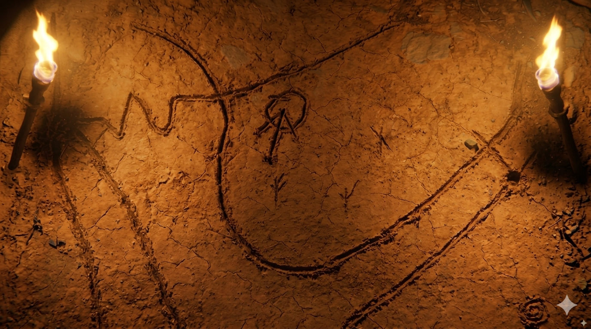
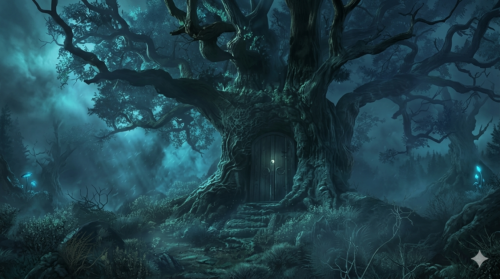
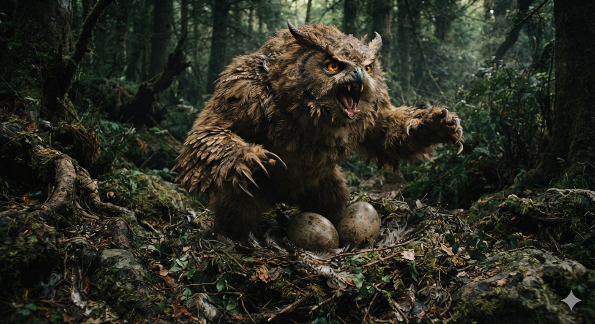
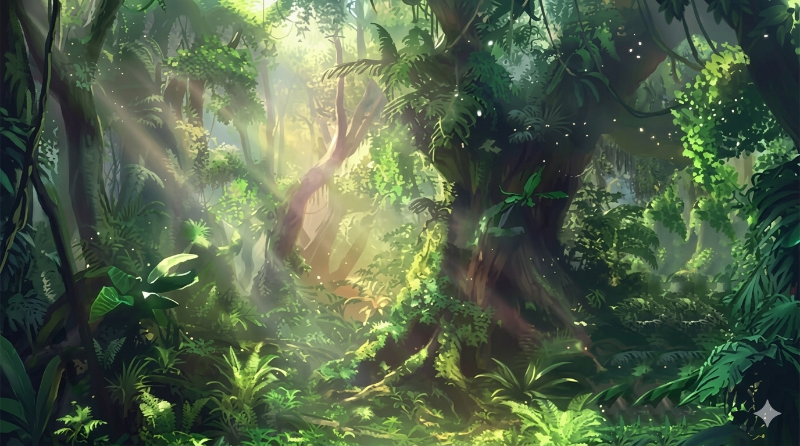
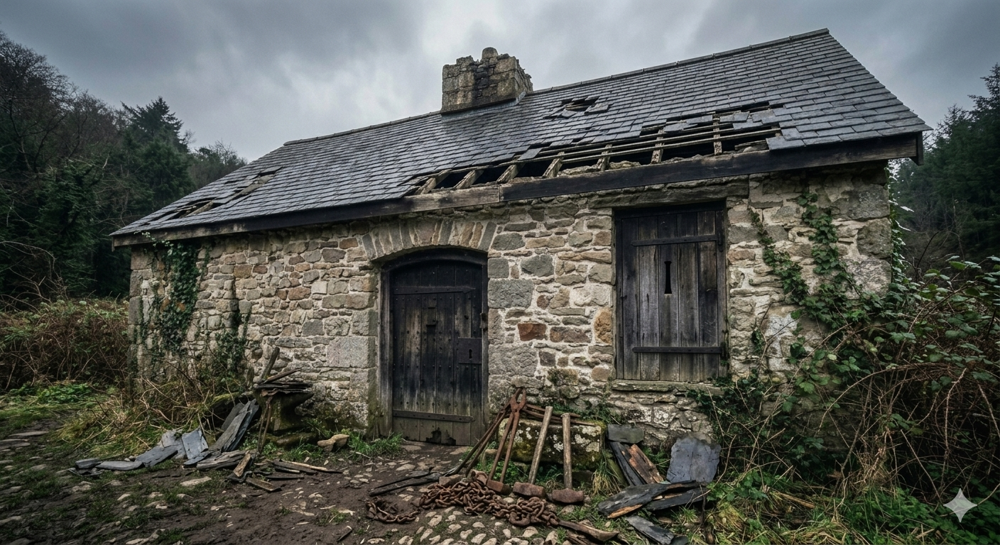

# Phandelver and Below: The Shattered Obelisk

## Sessão 7 Floresta

_data_ : 2026-07-06 \
_anterior_ : [Sessão 6 Wyvern Tor](06_wyvern_tor.md) \
_próxima_ : [Sessão 8 Venomfang](08_venomfang.md)

* Cenas
  * [Cena 1 Brughor](#cena-1-brughor)
  * [Cena 2 Agatha](#cena-2-agatha)
  * [Cena 3 Owlbear](#cena-3-owlbear)
  * [Cena 4 Buscas](#cena-4-buscas)
  * [Cena 5 Arrependido](#cena-5-arrependido)

####

* [Elenco](#elenco)
* [Cenários](#cenários)
* [Itens](#itens)

---

### Cena 1 Brughor

[Brughor](../casting/npcs/cragmaw/brughor.md), sob ameaças, fez um desenho no
chão da caverna indicando onde estão agora,
em [Wyvern Tor](../locations/wyvern_tor.md), e onde fica
o [Castelo Cragmaw](../locations/cragmaw_castle.md)
na [Floresta Neverwinter](../locations/neverwinter_wood.md) &mdash; logo ao sul
do [Rio Neverwinter](../locations/neverwinter_river.md), próximo do limite
ocidental da floresta.

O grupo desconfia que a informação possa ser mentirosa, e discuti a
possibilidade de levar Brughor por garantia. "Vocês não precisar de Brughor.
Mapa mostrar lugar de Castelo."

"Como podemos ter certeza de que não está mentindo?"

"Vocês ter palavra de Brughor!"

"Então podemos voltar aqui e te matar se descobrirmos o Castelo não estiver onde
você está falando?"

O orc apenas dá de ombros, mantendo uma expressão desafiadora, como quem diz
"podem tentar".

Sem muitas opções e entendendo que seria muito trabalhoso levar o orc
prisioneiro por tanto tempo, decidem libertá-lo, mas desarmado e sem sua
armadura.

Investigando um pouco mais a gruta, veem que, numa das paredes, há um desenho
tosco de um grupo de goblins venerando um outro, mas este bem maior, com a
cabeça mais alongada e com o que parecem ser cristais saindo do seu crânio. Seus
olhos estão representados como se estivessem emitindo algum tipo de brilho.

Além disso, no fundo da gruta, encontram um baú destrancado contendo cerca de
200 moedas &mdash; a maioria sp, mas podem ver que há também algumas ep &mdash;,
e três frascos que parecem conter perfume.

Partem e chegam novamente
no [Poço da Velha Coruja](../locations/old_owl_well.md) perto do fim do dia,
onde não encontram ninguém, apenas a barraca do necromante continua no local.
Preferindo não correr riscos, acampam nas proximidades, e continuam a viagem no
dia seguinte, após verificar novamente que as ruínas da guarnição continuam
aparentemente desertas &mdash; chegam a pensar em investigar mais, porém decidem
por não se envolver em encrenca.

---

### Cena 2 Agatha

Viajam de volta, pelo mesmo caminho percorrido há dois dias, e passam por
[Conyberry](../locations/conyberry.md) por volta do meio-dia.

Seguindo as orientações dadas
pela [Irmã Garaele](../casting/npcs/phandalin/sister_garaele.md), entram
na [Floresta Neverwinter](../locations/neverwinter_wood.md). Conforme avançam a
floresta vai ficando cada vez mais escura; vapor se forma quando expiram e o
silêncio é opressor.

Após duas horas de caminhada, viram uma curva da trilha e deparam com uma árvore
muito velha e grande no centro de uma clareira. O tronco da árvore é muito largo
e podem ver claramente que ele têm uma porta baixa. Chegaram
ao [Covil da Agatha](../locations/agathas_lair.md).

Aproximando-se cautelosamente, o silêncio segue absoluto. Abrem a porta com
cuidado e revelando o interior do abrigo: uma cama a um canto, uma pequena mesa
ao fundo, baús e prateleiras, tudo em estilo élfico, mas bem antigo com talvez
séculos de poeira acumulada. Nenhum sinal de que alguém habita o lugar há muito
tempo.

Professor é o primeiro a entrar e nota que o ar ali é ainda mais frio, e
imediatamente sente uma sensação de pavor.

Uma luz pálida cintila no ar, bem no meio do espaço, e circulando toma a forma
de uma elfa etérea, com cabelos e vestes ondulando em resposta a um vento
espectral. Uma expressão de ódio distorce as feições
de [Agatha](../casting/npcs/agatha.md), a banshee.

"Tolos mortais! O que vocês querem aqui? Não sabem que me procurar é o mesmo que
procurar a morte?"

"Viemos em busca de informações que, nos disseram, a senhora poderia nos dar."

"Sim... posso dar informações, mas nada é de graça."

Professor tira de sua mochila o [pente de prata] da Irmã Garaele e o mostra para
a banshee, que fica claramente encantada, com o olhar cobiçoso fixo no objeto.

"Ah! Que belo presente! Muito bem... Vejo que buscam muitas coisas. Façam uma
pergunta e eu lhes darei uma resposta. No entanto, responderei apenas a _uma_
pergunta, não mais que isso. Portanto, escolham com sabedoria."

Professor pergunta então o que ela sabe sobre o paradeiro
do [Grimório Bowgentle](../items/books/bowgentle_spellbook.md).
"[Bowgentle](../casting/npcs/mentions/bowgentle.md)! Há quanto tempo não ouço o
nome de meu velho amigo... Eu mesma fiquei com seu livro após sua morte, mas o
negociei com um necromante
chamado [Tsernoth](../casting/npcs/mentions/tsernoth.md),
de [Iriaebor](../locations/iriaebor.md), há mais de 100 anos, quando ainda vivia
entre vocês mortais. Depois disso, não sei mais."

O grupo insiste em querem saber mais detalhes deste tal necromante, mas ela
claramente começa a se irritar.

"Vocês fizeram sua pergunta e eu já lhes dei sua resposta! Vão embora e nunca
mais voltem, se é que valorizam suas miseráveis vidas!"

Quando já estão se virando para sair, ela ainda acrescenta: "E mandem lembranças
minhas para sua amiga e digam ela que também _não_ é bem-vinda ao meu lar."

Ainda tensos com a conversa pouco amistosa, deixam o local e se afastam bastante
antes procurar um bom local para descansar.

---

### Cena 3 Owlbear

No dia seguinte o plano é seguir viajando
pela [Floresta Neverwinter](../locations/neverwinter_wood.md) para noroeste até
encontrarem o [Rio Neverwinter](../locations/neverwinter_river.md) e de lá
seguir para oeste procurando
pelo [Castelo Cragmaw](../locations/cragmaw_castle.md) como indicado pelo mapa
de [Brughor](../casting/npcs/cragmaw/brughor.md).

Com Jeremias guiando o caminho, ao final do terceiro dia, enquanto já procuram
um lugar para acampar, encontram um ninho gigante, contendo dois ovos igualmente
grandes.

Ralf e Jeremias, curiosos, e sob alguns protestos do Professor, se aproximam.
Mas assim que chegam mais perto, ouvem um farfalhar na vegetação próxima,
seguido de um grito estridente.

Nem bem têm tempo de se colocar em alerta, surge uma criatura meio urso, meio
coruja, que sai da vegetação já atacando.

Ralf tenta acalmar a criatura, sem sucesso. Jeremias usa um feitiço para tentar
se comunicar, igualmente sem sucesso. A criatura, sentindo seu ninho ameaçado, é
irredutível e segue atacando impetuosamente. O grupo não tem opção senão lutar
por suas vidas.

Não sem bastante perigo conseguem derrotar a criatura, mas tomando cuidado para
que ela não fosse morta.

Professor, que, embora tenha ajudado no combate, havia se mantido a uma
distância segura, se aproxima e reconhece a estranha besta como sendo um
owlbear, um tipo de criatura criada por magia há muito tempo.

Ralf então resolve levar [um dos ovos](../items/objects/owlbear_egg.md) consigo,
com a intenção de tentar chocar o ovo, e criar o filhote. "Não seria legal ter
um destes?!?"

"Mas ele pode ser perigoso! Você garante que ele não vai fazer mal para a Bia?"

"Gente! Vocês já têm seus animais de estimação, por que só eu não posso ter um?"

---

### Cena 4 Buscas

Após mais dois dias viajando pela floresta, finalmente chegam
ao [Rio Neverwinter](../locations/neverwinter_river.md). Neste ponto, Professor
pede que Bia passe o dia sobrevoando a região em busca de algum sinal
do [Castelo Cragmaw](../locations/cragmaw_castle.md).

Seguem esta mesma estratégia de sobrevoos diários, enquanto seguem primeiro para
oeste, depois para sul, se afastando do rio.

Após alguns dias frustrantes sem nenhuma novidade, quando decidem desviar seu
rumo para noroeste, Bia reporta que chegou ao limite
da [Floresta Neverwinter](../locations/neverwinter_wood.md), e que, mais além,
há sinais de uma vila.

Usam o restante do dia para seguir na direção da tal vila, mas ainda mantendo
uma boa distância de segurança, decidem se aproximar apenas na manhã seguinte.

---

### Cena 5 Arrependido

Ao se aproximam da vila, veem que ela aparenta estar abandonada, com suas ruas e
casas tomadas pela vegetação, sufocadas por trepadeiras e arbustos. Algumas
poucas construções preservam telhados precários, mas maioria já desabou há muito
tempo com seus interiores expostos às intempéries.

Mais a frente, no meio do povoado, ergue-se uma colina íngreme, sobre a qual se
destaca uma torre de pedra com o telhado parcialmente desabado e uma casa anexa.

A construção mais próxima, parece ter sido uma oficina de ferreiro, como
denuncia uma chaminé larga e, ao lado da porta, uma pilha de lenha apodrecida e
algumas ferramentas velhas. O prédio pequeno, relativamente bem conservado, tem
uma porta de madeira e janelas tapadas com tábuas.

Explorando o lugar, Ralf ao olhar por uma das frestas da porta, vê um vulto que
afasta rapidamente, no interior. Ralf verifica que a porta está trancada e bate.

Lá de dentro ouvem uma voz fraca e lamurienta, "P-por favor, não me matem!"

"Abra a porta! Vamos conversar!"

"Não posso! Estou trancado aqui!"

Com sua madeira já envelhecida, Ralf derruba a porta com relativa facilidade. Lá
dentro, encolhido a um canto, encontram um homem baixo de cabelo e barba pretos,
bastante machucado que aparenta estar faminto.

"Quem são vocês! Não me matem, por favor! Vocês não se parecem com os
cultistas..."

"Que cultistas? Não somos cultistas!"

"Fui capturado pelos cultistas assim que cheguei
a [Thundertree](../locations/thundertree.md). Eles querem me sacrificar
ao [dragão](../casting/npcs/thundertree/venomfang.md) que vive na torre."

"Mas afinal quem é você?"

"Eu fugi de [Phandalin](../locations/phandalin.md) por causa dos bandidos que
estão vandalizando por lá, só estava procurando um lugar para me abrigar."

"Ah! De Phandalin? Nós também somos de Phandalin! Somos a nova força de
segurança da cidade. Os [Redbrands](../organizations/redbrands.md) não são mais
um problema, nós mesmos os debelamos."

"Ah! Então foram _vocês_ que derrotaram os Redbrands?!?", disse arregalando os
olhos e se encolhendo um pouco mais.

"Como assim 'foram _vocês_'!? Você já nos conhece?", Professor e Ralf desconfiam
da identidade do sujeito, "Quem é você? Qual o seu nome?"

"Bom... eu sou [Iarno Albrek](../casting/npcs/iarno_albrek.md)!"

"Então você é Glasstaff! O líder dos Redbrands!"

O homem se mostra assustado, mas não tem forças para negar. "Sim, sou eu... ou
era... mas estou arrependido de minhas ações."

E conta foi para Phandalin para representar
a [Lords' Alliance](../organizations/lords_alliance.md) na região, mas foi
tentado por [Spider](../casting/npcs/mentions/spider.md) que apelou para sua
ambição, prometendo grandes poderes. Tudo ia indo muito bem, mas com a derrocada
do Redbrands &mdash;
"graças a vocês!" &mdash; teve de fugir e Spider sugeriu que viesse
para [Thundertree](../locations/thundertree.md) para se esconder por um tempo.

Mas, ao que parece, Spider tinha um acordo com os cultistas que o capturaram
assim que chegou. Ele acha que Spider tem um interesse de se aliar
ao [dragão](../casting/npcs/thundertree/venomfang.md), e fez um acordo com os
cultistas para intermediar esta aliança. "E os cultistas pretendem me oferecer
em sacrifício para ganhar as boas graças da criatura."

"Mas onde estão estes cultistas?"

"Não sei exatamente, mas acho que eles se escondem em alguma das casas a leste
daqui."

"Mas, p-por favor, não me deixem aqui. Podem me levar, eu confesso todos os meus
crimes e me arrependo deles. [Sildar](../casting/npcs/sildar_hallwinter.md) era
meu amigo... ele vai entender... ou pelo menos será justo comigo. Prefiro a
justiça da Lords' Alliance a uma morte horrível e dolorosa..."

Perguntado se há mais alguém na vila, diz que ouviu os cultistas mencionarem de
um "[druida](../casting/npcs/thundertree/reidoth.md) velhote que poderia
atrapalhar seus planos". Entendeu que o tal druida mora na vila.

---

### Elenco

* [Wyvern Tor](../locations/wyvern_tor.md)
  * [Brughor](../casting/npcs/cragmaw/brughor.md), líder local

####

* [Floresta Neverwinter](../locations/neverwinter_wood.md)
  * [Agatha](../casting/npcs/agatha.md), banshee
  * owlbear

####

* [Thundertree](../locations/thundertree.md)
  * [Iarno 'Glasstaff' Albrek](../casting/npcs/iarno_albrek.md), mago fugitivo

#### Mencionados

* [Irmã Garaele](../casting/npcs/phandalin/sister_garaele.md), clériga
* [Bowgentle](../casting/npcs/mentions/bowgentle.md), mago lendário
* [Tsernoth](../casting/npcs/mentions/tsernoth.md), necromante
* [Spider](../casting/npcs/mentions/spider.md), vilão
* [Sildar Hallwinter](../casting/npcs/sildar_hallwinter.md), aliado

####

* [Thundertree](../locations/thundertree.md)
  * [dragão](../casting/npcs/thundertree/venomfang.md), ocupante da torre
  * [druida](../casting/npcs/thundertree/reidoth.md), morador
  * cultistas, ocupantes

### Cenários

* [Wyvern Tor](../locations/wyvern_tor.md)
* [Poço da Velha Coruja](../locations/old_owl_well.md)
* [Conyberry](../locations/conyberry.md)
* [Floresta Neverwinter](../locations/neverwinter_wood.md)
  * [Covil da Agatha](../locations/agathas_lair.md)
  * [Rio Neverwinter](../locations/neverwinter_river.md)
* [Thundertree](../locations/thundertree.md)

#### Mencionados

* [Castelo Cragmaw](../locations/cragmaw_castle.md)
* [Iriaebor](../locations/iriaebor.md)
* [Phandalin](../locations/phandalin.md)

### Itens

* [Wyvern Tor](../locations/wyvern_tor.md)
  * [Brughor](../casting/npcs/cragmaw/brughor.md)
    * ~200 moedas
      * 180 sp, 15 ep
    * 3 frascos de perfume
    * hide armor
    * greataxe

####

* [Floresta Neverwinter](../locations/neverwinter_wood.md)
  * owlbear
    * [ovo](../items/objects/owlbear_egg.md) &ndash; _com Ralf_

#### Mencionados

* [Covil da Agatha](../locations/agathas_lair.md)
  * [Agatha](../casting/npcs/agatha.md)
    * [Grimório Bowgentle](../items/books/bowgentle_spellbook.md)
