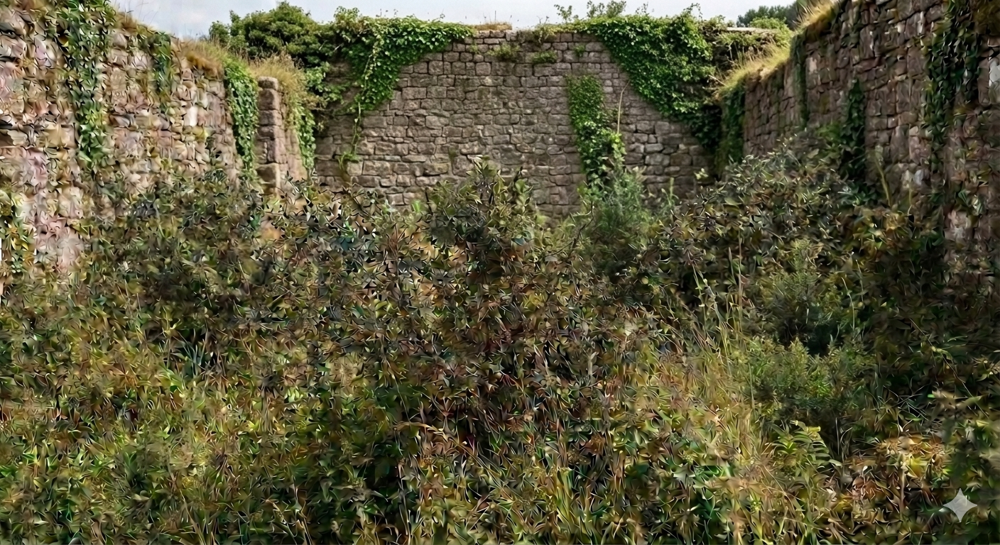
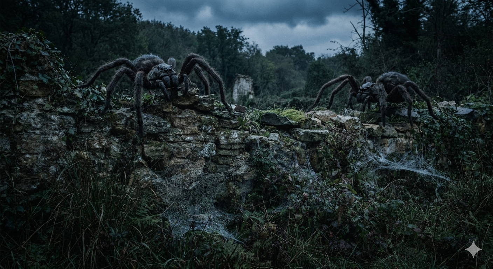
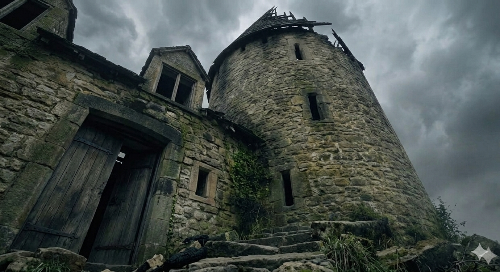

# Phandelver and Below: The Shattered Obelisk

## Sessão 8 Venomfang

_data_ : 2026-08-04 \
_anterior_ : [Sessão 7 Floresta](07_floresta.md) \
_próxima_ : [Sessão 9 Pacato](09_pacato.md)

* Cenas
  * [Cena 1 Galhos](#cena-1-galhos)
  * [Cena 2 Druida](#cena-2-druida)
  * [Cena 3 Aranhas](#cena-3-aranhas)
  * [Cena 4 Dragão](#cena-4-dragão)

####

* [Elenco](#elenco)
* [Cenários](#cenários)
* [Itens](#itens)

---

### Cena 1 Galhos

Sem saber muito bem o que fazer com [Iarno](../casting/npcs/iarno_albrek.md), o
grupo decide deixá-lo preso com algemas a uma pesada bigorna da oficina em que
estão, enquanto vão procurar pelo tal druida.

Como Iarno falou que os cultistas se escondem a leste, optam por começar a busca
pela casa, a oeste, que parece ainda estar em bom estado de conservação.

Mas ao contornar a oficina, passando por um grupo de
arbustos, [Ralf](../casting/pcs/ralf.md) nota que alguns galhos têm uma
aparência distinta do restante da vegetação. Curioso, cutuca o galho com sua
espada, revelando que se trata de uma criatura vegetal, que ao ser importunada,
reage imediatamente. E quase como se fossem um só organismo, diversos outros
galhos similares começam a se mover em direção dos intrusos.

As criaturas se revelam bastante frágeis, sendo especialmente vulneráveis aos
raios de fogo conjurados pelo [Professor](../casting/pcs/professor.md), e são
facilmente eliminadas.

---

### Cena 2 Druida

Seguindo pelas ruínas o grupo se aproxima cautelosamente de uma casa que está
especialmente bem conservada, com telhados praticamente novos, porta de madeira
sólida reforçada com faixas de ferro, e janelas com persianas grossas e
resistentes.

[Ralf](../casting/pcs/ralf.md), mantendo distância e abrigado nas ruínas
próximas, joga uma pedra contra a porta. Nada. Mais alguns segundos, outra
pedra. Agora a porta se abre e dela sai um homem velho, calvo, com barba e
cabelos brancos e muito longos, vestes longas e sandálias portando um cajado
penas, pedras, ossos e chifres.

"Malditos cultistas! Vão embora daqui! Não me encham o saco!"

Ralf sai do seu esconderijo, se apresentando e enfatizando que o grupo não é de
cultistas, e que estão, na verdade, procurando
pelo [Castelo Cragmaw](../locations/cragmaw_castle.md).

"Aqui é [Thundertree](../locations/thundertree.md)! Estão bem longe do Castelo
Cragmaw! O que estão fazendo aqui? Não viram as minhas placas de advertência?"

"Placas? Quê placas?"

"Droga! Acho que preciso fazer mais placas... Vocês precisam tomar cuidado
andando por estas ruínas. Desde que a erupção destruiu a vila há mais de 30
anos, a vila se tornou infestada desta praga de plantas mutantes... E ainda tem
os zumbis... eu acho eles que são antigos moradores contaminados pelas cinzas do
vulcão... mas faz já um tempo que não tenho cruzado com nenhum... o que será que
aconteceu com eles? Ah! Tem também umas aranhas grandes numa das casas aqui
perto..."

"Senhor!", Ralf interrompeu, "O senhor sabe onde fica o Castelo Cragmaw?"

"Sei, mas o que vocês querem com aquele lugar? Só tem um bando do goblins
fedorentos por lá... Mas... onde está minha hospitalidade?... já que estão aqui,
entrem, por favor!".

Após entrarem, o velhote fecha a porta, mas não sem antes de dar uma boa olhada
para se certificar de que não tem ninguém mais por ali.

"A propósito, eu me chamo [Reidoth](../casting/npcs/thundertree/reidoth.md),
muito prazer! Fiquem a vontade... bom...", disse olhando ao redor de seu pequeno
cômodo que é sua casa &mdash; uma cama ao lado de um pequeno fogão, uma mesa e
uma cadeira, e só &mdash; "não tenho muito conforto por aqui... não estou
acostumado a receber visitas... Aceitam um chá?"

Nisso Reidoth, nota a grande trouxa que o halfling carrega presa a uma vara.
"Mas o que é isso meu rapaz?"

Ralf, animado, mostra o [ovo de owlbear](../items/objects/owlbear_egg.md).

"Nossa! Que ovo magnífico! Não vejo um destes há muito tempo! Onde você o
conseguiu? Estes ovos podem ser bastante valorizados no mercado negro."

"Não pretendo vendê-lo! Quero, na verdade, criá-lo!"

O druída passou então a dissertar sobre as dificuldades &mdash; e perigos
&mdash; de uma empreitada destas.

"Você precisa mantê-lo aquecido... Ah! Você tem usado bolsas de água quente?
Muito esperto! O ideal mesmo seria que você _fosse_ um owlbear.", e, após dar
leves soquinhos na casca, coloca os ouvidos no ovo, "E parece que está próximo
do tempo de eclodir."

"Criaturas como estas podem ser bem difíceis e caras de se manter. No início,
vai depender muito de vocês para se alimentar. Uma galinha ou um coelho por dia
deve ser suficiente, pra começar, mas vai crescer rápido e logo vai precisar de
algo maior && uma ovelha ou, quem sabe, até um boi inteiro. Estas frutinhas
mágicas, que são bastante comuns, podem ser um paliativo, já que sustentam por
um dia, mas não enchem a barriga, o que pode deixá-los estressados &mdash; e não
queremos vê-los estressados, não é mesmo?"

"E, se pretende tentar domesticá-lo, também demandarão treinamento diário, desde
o início. Boa sorte nisso, pequeno rapaz! Você vai precisar..."

"Bom, senhor, obrigado pelas dicas, mas estamos aqui por outro motivo."

"Somos de [Phandalin](../locations/phandalin.md) e estamos..."

"Phandalin?", interrompeu, "Tenho uma velha amiga que mora em Phandalin. Ela tem
uma fazenda por lá... Qual é mesmo o nome dela? É Qe-alguma coisa... Como é
mesmo?", força um pouco a memória franzindo a testa e olhando para o vazio,
"Qelline... [Qelline Alderleaf](../casting/npcs/phandalin/alderleaf/qelline_alderleaf.md)!
É isso!"

"Ah! Sim! É a mãe da
menina [Carp](../casting/npcs/phandalin/alderleaf/carp_alderleaf.md)!",
reconheceu o [Professor](../casting/pcs/professor.md).

"Mas, como íamos dizendo... somos responsáveis pela segurança de Phandalin e
estamos procurando pelo Castelo Cragmaw e o goblins que têm atacado os viajantes
na [Estrada Triboar](../locations/triboar_trail.md). O senhor pode nos indicar
como chegar lá?"

"Putz! É complicado... é um lugar muito bem escondido
na [Floresta Neverwinter](../locations/neverwinter_wood.md)...", e após pensar
um pouco, "Eu até poderia levá-los até lá, mas estou aqui com este problema dos
cultistas e do [dragão](../casting/npcs/thundertree/venomfang.md)."

Então explicou que, não tem muito tempo, um jovem dragão verde se instalou na
torre que fica na colina no centro da vila. Pouco depois dele, vieram os
cultistas que, parece, estão tentando cair nas graças da criatura.

"Não posso sair daqui sem resolver esta situação antes... sabe-se lá o que
poderia encontrar quando voltasse..."

O grupo discute brevemente e, embora pareça uma tarefa bem perigosa, concordam
que pode ser uma forma de obter a ajuda do
druida. [Jeremias](../casting/pcs/jeremias.md) está confiante e
[Ralf](../casting/pcs/ralf.md) parece um pouco mais animado do que seria
razoável.

---

### Cena 3 Aranhas

Seguindo [Reidoth](../casting/npcs/thundertree/reidoth.md), o grupo segue pelo
que deve ter sido a rua principal da vila, hoje cercada por mato alto e ruínas.
Em dado momento, quando passavam pelo que parecia uma antiga loja, o druída
alerta, "Cuidado, rapazes! Tem uma teia atravessando o caminho. Aqui é que as
aranhas se escondem." No lugar apontado, agora que sabem o que procurar, é
possível ver a sombra sutil de um emaranhado de teia que liga a entrada da
antiga construção e o mato alto do outro lado do caminho.

"Será que não podemos dar a volta pelo outro lado?"

"Não! Por lá está cheio daquelas plantas mutantes."

E antes que alguém pudesse sugerir um outra opção, Reidoth toca seu cajado na
teia, que começa imediatamente a pegar fogo.

Quase que instantaneamente, como se tivessem esperando pelo chamado, duas
aranhas gigantes surgem por cima das paredes quebradas do lugar, já descendo na
direção do grupo.

[Professor](../casting/pcs/professor.md), a distância,
e [Ralf](../casting/pcs/ralf.md) atacam imediatamente a aranha mais próxima,
enquanto [Jeremias](../casting/pcs/jeremias.md)
e [Frodo](../casting/pcs/companions/frodo.md) correm para a segunda, mas acabam
pisando na teia e ficam presos, entre a aranha e o fogo que segue queimando em
suas direções.

Reidoth bate forte seu cajado no chão, que estremecer ao som de um trovão que
chacoalha as paredes e por pouco não faz as aranhas serem atiradas ao chão.

Após derrubar a primeira aranha, Ralf corre para a segunda, também ficando preso
na teia.

"Por que você fez isso, meu rapaz! Não viu que ia ficar preso?"

O fogo que segue avançando chega a ferir Jeremias, Frodo e Ralf, mas também os
livra da teia. A aranha também se vê obrigada a recuar, o que dá abertura para
Jeremias eliminá-la.

"Por que vocês entraram na teia!? Não viram que poderiam ficar presos?",
protestou o druída.

"Realmente não foi uma boa ideia, mas o senhor também poderia ter avisado que ia
colocar fogo na teia", retorquiu Ralf.

"Hum... é... poderia ter mencionado... não estou muito acostumado a trabalhar em
equipe."

---

### Cena 4 Dragão

Após um breve descanso, o grupo sobre o caminho sinuoso que leva ao topo da
colina. A primeira que veem ao se aproximar da torre, são duas aranhas gigantes
inertes. Os corpos estão enrugados e cheios de bolhas; algumas partes estão
faltando, como se dilaceradas por algum animal bem grande.

O silêncio é sepulcral &mdash; nenhuma criatura ousa se aproximar &mdash, e o ar
tem um cheiro meio acido, meio picante.

A torre e a casa anexa estão em razoável de conservação, exceto por metade do
telhado da torre que desabou há muito tempo.

A pedido
do [Professor](../casting/pcs/professor.md), [Bia](../casting/pcs/companions/bia.md)
sobrevoa a torre, tentando ver seu interior, mas só vê o que resta do segundo
piso, e uma escada em espiral que desce para o térreo escuro.

[Ralf](../casting/pcs/ralf.md) abre a porta da casa, onde encontram móveis
empoeirados, e muita teia de aranha. Há uma porta que lava aos fundos, cheio de
mato, e outra que leva para a torre.

Após uma breve deliberação sobre o que fazer, Ralf abre a segunda porta e
surpreendem o dragão que acorda com a intromissão.

"Quem se atreve a perturbar o descanso
de [Venomfang](../casting/npcs/thundertree/venomfang.md)?", a criatura, um jovem
dragão verde, é talvez um pouco menor do que o grupo temia, mas está claramente
incomodado com a presença indesejada.

"Só queremos conversar... ver, quem sabe, se o senhor não poderia procurar um
outro lugar para morar..."

"Estes são os domínios de Venomfang! Vão embora agora, ou vão sentir a minha
ira", começa a tomar folego para atacar.

Vendo que o dragão não está convencido a deixar o lugar, Ralf corre para dentro
e ataca o dragão que definitivamente não espera por tanta impetuosidade. Logo
[Jeremias](../casting/pcs/jeremias.md), [Frodo](../casting/pcs/companions/frodo.md)
e [Reidoth](../casting/npcs/thundertree/reidoth.md) o seguem, atacando a fera
antes que ele pudesse reagir.

Quando finalmente, consegue se recompor, Venomfang assopra seu bafo fedorento de
venenoso. Ralf consegue se esquivar, mas o druida atingido em cheio e com o
rosto queimado e sem folego precisar correr para fora para recuperar o ar.

Oa ataques bem sucedidos ferem bastante o dragão que se vendo cercado, desengaja
do combate e corre para as escadas, se espremendo para o segundo andar.

Quando já está prestes a sair voando pelo buraco do telhado, é atingido pelas
costas, por um raio de fogo do Professor, e cai já sem vida para o chão lá fora.

Após recuperarem o folego e acudir o druida que ficou bastante machucado pelo
bafo venenoso, o grupo não deixa de comemorar sua primeira vitória contra um
dragão. "[Carp](../casting/npcs/phandalin/alderleaf/carp_alderleaf.md) ficará
orgulhosa!"

Olhando o lugar que abrigava o jovem dragão, encontram um baú de madeira, que
deve ter quebrado ao ser transportado pela criatura. Dentro encontram cerca de
1000 moedas entre prata e ouro, 4 cálices de prata encrustados com pedras da
lua, dois scrolls &mdash; que o Professor identifica como sendo de _misty step_
e _lighting bolt_.

Por baixo de tudo isso, meio enterrado as moedas, um machado de guerra rústico,
que, apesar de parecer enferrujado, revela uma cabeça de aço muito bem
trabalhada com cuidado e atenção. Limpando um pouco a ferrugem, conseguem ler
uma palavra gravada em três runas anãs: H-E-W.

Quando o [Professor](../casting/pcs/professor.md) lê este nome em voz alta,
"Hew", [Jeremias](../casting/pcs/jeremias.md) se lembra de uma história antiga
sobre um certo [Machado Hew](../items/magical/battleaxe_hew.md)
que foi criado por um ferreiro anão que travava uma disputa pessoal contra as
dríades de uma floresta, pois elas o atacavam sempre que ele tentava cortar
lenha.

Movido por esta rivalidade, criou um machado mágico especialmente bom para
cortar madeira e contra seres vegetais.

Por outro lado, a história conta que, por conta desse rancor impregnado no
metal, quem o empunha sente um profundo desconforto sempre que anda por uma
floresta, como se a própria natureza o estivesse observando constantemente.

---

### Elenco

* [Iarno 'Glasstaff' Albrek](../casting/npcs/iarno_albrek.md), mago prisioneiro
* [Reidoth](../casting/npcs/thundertree/reidoth.md), druida
* [Venomfang](../casting/npcs/thundertree/venomfang.md) (RIP), dragão

####

* plantas mutantes
* aranhas gigantes

#### Mencionados

* [Qelline Alderleaf](../casting/npcs/phandalin/alderleaf/qelline_alderleaf.md),
  fazendeira
  * [Carp](../casting/npcs/phandalin/alderleaf/carp_alderleaf.md), filha

####

* cultistas
* zumbis

### Cenários

* [Thundertree](../locations/thundertree.md)
  * oficina de ferreiro
  * casa de [Reidoth](../casting/npcs/thundertree/reidoth.md)
  * ruínas com aranhas
  * torre de [Venomfang](../casting/npcs/thundertree/venomfang.md)

#### Mencionados

* [Castelo Cragmaw](../locations/cragmaw_castle.md)
* [Phandalin](../locations/phandalin.md)
* [Estrada Triboar](../locations/triboar_trail.md)
* [Floresta Neverwinter](../locations/neverwinter_wood.md)

### Itens

* [Thundertree](../locations/thundertree.md)
  * [Venomfang](../casting/npcs/thundertree/venomfang.md)
    ([Cena 4](#cena-4-dragão))
    * ~1000 moedas
      * 800 sp, 150 gp
    * 4 [cálices de prata]
    * scroll misty step
    * scroll lighting bolt
    * [Machado Hew](../items/magical/battleaxe_hew.md)

#### Mencionados

* [Thundertree](../locations/thundertree.md)
  * [Reidoth](../casting/npcs/thundertree/reidoth.md) ([Cena 2](#cena-2-druida))
    * [ovo de owlbear](../items/objects/owlbear_egg.md)
