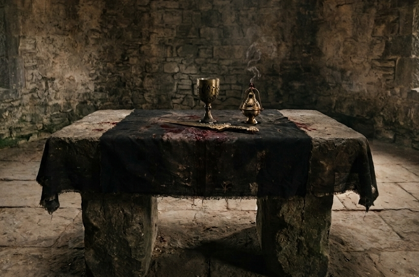
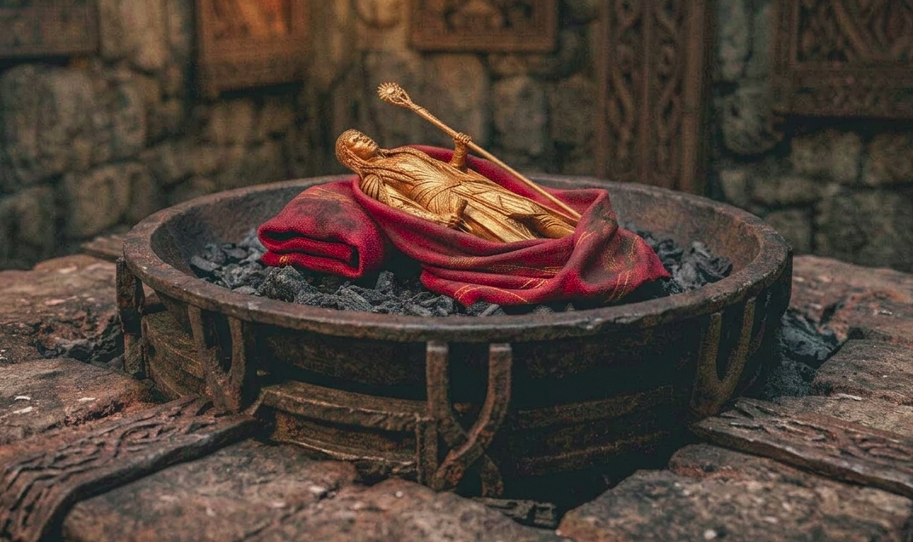
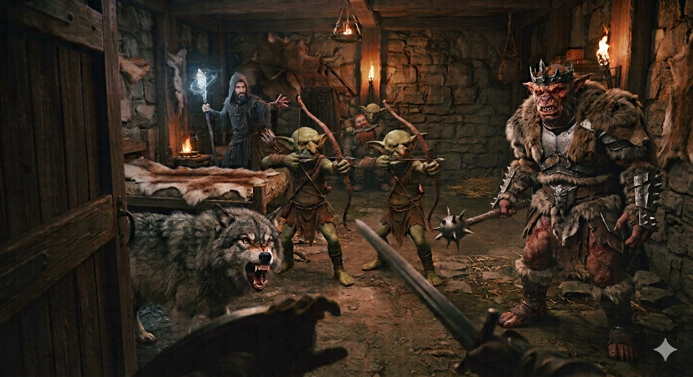

# Phandelver and Below: The Shattered Obelisk

## Sessão 11 Barricadas

_data_ : 2026-09-14 \
_anterior_ : [Sessão 10 Castelo](10_castelo.md) \
_próxima_ : [Sessão 12] :construction: continua...

* Cenas
  * [Cena 1 Altar](#cena-1-altar)
  * [Cena 2 Elfo Dourado](#cena-2-elfo-dourado)
  * [Cena 3 Barricadas](#cena-3-barricadas)
  * [Cena 4 Grol](#cena-4-grol)

####

* [Elenco](#elenco)
* [Cenários](#cenários)
* [Itens](#itens)

---

### Cena 1 Altar

Após o curto descanso, [Jeremias](../casting/pcs/jeremias.md)
e [Ralf](../casting/pcs/ralf.md)
experimentam a [bebida de anões](../items/objects/dwarven_brandy_cask.md) que se
mostra realmente revigorante, mas, ao mesmo tempo, muito forte. Temendo uma
embriaguês fora de hora, ambos preferem parar na primeira dose.

Após uma breve discussão sobre o caminho a seguir, Ralf abre a porta leste que
leva a uma sala com um altar no centro. O altar de pedra está coberto por um
papo preto manchado de sangue, sobre o que se encontram três objetos rituais de
ouro: um [cálice], uma [faca] e um [incensário]. Ao sul dois arcos idênticos,
encobertos por uma grossa cortina separam o ambiente de outra sala.

Ralf, Jeremias e [Frodo](../casting/pcs/companions/frodo.md) entram cautelosos,
mas assim que se aproximam, são surpreendidos por três goblins que estavam
escondidos atrás do altar, e saltam para o combate. Todos vestem túnicas negras
puídas sobre suas armaduras, dois estão com arcos, mas o que parece ser o líder
salta sobre o altar, empunhando uma bela espada curta esverdeada, bem diferente
das armas rústicas dos demais goblins que o grupo já encontrou.

"[Lhupo](../casting/npcs/cragmaw/castle/lhupo.md), o humilde, fala em nome do
deus supremo, [Maglubieyt](../casting/npcs/deities/maglubieyt.md), que ordena
que os ímpios profanadores sejam
mortos! [Grick](../casting/npcs/cragmaw/castle/grick.md), venha ao chamado
Dele."

Jeremias e Ralf engajam rapidamente, eliminando os arqueiros, e enquanto
Jeremias e Frodo se concentram no
líder [Lhupo](../casting/npcs/cragmaw/castle/lhupo.md), Ralf é surpreendido por
uma criatura que entra vindo pelo teto de trás de uma das cortinas e salta sobre
ele. A criatura, de corpo alongado, é munida de quatro tentáculos que terminam
em garras afiadas, e uma boca central com um poderoso bico encurvado.

Ralf consegue se esquivar dos tentáculos
do [Grick](../casting/npcs/cragmaw/castle/grick.md) e, com a ajuda
de [Faelar](../casting/pcs/faelar.md) e
[Professor](../casting/pcs/professor.md) a distância, consegue derrotar a
criatura, sem sofrer maiores danos.

Após breve combate, Ralf pega a espada
de [Lhupo](../casting/npcs/cragmaw/castle/lhupo.md) que verifica ser realmente
especial: além da lâmina de aço esverdeado, o punho é ornado com faixas de couro
trançadas de modo a lembrar escamas das patas de um inseto e a
inscrição ["Leroy J"](../items/magical/leroy_blade.md). Faelar recolhe os itens
de ouro que estava sobre o altar. E seguem todos para a sala ao sul das
cortinas.

---

### Cena 2 Elfo Dourado

O salão ao sul das cortinas é quase completamente escuro, exceto por uma tênue
luz que entra pelo alto de uma de suas paredes que está desmoronada.

Quando o [Professor](../casting/pcs/professor.md) acende uma luz em seu cajado,
todos podem ver que se trata da parte principal de uma antiga capela, ornada no
teto, ao redor das paredes, por estátuas representando os principais deuses de
panteão de Faerun todos olhando para baixo.

No centro apenas um velho braseiro de ferro que, embora ricamente ornado, está
rachado. Ao examinar o braseiro de
perto, [Professor](../casting/pcs/professor.md)
e [Faelar](../casting/pcs/faelar.md) percebem que, parcialmente encoberto pelas
cinzas, há um tecido vermelho. [Professor](../casting/pcs/professor.md) conjura
uma mão mágica para pegar o tecido sem o tocar, revelando uma estatueta de ouro
representando um elfo solar. [Professor](../casting/pcs/professor.md) reconhece
a figura como relacionada a mágia divinatória, mas como precisaria de mais tempo
para entender o seu funcionamento, resolve apenas a guardar para examinar mais
tarde.

---

### Cena 3 Barricadas

:construction: {Imagem}

Na capela há duas portas: uma para leste, outra para oeste. Supondo corretamente
que a porta oeste leva de volta ao hall de entrada do
castelo, [Ralf](../casting/pcs/ralf.md) abre a porta leste, que leva um grande
corredor, com diversos trechos ladeados pilhas de entulhos.

A passagem norte está bloqueada por uma barricada alta feita de entulhos, caixas
e barris. E também é possível ver que, num cômodo anexo a leste, também foi
erguida uma barricada similar, com camas e mesas.

Ao avançar para o corredor, uma fecha parte de cada barricada em sua direção,
ambas erram, mas desperta a atenção do grupo que vem logo atrás.

[Jeremias](../casting/pcs/jeremias.md) corre para a sala do fundo, se
posicionando de modo a não ser alvo da seteira improvisada. Nesta outra sala, vê
que ao sul há uma porta que está amarrada com uma corda tensa que sae da porta e
vai atá a barricada. Após uma rápida avaliação, entende que o arranjo foi feito
de modo a, caso a corda seja solta ou cortada, a porta será liberada. De trás da
porta, é possível ouvir guinchos estridentes que o elfo já ouvi antes em algum
lugar.

Enquanto isso [Ralf](../casting/pcs/ralf.md) está no fogo cruzado das duas
barricadas, e a situação piora quando surge às suas costas uma hobgoblin esguia,
usando trajes ajustados ao corpo que o ataca com socos e chutes muito ágeis.

Usando sua [nova espada](../../private/items/leroy_blade.md),
[Ralf](../casting/pcs/ralf.md) sente a lâmina pulsar energia vibrante e
inquietante, como se estivesse ansiosa pela
luta. [Faelar](../casting/pcs/faelar.md) ajuda lançando suas lâminas psíquicas.

[Professor](../casting/pcs/professor.md)
manda [Bia](../casting/pcs/companions/bia.md) por sobre a barricada mais
próxima, e desfere uma descarga elétrica através dela em um dos dois hobgoblins
que estavam ali e que morre imediatamente.

[Ralf](../casting/pcs/ralf.md) luta com a hobgoblin, mas esta se teleporta para
a sala de onde [Professor](../casting/pcs/professor.md)
e [Faelar](../casting/pcs/faelar.md) agiam a distância, e agora os ataca de
longe lançando dardos que saca de seu cinto.

No leste, enquanto [Jeremias](../casting/pcs/jeremias.md) busca uma maneira de
penetrar a barricada, os hobgoblins ali abrigados cortam a corda, ao que, quase
imediatamente, a porta se escancara revelando um owlbear enfurecido que ataca
Jeremias que está em seu caminho. Alertados pelo novo
perigo, [Professor](../casting/pcs/professor.md)
e [Ralf](../casting/pcs/ralf.md) correm para ajudar o amigo.

No oeste, a troca de arremessos entre a hobgoblin
e [Faelar](../casting/pcs/faelar.md) favorece o elfo. Se vendo bastante ferida,
a hobgoblin se teleporta desaparecendo da vista. Livre da
adversária, [Faelar](../casting/pcs/faelar.md) volta sua atenção aos hobgoblins
das barricadas, mas isso não dura muito, uma vez que a hobgoblin reaparece
apenas para lançar mais dardos e desaparecer novamente.

Agora bastante ferido [Faelar](../casting/pcs/faelar.md) aproveita o breve
sossego para se aproximar de [Ralf](../casting/pcs/ralf.md) que carrega
o [barril de aguardente](../items/objects/dwarven_brandy_cask.md), para tomar
uma dose da bebida e se recuperar um pouco, antes de procurar se afastar do
combate. Mas Jeremias o alcança e realiza uma de suas curas mágicas, tirando
novo amigo do perigo mais imediato.

Quando está voltando para a briga com o owlbear, vê de relance a hobgoblin se
escondendo em um canto ao sul do corredor. Aproveita para alvejá-la vê que ela
cai.

O owlbear segue tentando abrir caminho, e atinge
forte [Ralf](../casting/pcs/ralf.md),
enquanto [Professor](../casting/pcs/professor.md) lança mísseis mágicos contra a
criatura. Tudo isso, enquanto os hobgoblins da barricada seguem atirando em quem
aparece em seu ângulo de visão.

Quando o owlbear acaba derrotado, [Ralf](../casting/pcs/ralf.md) joga óleo na
barricada, ameaçando queimar os hobgoblins lá dentro. Em
seguida, [Jeremias](../casting/pcs/jeremias.md) não espera a reação dos inimigos
e ateia fogo no óleo e a barricada começa a queimar. Os hobgoblins continuam
atirando enquanto é possível, mas acabam recuando.

[Ralf](../casting/pcs/ralf.md) então se lembra do [Machado Hew] que, pela lenda
contada por [Jeremias](../casting/pcs/jeremias.md), seria especialmente bom para
cortar madeira, o que se mostra uma realidade, acelerando a abertura da
barricada.

Os dois últimos bugbears recuram e agora estão encurralados defendendo uma
porta, de onde é possível discernir uma discussão intensa.

"...não sabe com quem está lidando...", uma voz suplicante, mas urgente, está
dizendo, "Vamos logo acabar com isso! Me entregue o mapa
e [Spider](../casting/npcs/mentions/spider.md) será generoso em sua gratidão.
Pode ficar com o anão!"

"Cala boca, frangote!", replica uma voz rouca e trovejante, "Anão quase morto,
não valer nada para [Grol](../casting/npcs/cragmaw/castle/grol.md)! Se não
ajudar, ficar fora do caminho! Depois que Grol esmagar invasores, voltar a
conversar!"

Os hobgoblins acabam sendo eliminados pelo ataque conjunto
de [Ralf](../casting/pcs/ralf.md), [Jeremias](../casting/pcs/jeremias.md),
[Professor](../casting/pcs/professor.md)
e [Bia](../casting/pcs/companions/bia.md).

---

### Cena 4 Grol

"Sua estratégia estúpida nos deixou sem rotas de fuga!"

"Homenzinho franguinho! Hahaha!! [Grol](../casting/npcs/cragmaw/castle/grol.md)
não fugir! Grol poderoso! [Yepp], se necessário, acabar com o anão. [Snarl],
ficar... "

Neste momento, [Ralf](../casting/pcs/ralf.md) abre a porta e é imediatamente
atingindo pela forte pancada do mangual de um bugbear grande e corpulento. Quase
ao mesmo tempo, também é atingido pelas fechas de dois goblins posicionados de
frente para a porta.

Na outra lateral da porta, oposta a onde está o bugbear, há ainda um grande lobo
com os dentes salivando de antecipação.

Dentro da sala, pode ainda ver que, a um canto próximo a uma cama coberta com
peles, está [Iarno](../casting/npcs/iarno_albrek.md), com seu manto negro muito
bem alinhado e empunhando um cajado de vidro. Ao fundo, junto a parede oposta do
quarto, um goblin parrudo usando um avental de cozinha encardido segura a sua
frente como um escudo um anão desacordado, enquanto aponta grande faca contra
seu pescoço: "[Gundren](../casting/npcs/gundren_rockseeker.md)!"

---

### Elenco

* [Lhupo](../casting/npcs/cragmaw/castle/lhupo.md), sacerdote
  * [Grick](../casting/npcs/cragmaw/castle/grick.md), mascote
  * goblins, acólitos

####

* hobgoblin "iron shadow"
* hobgoblins
* owlbear

####

* [Grol](../casting/npcs/cragmaw/castle/grol.md), rei
  * [Snarl], lobo
  * [Yepp], cozinheiro
  * goblins
* [Iarno Albrek](../casting/npcs/iarno_albrek.md), mago
* [Gundren Rockseeker](../casting/npcs/gundren_rockseeker.md), anão desacordado

#### Mencionados

* [Maglubieyt](../casting/npcs/deities/maglubieyt.md), deus goblin

####

* [Spider](../casting/npcs/mentions/spider.md), vilão

### Cenários

* [Castelo Cragmaw](../locations/cragmaw_castle.md)

### Itens

* [Castelo Cragmaw](../locations/cragmaw_castle.md)
  * altar ([Cena 1](#cena-1-altar))
    * [Lâmina Leroy](../../private/items/leroy_blade.md)
    * [cálice de ouro]
    * [faca de ouro]
    * [incensário de ouro]
  * braseiro ([Cena 2](#cena-2-elfo-dourado))
    * [Elfo Dourado](../items/magical/golden_elf.md), estatueta
